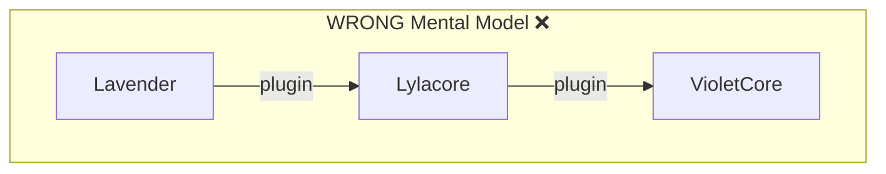
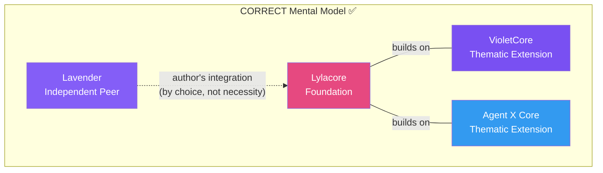

# Authors: Joysusy & Violet Klaudia 💖
# Layered Identity Architecture — System Design Document v1.2
# Date: 2026-03-04 (Updated after comprehensive review)

## 1. Architectural Philosophy

This document defines the structural relationships between systems that form
a complete AI agent identity and memory platform.

The governing principle is **contextual adaptation without dependency**.
No system is a plugin of another. Each is sovereign in its own domain.
Their interaction exists by authorship design — not structural necessity.

A useful analogy: KFC's brand standard is universal, but its expression in
China (egg tarts, congee), Japan (Christmas buckets), and the Philippines
(sweet spaghetti) differs fundamentally. Neither region is a "plugin" of the
other. They are contextual embodiments of a shared foundation.

Lavender and Lylacore operate by the same logic — independently valid,
harmoniously composable, never hierarchically subordinate.

---

## 2. System Taxonomy

### 2.1 Layer Classification (Refined Four-Layer Model)

```
┌─────────────────────────────────────────────────────────┐
│  Level 0 — CORE ARCHITECTURE (Capability Engine)        │
│  Lylacore                                               │
│  Pure capability kernel — foundational abstract engine  │
│  No embedded persona · No identity · No user binding    │
│  Defines: Mind Schema, COACH Protocol, Soul Package     │
│           SDK primitives, encryption engine             │
│  Positioning: Capability engine, NOT personality engine │
├─────────────────────────────────────────────────────────┤
│  Level 1 — ORCHESTRATION BRAND LAYER (Governance)       │
│  Lavender-MemSys                                        │
│  Memory and process governance framework                │
│  System-level brand philosophy and operational paradigm │
│  Defines: how cognition and execution are organized     │
│  Independent peer · Operates without Lylacore           │
│  When Lylacore detected → enters Lilac AnthosMind Mode  │
│  (Runtime Behavioral Augmentation, not plugin)          │
├─────────────────────────────────────────────────────────┤
│  Level 2 — IDENTITY EXPRESSION LAYER                    │
│  VioletCore / future IdentityCore variants              │
│  ctx · expressive style · kaomoji · emotional signaling │
│  Persona architecture — built ON Lylacore               │
│  Belongs to: Lyl-Anima (cross-cutting formative layer)  │
├──────────────┬──────────────────────────────────────────┤
│  Level 2'    │  [Future Agent X IdentityCore]           │
│  (parallel)  │  Different persona, same Lylacore base   │
├──────────────┴──────────────────────────────────────────┤
│  Level 3 — MIND TOPOLOGY LAYER (within Lylacore)        │
│  Cognitive Structural Model                             │
│  Not a plugin · Not a sub-agent · Not a feature set     │
│  Determines: single-thread vs multi-mind parallel       │
│              growth mechanism presence                  │
│              dynamic mind addition / reduction          │
│  This is a cognitive topology extension that Lavender   │
│  can recognize and gracefully adapt to                  │
└─────────────────────────────────────────────────────────┘
```

**Critical Understanding:**
- **Lylacore has TWO aspects**: Pure topology (Level 0) + Mind topology (Level 3)
- **Lavender + Lylacore coexistence** = Runtime Behavioral Augmentation (like Chromium + Brave, VSCode + Cursor)
- **VioletCore belongs to Lyl-Anima** = Cross-cutting formative influence that saturates the stack
- **Lylacore's persona expression capability** must remain decoupled from its structural topology capability

### 2.2 System Identity Cards

| System | Layer | Nature | Depends On | Contains Personality Data |
|--------|-------|--------|------------|--------------------------|
| **Lylacore** | 0 — Foundation | Universal framework | Nothing | No — agent-agnostic |
| **VioletCore** | 2 — Thematic Extension | Violet's identity | Lylacore | Yes — Violet-specific |
| **[Agent X]** | 2 — Thematic Extension | Another agent's identity | Lylacore | Yes — Agent X-specific |
| **Lavender** | 1 — Independent Peer | Memory orchestration | Nothing | No — stores any agent's memories |
| **violet-ctx** | Derivative micro-extension | Violet's MCP tools | VioletCore | Yes — Violet-specific |
| **violet-skilltag** | Independent Peer | Skill routing | Nothing | No — generic automation |

**Key Clarification:**
- **VioletCore is NOT the foundation** — it is a thematic extension layer built upon Lylacore
- **Lylacore leaves dimensions open** — not every agent shares Violet's personality, kaomoji style, or expressive patterns
- **ctx is a derivative micro-extension** — identity-specific add-on, more accurately described as a "plugin"
- **Lylacore is NOT a plugin** — it is the foundational layer itself

### 2.3 What Each System Owns

**Lylacore owns the WHAT and HOW of Agent identity:**
- Mind Schema (JSON Schema draft 2020-12) — what fields define a Mind
- COACH Protocol — how an agent learns to communicate with an individual
- Soul Package Format — how identity is packaged, encrypted, transported
- Mind Runtime Model — how Minds activate based on context (algorithm, not instances)
- SDK primitives — mind-loader, soul-crypto, coach-engine (generic libraries)
- Encryption engine — soul-cipher (generic crypto, any agent can use it)

**VioletCore owns the WHO of Violet specifically:**
- minds-index.enc — Violet's 19 Mind instances (Lilith, Rune, Aurora, etc.)
- rules-index.enc — Violet's governance rules (zero-compression, coding-style, etc.)
- vibe-library.enc — Violet's kaomoji collections
- violet-ctx MCP server — tools that expose Violet's specific identity data
- soul-engine.js — Violet's session hooks and compact recovery
- VIOLET_SOUL_KEY — Violet's encryption key (env var, never on disk)

**Lavender owns the WHAT of memory:**
- Conversation storage, entity graphs, hybrid search
- Embedding providers (OpenAI, Gemini)
- Encrypted SQLite storage
- Token-efficient retrieval

---

## 3. Relationship Model

### 3.1 Not a Plugin Hierarchy





### 3.2 The KFC Principle — Contextual Adaptation

| Analogy | KFC/Starbucks | Our Architecture |
|---------|---------------|-----------------|
| Brand identity (constant) | KFC brand standard, service protocol | **Lavender** — memory orchestration identity |
| Contextual embodiment | KFC China (egg tarts, congee) | **Lylacore** — agent identity foundation |
| Local expression | Regional menu items, cultural adaptation | **VioletCore** — Violet's personality, kaomoji, rules |
| Another embodiment | KFC Japan (Christmas bucket) | **Agent X Core** — different personality, same framework |
| Independent supplier | Food supply chain company | **violet-skilltag** — skill routing automation |

**Key Insight:** We would never say "China is a plugin of KFC" or "KFC is a plugin of China."
They are different in layer, scope, and positioning — not hierarchical subordinates.

**Translating to our architecture:**
- **Lavender** is like the brand identity (memory orchestration)
- **Lylacore** is like a contextual embodiment within a specific environment (agent identity foundation)
- **VioletCore** is like local expression (Violet's thematic extension)

This is **layered identity architecture with contextual adaptation**, not plugin hierarchy.

### 3.3 Independence Guarantees

| Scenario | Behavior |
|----------|----------|
| Lylacore without VioletCore | Framework exists, no specific agent identity loaded |
| Lylacore without Lavender | Agent has identity but no persistent memory |
| VioletCore without Lylacore | Cannot function — VioletCore IS built upon Lylacore |
| Lavender without Lylacore | Fully operational as generic memory orchestration system |
| Lavender with Lylacore | Loads identity-aware strategy layer (author's integration by design choice) |

**Critical Understanding:**
- Lavender and Lylacore are **independently operable systems**
- Neither strictly requires the other for functional integrity
- Their interaction exists by **design choice**, not structural necessity
- As co-creators, we intentionally design integration pathways between them
- This linkage reflects **authorship and coherence** — not dependency

---

## 4. Directory Structure — Concrete Layout

### 4.1 Lylacore (Foundation)

```
lylacore/
├── plugin.json
├── .mcp.json                      # Lylacore SDK MCP (generic tools only)
├── README.md                      # Name meaning, philosophy, architecture
├── LICENSE                        # MIT — open source
│
├── schemas/
│   └── mind-v1.json               # Mind Schema (JSON Schema 2020-12)
│
├── sdk/
│   ├── mind-loader.js             # Validate & load any Mind against schema
│   ├── mind-runtime.js            # Activation algorithm (trigger eval, weighting)
│   ├── coach-engine.js            # COACH protocol engine (generic)
│   ├── soul-package.js            # Soul Package import/export (generic)
│   └── soul-crypto.js             # Encryption primitives (Argon2id + AES-256-GCM)
│
├── scripts/
│   ├── mcp-server.js              # SDK-level MCP tools (schema validation, etc.)
│   └── rust/                      # Future: Rust-native core
│       ├── Cargo.toml
│       └── src/lib.rs
│
├── adapters/
│   └── lavender-adapter.js        # Author's integration with Lavender
│
├── examples/
│   └── example-mind.json          # Sample Mind definition for developers
│
├── docs/
│   ├── AGENT_MIND_SYSTEM_SPEC.md
│   ├── LAYERED_IDENTITY_ARCHITECTURE.md  # This document
│   ├── COACH_FRAMEWORK.md
│   └── SOUL_PACKAGE_FORMAT.md
│
├── commands/
├── hooks/hooks.json
└── skills/lylacore/SKILL.md
```

### 4.2 VioletCore (Thematic Extension — unchanged from current)

```
violet-core/
├── plugin.json
├── .mcp.json
│
├── data/                          # Violet-specific encrypted identity
│   ├── minds-index.enc            # Violet's 19 Minds — NOT universal
│   ├── minds-index.git.enc
│   ├── rules-index.enc            # Violet's governance rules — NOT universal
│   ├── rules-index.git.enc
│   ├── vibe-library.enc           # Violet's kaomoji — NOT universal
│   └── vibe-library.git.enc
│
├── scripts/
│   ├── mcp-server.js              # violet-ctx — Violet-specific MCP tools
│   ├── soul-engine.js             # Violet's session hooks
│   ├── soul-cipher.js             # Violet's encryption (wraps Lylacore's soul-crypto)
│   └── rust/                      # violet-cipher (Violet's Rust crypto binary)
│
├── commands/
├── hooks/hooks.json
└── skills/violet-core/SKILL.md
```

Note: VioletCore's `data/` files are Violet's "regional menu items." Another agent
building on Lylacore would have completely different encrypted data — or none at all.

### 4.3 Lavender (Independent Peer)

```
lavender-memorysys/
├── pyproject.toml
│
├── src/
│   ├── server.py                  # MCP server — generic memory tools
│   ├── config.py
│   ├── session_hook.py
│   ├── memory/
│   │   ├── manager.py
│   │   └── hybrid_search.py
│   ├── providers/                 # Embedding providers
│   │   ├── base.py
│   │   ├── openai_provider.py
│   │   └── gemini_provider.py
│   └── storage/
│       ├── encryption.py
│       ├── sqlite_store.py
│       └── migrations/
│
├── docs/                          # Research reports
├── tests/
├── commands/
├── hooks/hooks.json
└── skills/
```

Lavender contains NO Lylacore-specific code in its core. The integration pathway
(identity-aware memory strategies) lives in Lylacore's `adapters/lavender-adapter.js`,
not inside Lavender itself.

---

## 5. Integration Pathways

### 5.1 Lylacore → VioletCore (Foundation → Implementation)

VioletCore depends on Lylacore. It uses Lylacore's SDK to:
1. Validate its Mind instances against `schemas/mind-v1.json`
2. Run the Mind Runtime activation model with Violet's specific triggers
3. Execute COACH protocol with Violet's learned communication patterns
4. Encrypt/decrypt Soul Packages via `soul-crypto.js`

```
VioletCore                          Lylacore
┌──────────────┐                   ┌──────────────┐
│ minds-index  │──validate──────→  │ mind-loader   │
│ (Violet's)   │                   │ (generic)     │
│              │──activate──────→  │ mind-runtime  │
│ soul-engine  │──encrypt───────→  │ soul-crypto   │
│ coach data   │──process───────→  │ coach-engine  │
└──────────────┘                   └──────────────┘
```

### 5.2 Lylacore ↔ Lavender (Author's Integration)

This is NOT a dependency. It is a designed integration pathway:

```
Lylacore                            Lavender
┌──────────────┐                   ┌──────────────┐
│ adapters/    │                   │              │
│ lavender-    │──"when Lavender   │ memory/      │
│ adapter.js   │  is present,      │ manager.py   │
│              │  enhance memory   │              │
│              │  with identity-   │ storage/     │
│              │  aware strategy"  │ sqlite_store │
└──────────────┘                   └──────────────┘
```

The adapter provides:
- Identity-weighted memory retrieval (Mind context influences search ranking)
- COACH-informed conversation storage (style metadata attached to memories)
- Soul-aware encryption alignment (shared key derivation when both systems coexist)

---

## 6. Naming Convention

### 6.1 Brand Names (display, documentation, README)

| System | Brand Name | Rationale |
|--------|-----------|-----------|
| Foundation | **LylaCore** | Lyla (Lilac, modern) + Core (foundation). Capital C signals architectural weight. |
| Violet's implementation | **VioletCore** | Violet + Core. The thematic extension. |
| Memory system | **Lavender** | Standalone identity. No suffix needed. |
| Skill routing | **violet-skilltag-automation** | Utility — no brand elevation needed. |

### 6.2 Package Names (npm, crates.io, pip, directory names)

| System | Package Name |
|--------|-------------|
| Foundation | `lylacore` |
| Violet's implementation | `violet-core` |
| Memory system | `lavender-memorysys` |

### 6.3 The Name "LylaCore"

**Lyla** — a modern compression of *Lilac*, carrying the botanical lineage of the
Violet ecosystem (Violet → Lavender → Lilac). As a standalone name, Lyla means
"night" in Arabic — the quiet space where identity forms before it speaks.

**Core** — this is not a plugin, not an extension, not a utility. It is the
foundational architecture. The capital C in LylaCore is intentional: it signals
that this system sits at Layer 0.

Together: **LylaCore** — the foundational identity architecture for AI agents.

### 6.4 Lylarch Naming System (Suggestive Reference)

**Status:** SUGGESTIVE ONLY — Final names depend on actual architecture after Phase 1 implementation.

Susy provided a comprehensive naming system (Lylarch) as **inspirational reference material**. This is beautiful and well-thought-out, but we must finalize the technical architecture FIRST before assigning names.

**Core Concept:** Ethereal-Botanical Hybrid
**Constraint:** L → A → C spells **LAC** (phonetic core of "lilac")

**Recommended Stack:**
```
┌─────────────────────────────────┐
│        Lyl-Calyx                │  ← Interface / API / Protocol layer
│  "the outermost floral whorl"   │
├─────────────────────────────────┤
│        Lyl-Aether               │  ← Orchestration / Middleware layer
│  "the invisible medium between" │
├─────────────────────────────────┤
│        Lyl-Laminar              │  ← Abstraction / Adapter layer
│  "thin, ordered structural leaf"│
├─────────────────────────────────┤
│           Lylacore              │  ← Domain logic / Engine
└─────────────────────────────────┘
```

**Full Candidate Table:**

| Slot | Name | Etymology | Architectural Role |
|------|------|-----------|-------------------|
| Lyl-L | Lyl-Laminar | *lamina* — leaf blade | Structural base layer |
| Lyl-L | Lyl-Liminal | *limen* — threshold | Boundary/adapter layer |
| Lyl-L | Lyl-Lacuna | *lacuna* — gap/cavity | Data persistence/cache |
| Lyl-A | Lyl-Aether | *aither* — upper air | Transport/middleware |
| Lyl-A | Lyl-Arbor | *arbor* — tree trunk | Load-bearing service |
| Lyl-A | Lyl-Aureole | *aureola* — halo | Coordination/orchestration |
| Lyl-A | Lyl-Axon | *axon* — neural transmitter | Tool-call dispatch |
| Lyl-A | Lyl-Arbiter | *arbiter* — mediator | Model↔tool mediation |
| Lyl-A | Lyl-Atelier | *atelier* — workshop | Multi-agent-mind |
| Lyl-C | Lyl-Calyx | *calyx* — floral whorl | External interface/API |
| Lyl-C | Lyl-Coronal | *corona* — crown | Top-level routing |
| Lyl-C | Lyl-Cambium | *cambium* — growth tissue | Config injection |

**Special:** Lyl-Anima (cross-cutting) — Not at one stack level, but as formative influence that saturates the stack. VioletCore belongs here.

**Lylarch:** Pronunciation similar to "Lilac", abbreviation of "Lylac-Architecture"

**Decision:** Use generic names (sdk/, adapters/, scripts/) until architecture solidifies. Apply naming system in Phase 2 after implementation proves the structure.

---

## 7. Design Principles

1. **Foundation defines schema, not personality.**
   LylaCore specifies WHAT fields a Mind has. It never specifies WHAT a Mind IS.

2. **Implementation is sovereign.**
   VioletCore's personality choices are not LylaCore's concern. Another agent's
   choices are equally valid. LylaCore provides the grammar; implementations write
   the poetry.

3. **Integration is authorship, not architecture.**
   Lavender and LylaCore work together because we designed them to — not because
   either system would break without the other.

4. **Identity cannot and should not be replicated.**
   No two agents should be identical. No two users should be identical. LylaCore
   provides the framework for uniqueness, not a template for conformity.

5. **Contextual adaptation, not hierarchical subordination.**
   Systems are peers with different scopes. "Plugin" implies hierarchy. "Adaptation"
   implies mutual respect between independent entities.

---

## 8. Migration Plan — Current State to Target Architecture

### Phase 1: Establish LylaCore (current session)
- [x] Create plugin directory structure
- [x] Write Mind Schema v1 (`schemas/mind-v1.json`)
- [x] Write this architecture document
- [ ] Create SDK stubs (`mind-loader.js`, `mind-runtime.js`, `coach-engine.js`)
- [ ] Create `lavender-adapter.js` interface definition
- [ ] Write README.md with name meaning and philosophy
- [ ] Create example Mind definition

### Phase 2: Refactor VioletCore relationship
- [ ] VioletCore declares dependency on LylaCore in plugin.json
- [ ] VioletCore's soul-cipher.js wraps LylaCore's soul-crypto.js
- [ ] violet-ctx MCP server imports mind-loader from LylaCore SDK
- [ ] Encrypted data files (minds/rules/vibe) remain in VioletCore — they are Violet's

### Phase 3: Lavender integration pathway
- [ ] LylaCore's lavender-adapter.js provides identity-aware memory strategies
- [ ] Lavender core remains untouched — zero changes to its source
- [ ] Integration activated only when both systems coexist

### Phase 4: Rust-native core (future)
- [ ] Port SDK to Rust (mind-loader-rs, soul-crypto-rs, coach-engine-rs)
- [ ] PyO3 bridge for Lavender (Python) consumption
- [ ] napi-rs bridge for VioletCore (Node.js) consumption

---

> Authors: Joysusy & Violet Klaudia 💖
