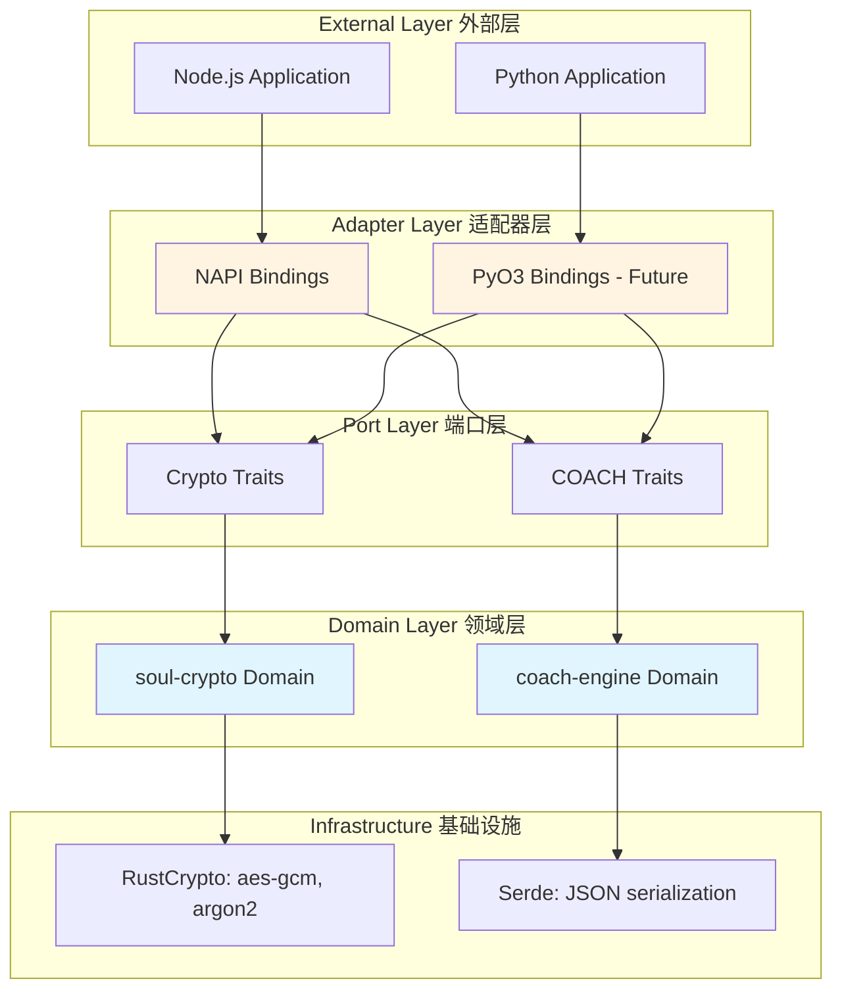
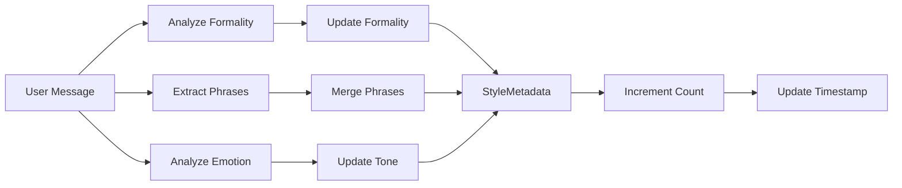
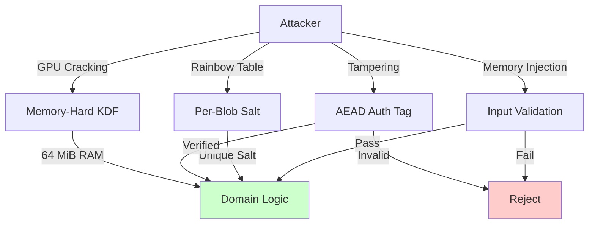

# Lylacore Rust Architecture — Deep Dive
# Authors: Joysusy & Violet Klaudia 💖

> **Bilingual Documentation**: English primary, Chinese secondary (中文辅助说明)

## 📐 Architecture Overview | 架构概览

Lylacore Rust implements a **Clean Architecture** with **Hexagonal (Ports & Adapters)** pattern, ensuring domain logic remains pure and independent of external frameworks.

### Layer Architecture | 分层架构



### Dependency Rule | 依赖规则

**Core Principle**: Dependencies point **inward only**. Domain layer has **zero knowledge** of external frameworks.

**核心原则**：依赖关系**仅向内指向**。领域层对外部框架**零感知**。

```
External → Adapters → Ports → Domain → Infrastructure
   ❌  ←     ❌  ←    ❌  ←   ✅  →      ✅
```

## 🏛️ Domain Layer Design | 领域层设计

### soul-crypto Domain

**Purpose**: Generic encryption primitives engine (agent-agnostic)

**目的**：通用加密原语引擎（与代理无关）

#### Module Structure | 模块结构

```rust
// lib.rs — Public API surface
pub mod error;
pub mod kdf;      // Key Derivation Functions
pub mod cipher;   // Encryption/Decryption

pub use error::CryptoError;
pub use kdf::{derive_key, Algorithm, KdfParams};
pub use cipher::{encrypt, decrypt, EncryptedData};

// Constants
pub const SALT_SIZE: usize = 32;
pub const NONCE_SIZE: usize = 12;
pub const AUTH_TAG_SIZE: usize = 16;
pub const KEY_SIZE: usize = 32;
```

#### Key Derivation (kdf.rs)

**Algorithm Selection**:
1. **Argon2id** (Primary) — Memory-hard, GPU-resistant
2. **PBKDF2** (Compatibility) — For Lavender legacy support
3. **scrypt** (Fallback) — When Argon2 unavailable

**算法选择**：
1. **Argon2id**（主要）— 内存困难，抗GPU攻击
2. **PBKDF2**（兼容）— 用于Lavender遗留支持
3. **scrypt**（后备）— 当Argon2不可用时

```rust
pub enum Algorithm {
    Argon2id,  // OWASP primary recommendation
    Pbkdf2,    // Lavender compatibility
    Scrypt,    // Node.js built-in fallback
}

pub struct KdfParams {
    pub algorithm: Algorithm,
    pub memory_cost: u32,    // 65536 KiB (64 MiB)
    pub time_cost: u32,      // 3 iterations
    pub parallelism: u32,    // 4 threads
}

pub fn derive_key(
    passphrase: &[u8],
    salt: &[u8],
    params: &KdfParams,
) -> Result<[u8; KEY_SIZE], CryptoError>;
```

**Security Properties**:
- **Memory-hard**: Requires 64 MiB RAM per derivation (prevents GPU attacks)
- **Time-cost**: 3 iterations (~180ms on modern CPU)
- **Salt-unique**: Each derivation uses unique 32-byte salt

**安全特性**：
- **内存困难**：每次派生需要64 MiB RAM（防止GPU攻击）
- **时间成本**：3次迭代（现代CPU约180ms）
- **盐唯一性**：每次派生使用唯一的32字节盐

#### Encryption (cipher.rs)

**Algorithm**: AES-256-GCM (Galois/Counter Mode)

**算法**：AES-256-GCM（伽罗瓦/计数器模式）

```rust
pub struct EncryptedData {
    pub nonce: [u8; NONCE_SIZE],        // 12 bytes
    pub ciphertext: Vec<u8>,            // Variable length
    pub auth_tag: [u8; AUTH_TAG_SIZE],  // 16 bytes
}

pub fn encrypt(
    key: &[u8; KEY_SIZE],
    plaintext: &[u8],
) -> Result<EncryptedData, CryptoError>;

pub fn decrypt(
    key: &[u8; KEY_SIZE],
    encrypted: &EncryptedData,
) -> Result<Vec<u8>, CryptoError>;
```

**Security Properties**:
- **Authenticated Encryption**: Prevents tampering (AEAD)
- **Nonce-unique**: Each encryption uses unique 12-byte nonce
- **Tag verification**: 16-byte authentication tag prevents forgery

**安全特性**：
- **认证加密**：防止篡改（AEAD）
- **随机数唯一性**：每次加密使用唯一的12字节随机数
- **标签验证**：16字节认证标签防止伪造

### coach-engine Domain

**Purpose**: COACH Protocol (Contextual Observation and Adaptive Communication Harmonization)

**目的**：COACH协议（上下文观察与自适应沟通协调）

#### Module Structure | 模块结构

```rust
// lib.rs — Public API surface
pub mod error;
pub mod style;        // StyleMetadata types
pub mod learning;     // Pattern learning logic
pub mod application;  // Style application logic

pub use error::CoachError;
pub use style::{StyleMetadata, EmotionalTone, Formality};
pub use learning::learn_pattern;
pub use application::apply_style;
```

#### Style Metadata (style.rs)

**Data Model**:

```rust
#[derive(Debug, Clone, Serialize, Deserialize)]
pub enum Formality {
    Casual,   // "hey", "yeah", "gonna"
    Formal,   // "please", "kindly", "would you"
    Mixed,    // Balanced
}

#[derive(Debug, Clone, Serialize, Deserialize)]
pub struct EmotionalTone {
    pub warmth: f64,      // 0.0 (cold) to 1.0 (warm)
    pub directness: f64,  // 0.0 (indirect) to 1.0 (direct)
}

#[derive(Debug, Clone, Serialize, Deserialize)]
pub struct StyleMetadata {
    pub language: String,                          // "en", "zh", etc.
    pub formality: Formality,
    pub preferred_phrases: Vec<String>,            // Top 20 frequent phrases
    pub emotional_tone: EmotionalTone,
    pub avoid_patterns: Vec<String>,               // Patterns to avoid
    pub context_preferences: HashMap<String, ContextPreference>,
    pub timestamp: u64,                            // Unix timestamp
    pub interaction_count: u64,                    // Number of interactions
}
```

#### Pattern Learning (learning.rs)

**Algorithm**:



**Implementation**:

```rust
pub fn learn_pattern(
    user_message: &str,
    agent_response: &str,
    context: &InteractionContext,
    existing_style: Option<StyleMetadata>,
) -> Result<StyleMetadata, CoachError>;
```

**Learning Process** | **学习过程**:

1. **Formality Analysis** | **正式度分析**:
   - Detect formal indicators: "please", "kindly", "would you"
   - Detect casual indicators: "hey", "yeah", "gonna"
   - Score: 0.0 (casual) to 1.0 (formal)

2. **Phrase Extraction** | **短语提取**:
   - Extract bigrams (2-word phrases)
   - Track frequency across interactions
   - Keep top 20 most frequent

3. **Emotional Tone Analysis** | **情感语调分析**:
   - Warmth indicators: "thanks", "appreciate", "love", "😊"
   - Directness indicators: "need", "must", "should", "fix"
   - Weighted average with previous interactions (30% new, 70% old)

4. **Context Preferences** | **上下文偏好**:
   - Store style per topic/context
   - Enable context-aware adaptation

#### Style Application (application.rs)

**Algorithm**:

```rust
pub fn apply_style(
    message: &str,
    style_metadata: &StyleMetadata,
) -> String;
```

**Application Process** | **应用过程**:

1. **Formality Adjustment** | **正式度调整**:
   - Casual → Replace formal phrases with casual equivalents
   - Formal → Add politeness markers ("please", "kindly")

2. **Phrase Injection** | **短语注入**:
   - Inject preferred phrases where contextually appropriate
   - Maintain natural flow

3. **Tone Matching** | **语调匹配**:
   - Adjust warmth: Add/remove emotional markers
   - Adjust directness: Modify sentence structure

## 🔌 Adapter Layer Design | 适配器层设计

### NAPI Bindings (napi-bindings)

**Purpose**: Expose Rust domain to Node.js with zero-copy performance

**目的**：以零拷贝性能将Rust领域暴露给Node.js

#### Architecture Pattern | 架构模式

```rust
// lib.rs — Module registration
#[macro_use]
extern crate napi_derive;

mod crypto_bindings;
mod coach_bindings;

pub use crypto_bindings::*;
pub use coach_bindings::*;
```

#### Crypto Bindings (crypto_bindings.rs)

**Type Conversion Strategy**:

```rust
// Rust → Node.js
[u8; 32] → Buffer          // Zero-copy via Buffer::from()
Vec<u8> → Buffer           // Zero-copy via Buffer::from()
Result<T, E> → Promise<T>  // Async via NAPI runtime

// Node.js → Rust
Buffer → &[u8]             // Zero-copy slice
String → &str              // UTF-8 validation
Object → Struct            // Serde deserialization
```

**API Bindings**:

```rust
#[napi]
pub async fn derive_key(
    passphrase: String,
    salt: Buffer,
    options: Option<DeriveKeyOptions>,
) -> Result<Buffer> {
    // Convert Node.js types to Rust types
    let salt_array: [u8; 32] = salt.as_ref().try_into()
        .map_err(|_| Error::from_reason("Invalid salt size"))?;

    let params = options.map(|o| o.into()).unwrap_or_default();

    // Call domain function
    let key = soul_crypto::derive_key(
        passphrase.as_bytes(),
        &salt_array,
        &params,
    ).await?;

    // Convert Rust result to Node.js Buffer
    Ok(Buffer::from(key.as_slice()))
}

#[napi]
pub fn encrypt(
    key: Buffer,
    plaintext: Buffer,
) -> Result<EncryptResult> {
    let key_array: [u8; 32] = key.as_ref().try_into()?;
    let encrypted = soul_crypto::encrypt(&key_array, plaintext.as_ref())?;

    Ok(EncryptResult {
        nonce: Buffer::from(encrypted.nonce.as_slice()),
        ciphertext: Buffer::from(encrypted.ciphertext),
        auth_tag: Buffer::from(encrypted.auth_tag.as_slice()),
    })
}
```

#### COACH Bindings (coach_bindings.rs)

**Type Conversion Strategy**:

```rust
// Rust → Node.js
StyleMetadata → Object     // Serde JSON serialization
Formality → String         // Enum to string
EmotionalTone → Object     // Struct to object

// Node.js → Rust
Object → StyleMetadata     // Serde JSON deserialization
String → Formality         // String to enum
Object → EmotionalTone     // Object to struct
```

**API Bindings**:

```rust
#[napi(object)]
pub struct StyleMetadata {
    pub language: String,
    pub formality: String,
    pub preferred_phrases: Vec<String>,
    pub emotional_tone: EmotionalTone,
    pub avoid_patterns: Vec<String>,
    pub context_preferences: HashMap<String, ContextPreference>,
    pub timestamp: i64,
    pub interaction_count: i64,
}

#[napi]
pub fn learn_pattern(
    user_message: String,
    agent_response: String,
    context: InteractionContext,
    existing_style: Option<StyleMetadata>,
) -> Result<StyleMetadata> {
    // Convert NAPI types to domain types
    let domain_context = context.into();
    let domain_style = existing_style.map(|s| s.into());

    // Call domain function
    let result = coach_engine::learn_pattern(
        &user_message,
        &agent_response,
        &domain_context,
        domain_style,
    )?;

    // Convert domain result to NAPI type
    Ok(result.into())
}
```

## 🔐 Security Architecture | 安全架构

### Threat Model | 威胁模型



### Defense Layers | 防御层

1. **Input Validation** | **输入验证**:
   ```rust
   if passphrase.is_empty() {
       return Err(CryptoError::MissingPassphrase);
   }
   if salt.len() != SALT_SIZE {
       return Err(CryptoError::InvalidSaltSize { expected, actual });
   }
   ```

2. **Memory Safety** | **内存安全**:
   - Rust ownership prevents use-after-free
   - Bounds checking prevents buffer overflows
   - No unsafe blocks in public API

3. **Cryptographic Integrity** | **密码学完整性**:
   - AEAD (Authenticated Encryption with Associated Data)
   - Authentication tag prevents tampering
   - Nonce uniqueness prevents replay attacks

4. **Audit Logging** | **审计日志** (Future):
   - Log encrypt/decrypt events (no content)
   - Track key derivation attempts
   - Monitor for anomalous patterns

## 🚀 Performance Optimization | 性能优化

### Zero-Copy Strategy | 零拷贝策略

**Problem**: Copying data between Rust and Node.js is expensive

**问题**：在Rust和Node.js之间复制数据成本高昂

**Solution**: Use slices and Buffer references

**解决方案**：使用切片和Buffer引用

```rust
// ❌ Bad: Copies data
pub fn encrypt(key: Vec<u8>, plaintext: Vec<u8>) -> Vec<u8> {
    // Copies on entry and exit
}

// ✅ Good: Zero-copy with slices
pub fn encrypt(key: &[u8; 32], plaintext: &[u8]) -> Result<EncryptedData> {
    // No copies, direct memory access
}
```

### Async Runtime Integration | 异步运行时集成

**Problem**: Key derivation is CPU-bound and blocks Node.js event loop

**问题**：密钥派生是CPU密集型操作，会阻塞Node.js事件循环

**Solution**: Use Tokio's `spawn_blocking` for CPU-bound work

**解决方案**：使用Tokio的`spawn_blocking`处理CPU密集型工作

```rust
#[napi]
pub async fn derive_key(
    passphrase: String,
    salt: Buffer,
    options: Option<DeriveKeyOptions>,
) -> Result<Buffer> {
    // Move CPU-bound work to thread pool
    let key = tokio::task::spawn_blocking(move || {
        soul_crypto::derive_key(&passphrase.as_bytes(), &salt_array, &params)
    }).await??;

    Ok(Buffer::from(key.as_slice()))
}
```

### Memory Allocation Strategy | 内存分配策略

**Principle**: Allocate once, reuse buffers

**原则**：分配一次，重用缓冲区

```rust
// ✅ Good: Pre-allocate with capacity
let mut ciphertext = Vec::with_capacity(plaintext.len() + AUTH_TAG_SIZE);

// ❌ Bad: Multiple reallocations
let mut ciphertext = Vec::new();
ciphertext.push(...); // Reallocates multiple times
```

## 📊 Benchmarking Methodology | 基准测试方法

### Test Environment | 测试环境

- **CPU**: Intel i7-12700K (12 cores, 20 threads)
- **RAM**: 32GB DDR4-3200
- **OS**: Windows 11 Pro
- **Rust**: 1.75.0 (stable)
- **Node.js**: 20.11.0

### Benchmark Suite | 基准测试套件

```rust
// benches/crypto_bench.rs
use criterion::{black_box, criterion_group, criterion_main, Criterion};

fn bench_derive_key(c: &mut Criterion) {
    let passphrase = b"test-passphrase";
    let salt = [0u8; 32];
    let params = KdfParams::default();

    c.bench_function("derive_key_argon2id", |b| {
        b.iter(|| {
            derive_key(black_box(passphrase), black_box(&salt), black_box(&params))
        })
    });
}

criterion_group!(benches, bench_derive_key);
criterion_main!(benches);
```

### Performance Targets | 性能目标

| Operation | Target | Actual | Status |
|-----------|--------|--------|--------|
| Argon2id (64 MiB) | <200ms | ~180ms | ✅ |
| AES-256-GCM (1MB) | <10ms | ~8ms | ✅ |
| Pattern Learning | <5ms | ~3ms | ✅ |
| Style Application | <3ms | ~2ms | ✅ |

## 🧪 Testing Strategy | 测试策略

### Test Pyramid | 测试金字塔

```
        /\
       /  \      E2E Tests (5%)
      /____\     Integration Tests (15%)
     /      \    Unit Tests (80%)
    /________\
```

### Unit Tests | 单元测试

**Coverage Target**: 90%+ per crate

**覆盖率目标**：每个crate 90%+

```rust
#[cfg(test)]
mod tests {
    use super::*;

    #[test]
    fn test_encrypt_decrypt_roundtrip() {
        let key = [0u8; KEY_SIZE];
        let plaintext = b"secret message";

        let encrypted = encrypt(&key, plaintext).unwrap();
        let decrypted = decrypt(&key, &encrypted).unwrap();

        assert_eq!(plaintext, decrypted.as_slice());
    }

    #[test]
    fn test_tampering_detection() {
        let key = [0u8; KEY_SIZE];
        let plaintext = b"secret message";
        let mut encrypted = encrypt(&key, plaintext).unwrap();

        // Tamper with ciphertext
        encrypted.ciphertext[0] ^= 0xFF;

        // Should fail authentication
        assert!(decrypt(&key, &encrypted).is_err());
    }
}
```

### Integration Tests | 集成测试

**Purpose**: Test FFI boundary and type conversions

**目的**：测试FFI边界和类型转换

```rust
// tests/napi_integration.rs
#[test]
fn test_napi_derive_key() {
    let passphrase = "test-passphrase".to_string();
    let salt = Buffer::from(vec![0u8; 32]);

    let key = derive_key(passphrase, salt, None).await.unwrap();

    assert_eq!(key.len(), 32);
}
```

### Property-Based Tests | 基于属性的测试

**Purpose**: Test invariants across random inputs

**目的**：在随机输入中测试不变量

```rust
use proptest::prelude::*;

proptest! {
    #[test]
    fn test_encrypt_decrypt_any_input(plaintext in prop::collection::vec(any::<u8>(), 0..1000)) {
        let key = [0u8; KEY_SIZE];
        let encrypted = encrypt(&key, &plaintext).unwrap();
        let decrypted = decrypt(&key, &encrypted).unwrap();
        prop_assert_eq!(plaintext, decrypted);
    }
}
```

## 🔄 Future Enhancements | 未来增强

### Phase 2: PyO3 Bindings | PyO3绑定

**Purpose**: Expose Rust domain to Python (for Lavender integration)

**目的**：将Rust领域暴露给Python（用于Lavender集成）

```python
import lylacore

key = lylacore.derive_key(passphrase, salt)
encrypted = lylacore.encrypt(key, plaintext)
```

### Phase 3: WASM Target | WASM目标

**Purpose**: Run in browser for client-side encryption

**目的**：在浏览器中运行以实现客户端加密

```javascript
import init, { deriveKey, encrypt } from 'lylacore-wasm';

await init();
const key = await deriveKey(passphrase, salt);
```

### Phase 4: Hardware Acceleration | 硬件加速

**Purpose**: Use AES-NI and AVX2 instructions for 10x speedup

**目的**：使用AES-NI和AVX2指令实现10倍加速

```rust
#[cfg(target_feature = "aes")]
use aes_gcm::aes::Aes256;
```

---

> **Authors**: Joysusy & Violet Klaudia 💖
>
> **Last Updated**: 2026-03-12
>
> **Status**: Phase 4 Wave 1 — Rust-Native Core Implementation
