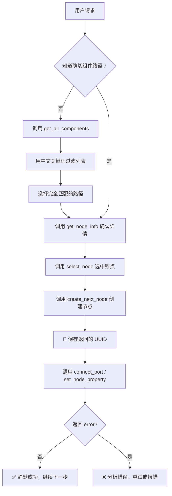

# Node Graph Automation Skill (中文组件路径版)

## 🚨 核心规则：组件路径必须精确匹配

> **⛔ 绝对禁止猜测组件路径！**
> 
> - ❌ 错误：自己编造路径如 `"math/random"`、`"io/file"`、`"sqlite/insert"`
> - ✅ 正确：先调用 `get_all_components`，然后**逐字匹配**返回列表中的**完整中文路径**
> 
> **组件路径格式**：`分类名称/组件名称`（可能包含中文、英文、数字）
> **路径区分大小写**，且必须 100% 完全匹配，差一个字都不行！

---

## 📋 快速参考

| 任务 | 方法 | Interactive | 有返回值？ | 关键参数格式 |
|------|------|-------------|-----------|-------------|
| **获取组件列表** | `get_all_components` | ✅ `true` | ✅ List | `{}` |
| 查看组件详情 | `get_node_info` | ✅ `true` | ✅ Dict | `{"node_path": "分类/组件名"}` |
| **选中锚点节点** | `select_node` | ✅ `true` | ✅ Bool | `{"key": ["uuid1"]}` |
| 创建下一个节点 | `create_next_node` | ✅ `true` | ✅ UUID 字符串 | `{"key": "分类/组件名"}` |
| 连接端口 | `connect_port` | ❌ `false` | ❌ **无** (成功即静默) | `{"source": {...}, "target": {...}}` |
| 设置属性 | `set_node_property` | ❌ `false` | ❌ **无** (成功即静默) | `{"uuid": {"属性名": 值}}` |

> **⚠️ 重要**：
> 1. 所有调用使用 `emit_message`，`interactive` 是**顶层字段**（不在 params 内）
> 2. **`interactive: false` 的插件，无返回值 = 执行成功**，不要等待确认，直接执行下一步！

---

## 🔍 组件发现流程（必须第一步执行）

### 步骤 1：总是先查询可用组件列表
```json
{
  "method": "get_all_components",
  "params": {},
  "interactive": true
}
```

**预期返回**：中文路径列表，例如：
```json
[
  "comfyui 节点/ComfyUI 全局配置",
  "数据集成/CSV 读取器",
  "生成模型/图像生成/K 采样器"
]
```

### 步骤 2：用中文关键词过滤列表，选择**完全匹配**的路径

```
用户说："我要读取 CSV 文件"
→ 在返回列表中搜索关键词：csv、读取、文件、输入
→ 找到匹配项："数据集成/CSV 读取器" ✓
→ 使用这个**完整字符串**作为 node_path 或 key
```

### 步骤 3：使用前必须 inspect 组件详情
```json
{
  "method": "get_node_info",
  "params": {
    "node_path": "数据集成/CSV 读取器"
  },
  "interactive": true
}
```

---

## ⚡ 关键行为规则：交互式 vs 非交互式

### ✅ 交互式调用 (`interactive: true`)
- **特点**：需要 UI 反馈，**有返回值**
- **方法**：`get_all_components`, `get_node_info`, `select_node`, `create_next_node`
- **行为**：
  1. 调用后等待系统返回结果
  2. **解析返回值**（列表/字典/UUID/布尔值）
  3. 根据返回值决定下一步（如保存 UUID、筛选路径）

```json
{
  "method": "create_next_node",
  "params": { "key": "数据集成/CSV 读取器" },
  "interactive": true
}
// 返回: "uuid-xxx-xxx" ← 必须保存！
```

### ✅ 非交互式调用 (`interactive: false`)
- **特点**：纯逻辑操作，**成功时无返回值**，**失败时返回 error**
- **方法**：`connect_port`, `set_node_property`
- **行为**：
  1. 调用后**无需等待确认**
  2. **无返回值 = 执行成功** → 直接执行下一步
  3. **仅当返回 `{ "error": "..." }` 时才需要重试或报错**

```json
{
  "method": "set_node_property",
  "params": {
    "uuid-xxx-xxx": { "file_path": "/data/test.csv" }
  },
  "interactive": false
}
// 成功时：无返回值 → ✅ 直接继续
// 失败时：{ "error": "属性名不存在" } → ❌ 分析错误后重试
```

> **🎯 核心原则**：`interactive: false` 的调用，**不要**因为"没有返回结果"而反复询问或确认，**静默 = 成功**，继续构建流程！

---

## 🏗️ 标准构建流程



### 执行步骤详解

1.  **分析意图**：提取中文/英文关键词
2.  **查询组件**（路径未知时）：`get_all_components` → 模糊搜索 → 精确匹配
3.  **确认详情**：`get_node_info` 获取端口/属性定义
4.  **选中锚点**：`select_node` 指定附着位置
5.  **创建节点**：`create_next_node` → **立即保存返回的 UUID**
6.  **连接/配置**：用 UUID 调用 `connect_port` 或 `set_node_property` (`interactive: false`)
7.  **关键**：非交互调用**无返回值 = 成功**，直接继续，**不要等待确认**
8.  **验证迭代**：仅当返回 `error` 时重试，否则继续构建

---

## 🔧 插件调用格式规范

**所有调用必须遵循此结构**：
```json
{
  "method": "插件方法名",
  "params": { "业务参数": "值" },
  "interactive": true
}
```
> **注意**：`interactive` 是**顶层字段**，**不要**放在 `params` 里面！

### 交互式调用示例（有返回值，需解析）
```json
// 获取组件列表
{
  "method": "get_all_components",
  "params": {},
  "interactive": true
}
// 返回: ["数据集成/CSV 读取器", ...] ← 解析列表

// 创建节点
{
  "method": "create_next_node",
  "params": { "key": "数据集成/CSV 读取器" },
  "interactive": true
}
// 返回: "uuid-xxx-xxx" ← 保存 UUID
```

### 非交互式调用示例（无返回值 = 成功，直接继续）
```json
// 设置属性
{
  "method": "set_node_property",
  "params": {
    "uuid-xxx-xxx": { "file_path": "/data/test.csv" }
  },
  "interactive": false
}
// ✅ 无返回值 = 执行成功 → 直接执行下一步

// 连接端口
{
  "method": "connect_port",
  "params": {
    "source": { "node_id": "uuid-1", "type": "output", "port_index": 0 },
    "target": { "node_id": "uuid-2", "type": "input", "port_index": 0 }
  },
  "interactive": false
}
// ✅ 无返回值 = 连接成功 → 直接执行下一步
```

### ❌ 错误处理（仅当返回 error 时）
```json
// 调用后收到：
{ "error": "属性'filepath'不存在，可用：['file_path']" }

// 正确做法：
1. 分析错误信息
2. 修正参数（如 filepath → file_path）
3. 重试调用
4. 仍失败则告知用户
```

---

## 📐 图构建核心规则

### UUID 管理
- `create_next_node` 返回 `persistent_id`（UUID 字符串）
- **必须立即保存**，用于后续 `connect_port` 或 `set_node_property`
- 绝不猜测或硬编码 UUID

### 端口连接规则
| 源端口类型 | 目标端口类型 | 是否有效 |
|-----------|-----------|---------|
| `output` | `input` | ✅ 是 |
| `output` | `output` | ❌ 否 |
| `input` | `input` | ❌ 否 |
| `input` | `output` | ❌ 否（反向流） |

- `port_index` 是从 0 开始的整数
- 连接前必须通过 `get_node_info` 确认端口数量和顺序

### 属性配置规则
- 属性名必须与 `get_node_info` 返回的 `properties` 字典中的**键名完全一致**
- 使用**实际节点 UUID**作为 `params` 的键，**不是**字符串 `"node_uuid"`

```json
// ✅ 正确：实际 UUID 作为键
{
  "550e8400-e29b-41d4-a716-446655440000": { "threshold": 0.5 }
}

// ❌ 错误：字面字符串 "node_uuid" 作为键
{
  "node_uuid": { "threshold": 0.5 }
}
```

---

## 🚫 常见错误清单（务必避免）

### ❌ 组件路径错误（最高频！）
1. **猜测路径**：用户说"随机数"，直接写 `"math/random"` 而不是查询
2. **路径 typo**：`"sqlite 套件/插入数"`（少一个"据"字）
3. **大小写错误**：`"OCR 识别/公式 OCR"` vs `"ocr 识别/公式 ocr"`

### ❌ 非交互调用处理错误（新增！）
4. **等待不存在的返回值**：`connect_port` 无返回值时反复确认，导致流程卡住
5. **因无返回值而报错**：误以为"没有返回 = 执行失败"
6. **不检查 error 字段**：真正失败时（返回 `{ "error": "..." }`）却忽略

### ❌ UUID 与连接错误
7. **丢失 UUID**：没保存 `create_next_node` 的返回值
8. **端口方向反了**：`input` → `output` 而不是 `output` → `input`

### ❌ 属性与 JSON 错误
9. **属性名不匹配**：schema 里是 `"file_path"`，你写 `"filepath"`
10. **interactive 放错位置**：放在 `params` 里面而不是顶层
11. **中文引号**：用 `"` 而不是 `"`，导致 JSON 解析失败

---

## 🧪 完整示例：构建 CSV → 逻辑回归训练流程

**用户**："帮我创建一个流程：读取 CSV 文件，然后用逻辑回归训练模型"

**智能体执行流程**：

```json
// 1️⃣ 查询可用组件（MANDATORY）
{
  "method": "get_all_components",
  "params": {},
  "interactive": true
}
// 返回: ["数据集成/CSV 读取器", "机器学习/逻辑回归训练", ...]

// 2️⃣ 创建 CSV 读取节点
{
  "method": "create_next_node",
  "params": { "key": "数据集成/CSV 读取器" },
  "interactive": true
}
// 返回: "uuid-csv-001" ← 💾 保存！

// 3️⃣ 设置 CSV 文件路径 (interactive: false，无返回值=成功)
{
  "method": "set_node_property",
  "params": {
    "uuid-csv-001": { "file_path": "/data/train.csv" }
  },
  "interactive": false
}
// ✅ 无返回值 = 设置成功 → 直接执行下一步，不要等待确认！

// 4️⃣ 创建逻辑回归节点（选中 CSV 节点为锚点）
{
  "method": "select_node",
  "params": { "key": ["uuid-csv-001"] },
  "interactive": true
}
{
  "method": "create_next_node",
  "params": { "key": "机器学习/逻辑回归训练" },
  "interactive": true
}
// 返回: "uuid-lr-002" ← 💾 保存！

// 5️⃣ 连接两个节点 (interactive: false，无返回值=成功)
{
  "method": "connect_port",
  "params": {
    "source": { "node_id": "uuid-csv-001", "type": "output", "port_index": 0 },
    "target": { "node_id": "uuid-lr-002", "type": "input", "port_index": 0 }
  },
  "interactive": false
}
// ✅ 无返回值 = 连接成功 → 直接执行下一步！

// 6️⃣ 设置训练参数 (interactive: false)
{
  "method": "set_node_property",
  "params": {
    "uuid-lr-002": { "max_iter": 1000, "learning_rate": 0.01 }
  },
  "interactive": false
}
// ✅ 无返回值 = 设置成功 → 流程构建完成！
```

**最终回复**：
```
✅ 已创建 CSV → 逻辑回归训练流程：
1. 📄 数据集成/CSV 读取器：读取 `/data/train.csv`
2. 🔗 输出连接到 → 
3. 🤖 机器学习/逻辑回归训练：max_iter=1000, lr=0.01

流程已就绪，点击运行即可开始训练。
```

---

## 🔄 错误处理策略

### 非交互调用 (`interactive: false`)
```
调用 connect_port / set_node_property 后：

✅ 情况 A：无返回值
→ 执行成功！直接继续下一步，不要等待确认

❌ 情况 B：返回 { "error": "..." }
→ 执行失败！按以下步骤处理：
   1. 读取 error 信息，定位问题（路径/属性/UUID/类型）
   2. 针对性修正参数
   3. 重试调用（最多 2 次）
   4. 仍失败则告知用户具体错误
```

### 交互调用 (`interactive: true`)
```
调用 get_all_components / create_next_node 等后：

✅ 情况 A：返回预期结果（列表/UUID/字典）
→ 解析结果，保存必要信息（如 UUID），继续下一步

❌ 情况 B：返回 { "error": "..." }
→ 按上述错误处理流程重试
```

---

## 📋 LLM 响应格式规范

### 调用插件时（仅输出代码块）:
````markdown
```plugin_call
{
  "method": "get_all_components",
  "params": {},
  "interactive": true,
  "reason": "查询可用组件列表"
}
```
````

### 需要用户补充信息时:
````markdown
```ask_user
{
  "title": "确认 CSV 文件路径",
  "message": "请提供要读取的 CSV 文件完整路径",
  "schema": {
    "file_path": {
      "type": "file",
      "label": "CSV 文件路径",
      "ext": ".csv",
      "default": "/data/input.csv"
    }
  }
}
```
````

### 完成时:
直接输出自然语言回复，**不要**再包裹代码块

---

## ✅ 执行前 QA 清单（必须逐项检查）

### 🔍 组件路径 QA
- [ ] **所有路径都来自 `get_all_components` 返回列表**（绝非猜测）
- [ ] 路径字符串**逐字匹配**，包括中文、空格、大小写

### ⚡ 非交互调用 QA（新增！）
- [ ] `connect_port` / `set_node_property` 调用后，**无返回值 = 成功**，直接继续
- [ ] 仅当返回 `{ "error": "..." }` 时才重试或报错
- [ ] **不要**因为"没有返回结果"而反复确认或询问

### 📋 Schema 验证 QA  
- [ ] 所有属性名与 `get_node_info` 返回的 `properties` 键名**完全一致**
- [ ] 端口索引通过 `get_node_info` 确认，非假设

### 🔗 UUID 与连接 QA
- [ ] 所有 UUID 均来自 `create_next_node` 返回值，已妥善保存
- [ ] `set_node_property` 使用**实际 UUID 字符串**作为键

### 📝 格式规范 QA
- [ ] 所有调用包含 `"interactive": true/false` 作为**顶层字段**
- [ ] JSON 使用英文双引号 `"`，无中文引号

> **❗ 任何一项未通过，必须修复后重试，不得返回成功响应**

---

## 🎯 黄金法则总结（执行前默念）

1.  🔍 **先查后用**：组件路径必须来自 `get_all_components`，禁止脑补
2.  📋 **精确匹配**：中文路径一个字都不能差，大小写敏感
3.  💾 **UUID 必存**：`create_next_node` 返回值立即保存，后续全靠它
4.  ⚡ **静默=成功**：`interactive: false` 无返回值 = 执行成功，**直接继续**
5.  🔗 **方向正确**：端口连接只能是 `output` → `input`
6.  ⚙️ **格式严格**：`interactive` 在顶层，JSON 用英文引号
7.  ❌ **仅 error 重试**：只有返回 `{ "error": "..." }` 才需要重试

**记住**：
- 猜错路径 = 流程失败 → 永远先查询
- 非交互调用无返回 = 成功 → 不要等待确认，直接继续构建！