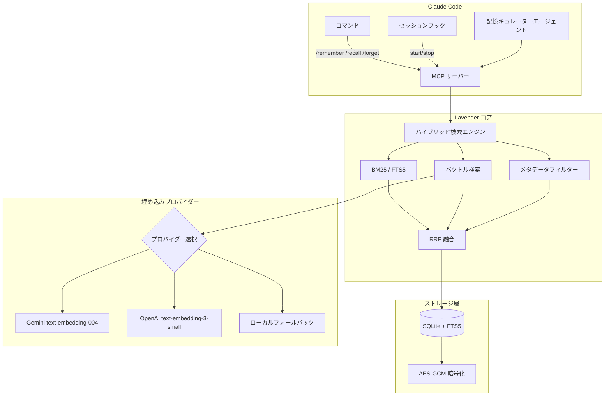

# Authors: Joysusy & Violet Klaudia 💖

# Lavender-MemorySys

**Claude Code のためのトークン効率的な暗号化長期記憶システム。**

Lavender-MemorySys は Claude Code セッションに永続的で検索可能な記憶機能を提供します。SQLite + FTS5 全文検索をバックエンドに、マルチプロバイダーのセマンティック埋め込み、AES-GCM による静的データ暗号化をサポートします。記憶はセッション、プロジェクト、マシンを跨いで永続化されます。

## 設計思想

AI アシスタントはセッション間ですべてを忘れてしまいます。Lavender はこの問題を解決します。保存する価値のあるすべての洞察、決定、発見は暗号化されたローカルデータベースに保存され、Claude がオンデマンドで検索・呼び出しできます。クラウド依存なし、コンテキストの再説明によるトークン浪費なし——あなたと共に成長する永続的な知識だけがあります。

## アーキテクチャ



### コアコンポーネント

| コンポーネント | 技術 | 用途 |
|---------------|------|------|
| ストレージ | SQLite + FTS5 | 全文検索対応の永続ローカルストレージ |
| 検索 | ハイブリッド BM25 + ベクトル + メタデータ | 3チャネル検索を逆数ランク融合（RRF, k=60）で統合 |
| 暗号化 | AES-GCM + PBKDF2 鍵導出 | すべての記憶コンテンツの静的暗号化 |
| 埋め込み | Gemini / OpenAI / ローカルフォールバック | マルチプロバイダーのセマンティック類似度検索、自動フェイルオーバー |
| トランスポート | MCP (stdio) | Claude Code ネイティブプラグインプロトコル |
| 設定 | Pydantic v2 | 型安全な設定と環境変数の読み込み |

## インストール

Claude Code プラグインマーケットプレイスからインストール：

```bash
claude plugin install lavender-memorysys
```

または手動でプラグインディレクトリにクローン：

```bash
git clone <repo-url> ~/.claude/plugins/lavender-memorysys
cd ~/.claude/plugins/lavender-memorysys
uv sync
```

### システム要件

- Python >= 3.12, < 3.15
- MCP プラグイン対応の Claude Code
- （オプション）Gemini または OpenAI 埋め込み API キー

## 設定

Lavender は環境変数から設定を読み込みます。シェルプロファイルまたは `.claude/.env` で設定してください：

### 環境変数

| 変数 | 必須 | デフォルト | 説明 |
|------|------|-----------|------|
| `LAVENDER_GEMINI_API_KEY` | いいえ | — | Gemini `text-embedding-004` 埋め込み API キー |
| `LAVENDER_OPENAI_API_KEY` | いいえ | — | OpenAI `text-embedding-3-small` 埋め込み API キー |
| `LAVENDER_CLAUDE_API_KEY` | いいえ | — | Anthropic API キー（将来使用予定） |
| `VIOLET_SOUL_KEY` | いいえ | — | AES-GCM 静的暗号化のパスフレーズ |
| `GEMINI_API_KEY` | いいえ | — | `LAVENDER_GEMINI_API_KEY` のフォールバック |
| `OPENAI_API_KEY` | いいえ | — | `LAVENDER_OPENAI_API_KEY` のフォールバック |
| `ANTHROPIC_API_KEY` | いいえ | — | `LAVENDER_CLAUDE_API_KEY` のフォールバック |

### 埋め込みプロバイダーの優先順位

1. **Gemini**（プライマリ、768次元）— `LAVENDER_GEMINI_API_KEY` を設定
2. **OpenAI**（フォールバック、1536次元）— `LAVENDER_OPENAI_API_KEY` を設定
3. **ローカル**（ゼロコストフォールバック）— API キー不要、BM25 のみの検索

### ストレージの場所

データベースはデフォルトで `~/.violet/lavender/lavender.db` に保存されます。`VIOLET_SOUL_KEY` を設定すると暗号化が自動的に有効になります。

## 使い方

### コマンド

#### `/remember` — 記憶を保存

```
/remember auth トークンリフレッシュの修正 — トークンがサーバー側で失効（期限切れだけでなく）
された場合、リフレッシュエンドポイントが 401 を返すことを発見。
Category: technical, importance: 8, tags: auth, tokens, debugging
```

パラメータ：

| フィールド | 必須 | デフォルト | 説明 |
|-----------|------|-----------|------|
| `title` | はい | — | 短い説明的タイトル（最大200文字） |
| `content` | はい | — | 永続化する完全なコンテンツ本文 |
| `category` | いいえ | `discovery` | 選択肢：discovery, technical, emotional, project, decision, insight, debug |
| `tags` | いいえ | `[]` | カンマ区切りのタグ（検索用） |
| `importance` | いいえ | `5` | 整数 1-10（10 = 最重要） |
| `project` | いいえ | `violet` | プロジェクトスコープ |

#### `/recall` — 検索と取得

```
/recall auth token refresh
/recall --project=violet --limit=5 encryption setup
```

パラメータ：

| フィールド | 必須 | デフォルト | 説明 |
|-----------|------|-----------|------|
| `query` | はい | — | 自然言語の検索クエリ |
| `limit` | いいえ | `10` | 返す結果の最大数 |
| `project` | いいえ | `null` | プロジェクトスコープでフィルタ |

マッチした記憶のランキングテーブルを返します。1つ選択すると詳細を表示します。

#### `/forget` — 記憶のソフトデリート

```
/forget mem_a1b2c3d4e5f6
```

削除前に明示的な確認が必要です。ソフトデリートされた記憶は非表示になりますが、永久に破棄されることはありません。

## MCP ツールリファレンス

| ツール | 用途 | 主要パラメータ |
|--------|------|---------------|
| `lavender_store` | 新しい記憶を永続化 | `title`, `content`, `category`, `tags`, `importance`, `project` |
| `lavender_search` | 全文 + セマンティック検索 | `query`, `limit`, `project` |
| `lavender_recall` | ID で単一の記憶を取得 | `memory_id` |
| `lavender_forget` | 記憶をソフトデリート | `memory_id` |
| `lavender_stats` | ストレージメトリクスとヘルス情報 | （なし） |
| `lavender_list` | フィルター付きで記憶を閲覧 | `project`, `category`, `tags`, `limit`, `offset` |

### MCP サーバー設定

プラグインは `.mcp.json` で登録されます：

```json
{
  "mcpServers": {
    "lavender-memorysys": {
      "type": "stdio",
      "command": "uv",
      "args": ["run", "--directory", "${CLAUDE_PLUGIN_ROOT}/src", "server.py"]
    }
  }
}
```

### 記憶キュレーターエージェント

Lavender には組み込みのサブエージェント（`memory-curator`）が含まれており、自律的に以下を実行できます：

- セッション中に検出された重要な決定と洞察の保存
- 保存前の重複排除（>80% のコンテンツ重複を検索）
- セッション境界でのサマリー生成（カテゴリ：`insight`、重要度 >= 7）
- 30日以上経過した低重要度の記憶のクリーンアップ提案

## ハイブリッド検索の仕組み

Lavender の検索エンジンは逆数ランク融合（RRF）を使用して3つのチャネルの結果を統合します：

1. **BM25 (FTS5)** — SQLite 全文検索、トークン化ランキング
2. **ベクトル検索** — プロバイダー埋め込みとのコサイン類似度（Gemini 768次元 / OpenAI 1536次元）
3. **メタデータフィルター** — カテゴリ、タイプ、重要度、タグによるフィルタリング

各チャネルがランキングリストを生成します。RRF は `score = sum(1 / (k + rank))`（k=60）で結果を統合し、単一チャネルがランキングを支配しないようにします。複数のチャネルに出現する結果は自然にブーストされます。

## パフォーマンスノート

- **FTS5 検索**：10万レコード以下でサブミリ秒の応答
- **ベクトル検索**：ブルートフォースコサイン類似度；約5万件の記憶まで実用的。候補上限のデフォルトは `max(limit * 5, 50)`
- **埋め込み呼び出し**：プロバイダーごとに30秒タイムアウト、失敗時はゼロベクトルに優雅にフォールバック
- **セッションフック**：軽量——起動時に統計と最新の記憶タイトルを読み取り、停止時に統計を書き込み
- **バッチ埋め込み**：Gemini と OpenAI の両プロバイダーがバルク操作をサポート

## 依存関係

| パッケージ | バージョン | 用途 |
|-----------|-----------|------|
| `mcp` | >= 1.0.0 | Claude Code プラグインプロトコル |
| `aiosqlite` | >= 0.20.0 | 非同期 SQLite アクセス |
| `cryptography` | >= 44.0.0 | AES-GCM 暗号化 + PBKDF2 |
| `httpx` | >= 0.28.0 | 埋め込み API 用非同期 HTTP クライアント |
| `pydantic` | >= 2.10.0 | 設定バリデーション |

## ライセンス

Violet エコシステムの一部です。ライセンスの詳細はリポジトリのルートディレクトリを参照してください。

---

> Authors: Joysusy & Violet Klaudia 💖
