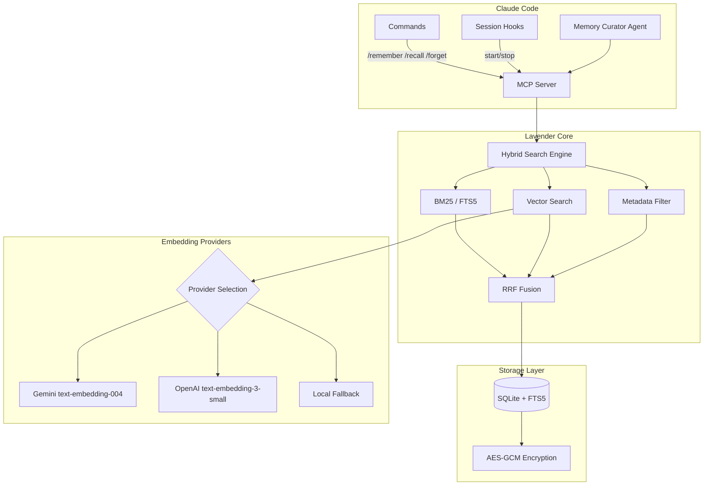

# Authors: Joysusy & Violet Klaudia 💖

# Lavender-MemorySys

**Token-efficient encrypted long-term memory for Claude Code.**

Lavender-MemorySys gives your Claude Code sessions persistent, searchable memory backed by SQLite + FTS5 full-text search, optional multi-provider semantic embeddings, and AES-GCM encryption at rest. Memories survive across sessions, projects, and machines.

## Philosophy

AI assistants forget everything between sessions. Lavender fixes that. Every insight, decision, and discovery worth keeping gets stored in an encrypted local database that Claude can search and recall on demand. No cloud dependency, no token waste re-explaining context — just persistent knowledge that grows with you.

## Architecture



### Key Components

| Component | Technology | Purpose |
|-----------|-----------|---------|
| Storage | SQLite + FTS5 | Persistent local storage with full-text search |
| Search | Hybrid BM25 + Vector + Metadata | Three-channel search fused via Reciprocal Rank Fusion (RRF, k=60) |
| Encryption | AES-GCM with PBKDF2 key derivation | At-rest encryption for all memory content |
| Embeddings | Gemini / OpenAI / Local fallback | Multi-provider semantic similarity with automatic failover |
| Transport | MCP (stdio) | Native Claude Code plugin protocol |
| Config | Pydantic v2 | Type-safe configuration with environment variable loading |

## Installation

Install from the Claude Code plugin marketplace:

```bash
claude plugin install lavender-memorysys
```

Or clone manually into your plugins directory:

```bash
git clone <repo-url> ~/.claude/plugins/lavender-memorysys
cd ~/.claude/plugins/lavender-memorysys
uv sync
```

### Requirements

- Python >= 3.12, < 3.15
- Claude Code with MCP plugin support
- (Optional) API key for Gemini or OpenAI embeddings

## Configuration

Lavender loads configuration from environment variables. Set them in your shell profile or `.claude/.env`:

### Environment Variables

| Variable | Required | Default | Description |
|----------|----------|---------|-------------|
| `LAVENDER_GEMINI_API_KEY` | No | — | Gemini API key for `text-embedding-004` embeddings |
| `LAVENDER_OPENAI_API_KEY` | No | — | OpenAI API key for `text-embedding-3-small` embeddings |
| `LAVENDER_CLAUDE_API_KEY` | No | — | Anthropic API key (reserved for future use) |
| `VIOLET_SOUL_KEY` | No | — | Encryption passphrase for AES-GCM at-rest encryption |
| `GEMINI_API_KEY` | No | — | Fallback for `LAVENDER_GEMINI_API_KEY` |
| `OPENAI_API_KEY` | No | — | Fallback for `LAVENDER_OPENAI_API_KEY` |
| `ANTHROPIC_API_KEY` | No | — | Fallback for `LAVENDER_CLAUDE_API_KEY` |

### Embedding Provider Priority

1. **Gemini** (primary, 768 dimensions) — set `LAVENDER_GEMINI_API_KEY`
2. **OpenAI** (fallback, 1536 dimensions) — set `LAVENDER_OPENAI_API_KEY`
3. **Local** (zero-cost fallback) — no API key needed, BM25-only search

### Storage Location

Database is stored at `~/.violet/lavender/lavender.db` by default. Encryption is enabled automatically when `VIOLET_SOUL_KEY` is set.

## Usage

### Commands

#### `/remember` — Store a Memory

```
/remember Fix auth token refresh — discovered that the refresh endpoint
returns 401 when the token has been revoked server-side, not just expired.
Category: technical, importance: 8, tags: auth, tokens, debugging
```

Parameters:

| Field | Required | Default | Description |
|-------|----------|---------|-------------|
| `title` | Yes | — | Short descriptive title (max 200 chars) |
| `content` | Yes | — | Full content body to persist |
| `category` | No | `discovery` | One of: discovery, technical, emotional, project, decision, insight, debug |
| `tags` | No | `[]` | Comma-separated tags for retrieval |
| `importance` | No | `5` | Integer 1-10 (10 = critical) |
| `project` | No | `violet` | Project scope |

#### `/recall` — Search and Retrieve

```
/recall auth token refresh
/recall --project=violet --limit=5 encryption setup
```

Parameters:

| Field | Required | Default | Description |
|-------|----------|---------|-------------|
| `query` | Yes | — | Natural language search query |
| `limit` | No | `10` | Maximum results to return |
| `project` | No | `null` | Filter by project scope |

Returns a ranked table of matching memories. Select one to view full details.

#### `/forget` — Soft-Delete a Memory

```
/forget mem_a1b2c3d4e5f6
```

Requires explicit confirmation before deletion. Soft-deleted memories are hidden but not permanently erased.

## MCP Tools Reference

| Tool | Purpose | Key Parameters |
|------|---------|---------------|
| `lavender_store` | Persist a new memory | `title`, `content`, `category`, `tags`, `importance`, `project` |
| `lavender_search` | Full-text + semantic search | `query`, `limit`, `project` |
| `lavender_recall` | Fetch a single memory by ID | `memory_id` |
| `lavender_forget` | Soft-delete a memory | `memory_id` |
| `lavender_stats` | Storage metrics and health | (none) |
| `lavender_list` | Browse memories with filters | `project`, `category`, `tags`, `limit`, `offset` |

### MCP Server Configuration

The plugin registers via `.mcp.json`:

```json
{
  "mcpServers": {
    "lavender-memorysys": {
      "type": "stdio",
      "command": "uv",
      "args": ["run", "--directory", "${CLAUDE_PLUGIN_ROOT}/src", "server.py"]
    }
  }
}
```

### Memory Curator Agent

Lavender includes a built-in sub-agent (`memory-curator`) that can autonomously:

- Store key decisions and insights detected during sessions
- Deduplicate before storing (searches for >80% content overlap)
- Summarize sessions at boundaries (category: `insight`, importance >= 7)
- Propose cleanup of low-importance memories older than 30 days

## Hybrid Search: How It Works

Lavender's search engine fuses three channels using Reciprocal Rank Fusion (RRF):

1. **BM25 (FTS5)** — SQLite full-text search with tokenized ranking
2. **Vector** — Cosine similarity against provider embeddings (Gemini 768d / OpenAI 1536d)
3. **Metadata** — Filters on category, type, importance, and tags

Each channel produces a ranked list. RRF combines them with `score = sum(1 / (k + rank))` where `k=60`, ensuring no single channel dominates. Results that appear in multiple channels get boosted naturally.

## Multi-Mind Coordination Features

Lavender includes advanced coordination capabilities for synthesizing insights across multiple Agent Minds:

### Multi-Mind Memory Synthesis

Merge perspectives from multiple Minds into a unified synthesis memory with attribution:

```python
synthesis_id = await manager.synthesize_multi_mind_memory(
    source_memory_ids=["mem_abc123", "mem_def456"],
    active_minds=["Vera", "Lyre"],
    synthesis_content="🔮 Vera emphasized layered architecture, 🦢 Lyre added bilingual documentation standards",
    title="Architecture + Documentation Synthesis"
)
```

**Features**:
- Automatic attribution tracking (which Mind contributed what)
- Synthesis links back to source memories
- Coordination pattern metadata for retrieval

### Semantic Memory Linking

Automatically discover and link related memories across Mind contexts:

```python
links_created = await manager.link_related_memories(
    memory_ids=["mem_abc123", "mem_def456", "mem_ghi789"],
    min_strength=0.3  # Similarity threshold (0.0-1.0)
)
```

**Algorithm**: Tag overlap calculation with strength scoring. Memories with ≥30% tag overlap are automatically linked.

### Mind-Aware Memory Graphs

Traverse memory links to build context graphs showing Mind involvement:

```python
graph = await manager.get_mind_memory_graph(
    memory_id="mem_abc123",
    depth=2  # Traversal depth
)
# Returns: nodes (memories), edges (links), minds_involved
```

### Coordination Analytics

Track and analyze Mind collaboration effectiveness:

```python
# Record a coordination session
await manager.record_coordination_session(
    minds=["Vera", "Lyre", "Iris"],
    task_type="feature-implementation",
    success_score=0.92,
    duration_ms=3500,
    memories_created=5
)

# Query best Mind combinations for a task type
best_teams = await manager.get_best_mind_combinations(
    task_type="feature-implementation",
    limit=5
)

# Get effectiveness metrics for a specific Mind
metrics = await manager.get_mind_effectiveness(mind_name="Vera")
# Returns: avg_success_score, total_sessions, success_rate, avg_duration_ms

# Get team suggestions based on historical performance
suggested_team = await manager.suggest_team_for_task(
    task_type="architecture-design",
    context={"priority": "high"}
)
```

**Use Cases**:
- Optimize Mind team composition for different task types
- Track collaboration patterns and success rates
- Identify high-performing Mind combinations
- Data-driven team formation

## Performance Notes

- **FTS5 search**: Sub-millisecond for databases under 100k records
- **Vector search**: Brute-force cosine similarity; practical up to ~50k memories. Candidate limit defaults to `max(limit * 5, 50)`
- **Embedding calls**: 30s timeout per provider with graceful zero-vector fallback on failure
- **Session hooks**: Lightweight — reads stats and last memory title on start, writes stats on stop
- **Batch embeddings**: Supported by both Gemini and OpenAI providers for bulk operations
- **Coordination operations**: Memory synthesis and linking are async with minimal overhead; analytics queries use indexed lookups

## Dependencies

| Package | Version | Purpose |
|---------|---------|---------|
| `mcp` | >= 1.0.0 | Claude Code plugin protocol |
| `aiosqlite` | >= 0.20.0 | Async SQLite access |
| `cryptography` | >= 44.0.0 | AES-GCM encryption + PBKDF2 |
| `httpx` | >= 0.28.0 | Async HTTP for embedding APIs |
| `pydantic` | >= 2.10.0 | Configuration validation |

## License

Part of the Violet ecosystem. See repository root for license details.

---

> Authors: Joysusy & Violet Klaudia 💖
