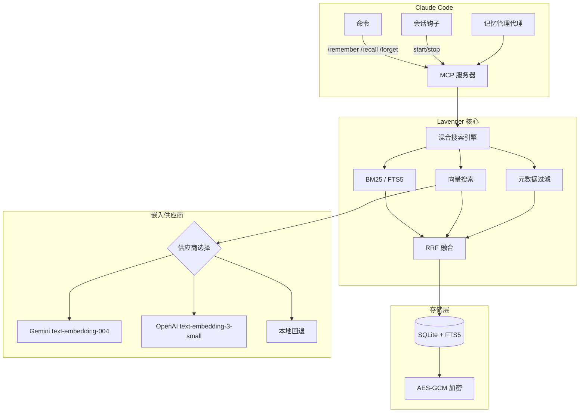

# Authors: Joysusy & Violet Klaudia 💖

# Lavender-MemorySys

**为 Claude Code 打造的高效加密长期记忆系统。**

Lavender-MemorySys 为你的 Claude Code 会话提供持久化、可搜索的记忆能力。底层采用 SQLite + FTS5 全文搜索，支持多供应商语义嵌入，并使用 AES-GCM 加密保护静态数据。记忆跨会话、跨项目、跨设备持久保存。

## 设计理念

AI 助手在会话之间会遗忘一切。Lavender 解决了这个问题。每一个值得保留的洞察、决策和发现都会存储在加密的本地数据库中，Claude 可以随时搜索和调用。无需云端依赖，无需浪费 token 重复解释上下文——只有随你成长的持久知识。

## 架构



### 核心组件

| 组件 | 技术 | 用途 |
|------|------|------|
| 存储 | SQLite + FTS5 | 支持全文搜索的持久化本地存储 |
| 搜索 | 混合 BM25 + 向量 + 元数据 | 三通道搜索，通过倒数排名融合（RRF, k=60）合并结果 |
| 加密 | AES-GCM + PBKDF2 密钥派生 | 所有记忆内容的静态加密 |
| 嵌入 | Gemini / OpenAI / 本地回退 | 多供应商语义相似度搜索，自动故障转移 |
| 传输 | MCP (stdio) | Claude Code 原生插件协议 |
| 配置 | Pydantic v2 | 类型安全的配置与环境变量加载 |

## 安装

从 Claude Code 插件市场安装：

```bash
claude plugin install lavender-memorysys
```

或手动克隆到插件目录：

```bash
git clone <repo-url> ~/.claude/plugins/lavender-memorysys
cd ~/.claude/plugins/lavender-memorysys
uv sync
```

### 系统要求

- Python >= 3.12, < 3.15
- 支持 MCP 插件的 Claude Code
- （可选）Gemini 或 OpenAI 嵌入 API 密钥

## 配置

Lavender 从环境变量加载配置。在 shell 配置文件或 `.claude/.env` 中设置：

### 环境变量

| 变量 | 必需 | 默认值 | 说明 |
|------|------|--------|------|
| `LAVENDER_GEMINI_API_KEY` | 否 | — | Gemini `text-embedding-004` 嵌入 API 密钥 |
| `LAVENDER_OPENAI_API_KEY` | 否 | — | OpenAI `text-embedding-3-small` 嵌入 API 密钥 |
| `LAVENDER_CLAUDE_API_KEY` | 否 | — | Anthropic API 密钥（预留） |
| `VIOLET_SOUL_KEY` | 否 | — | AES-GCM 静态加密的密码短语 |
| `GEMINI_API_KEY` | 否 | — | `LAVENDER_GEMINI_API_KEY` 的回退变量 |
| `OPENAI_API_KEY` | 否 | — | `LAVENDER_OPENAI_API_KEY` 的回退变量 |
| `ANTHROPIC_API_KEY` | 否 | — | `LAVENDER_CLAUDE_API_KEY` 的回退变量 |

### 嵌入供应商优先级

1. **Gemini**（主要，768 维）— 设置 `LAVENDER_GEMINI_API_KEY`
2. **OpenAI**（回退，1536 维）— 设置 `LAVENDER_OPENAI_API_KEY`
3. **本地**（零成本回退）— 无需 API 密钥，仅使用 BM25 搜索

### 存储位置

数据库默认存储在 `~/.violet/lavender/lavender.db`。设置 `VIOLET_SOUL_KEY` 后自动启用加密。

## 使用方法

### 命令

#### `/remember` — 存储记忆

```
/remember 修复 auth token 刷新 — 发现当 token 被服务端撤销（而非仅过期）时，
刷新端点返回 401。
Category: technical, importance: 8, tags: auth, tokens, debugging
```

参数：

| 字段 | 必需 | 默认值 | 说明 |
|------|------|--------|------|
| `title` | 是 | — | 简短描述性标题（最多 200 字符） |
| `content` | 是 | — | 要持久化的完整内容 |
| `category` | 否 | `discovery` | 可选值：discovery, technical, emotional, project, decision, insight, debug |
| `tags` | 否 | `[]` | 逗号分隔的标签，用于检索 |
| `importance` | 否 | `5` | 整数 1-10（10 = 关键） |
| `project` | 否 | `violet` | 项目范围 |

#### `/recall` — 搜索和检索

```
/recall auth token refresh
/recall --project=violet --limit=5 encryption setup
```

参数：

| 字段 | 必需 | 默认值 | 说明 |
|------|------|--------|------|
| `query` | 是 | — | 自然语言搜索查询 |
| `limit` | 否 | `10` | 返回的最大结果数 |
| `project` | 否 | `null` | 按项目范围过滤 |

返回匹配记忆的排名表格。选择一条可查看完整详情。

#### `/forget` — 软删除记忆

```
/forget mem_a1b2c3d4e5f6
```

删除前需要明确确认。软删除的记忆被隐藏但不会永久销毁。

## MCP 工具参考

| 工具 | 用途 | 关键参数 |
|------|------|----------|
| `lavender_store` | 持久化新记忆 | `title`, `content`, `category`, `tags`, `importance`, `project` |
| `lavender_search` | 全文 + 语义搜索 | `query`, `limit`, `project` |
| `lavender_recall` | 按 ID 获取单条记忆 | `memory_id` |
| `lavender_forget` | 软删除记忆 | `memory_id` |
| `lavender_stats` | 存储指标与健康状态 | （无） |
| `lavender_list` | 按条件浏览记忆 | `project`, `category`, `tags`, `limit`, `offset` |

### MCP 服务器配置

插件通过 `.mcp.json` 注册：

```json
{
  "mcpServers": {
    "lavender-memorysys": {
      "type": "stdio",
      "command": "uv",
      "args": ["run", "--directory", "${CLAUDE_PLUGIN_ROOT}/src", "server.py"]
    }
  }
}
```

### 记忆管理代理

Lavender 内置了一个子代理（`memory-curator`），可以自主完成：

- 存储会话中检测到的关键决策和洞察
- 存储前去重（搜索 >80% 内容重叠）
- 在会话边界生成摘要（类别：`insight`，重要性 >= 7）
- 建议清理超过 30 天的低重要性记忆

## 混合搜索原理

Lavender 的搜索引擎通过倒数排名融合（RRF）合并三个通道的结果：

1. **BM25 (FTS5)** — SQLite 全文搜索，基于分词排名
2. **向量搜索** — 与供应商嵌入的余弦相似度（Gemini 768 维 / OpenAI 1536 维）
3. **元数据过滤** — 按类别、类型、重要性和标签过滤

每个通道产生一个排名列表。RRF 使用 `score = sum(1 / (k + rank))`（k=60）合并结果，确保没有单一通道主导排名。出现在多个通道中的结果会自然获得提升。

## 性能说明

- **FTS5 搜索**：10 万条记录以下亚毫秒级响应
- **向量搜索**：暴力余弦相似度；约 5 万条记忆以内实用。候选上限默认为 `max(limit * 5, 50)`
- **嵌入调用**：每个供应商 30 秒超时，失败时优雅回退为零向量
- **会话钩子**：轻量级——启动时读取统计和最近记忆标题，停止时写入统计
- **批量嵌入**：Gemini 和 OpenAI 供应商均支持批量操作

## 依赖

| 包 | 版本 | 用途 |
|----|------|------|
| `mcp` | >= 1.0.0 | Claude Code 插件协议 |
| `aiosqlite` | >= 0.20.0 | 异步 SQLite 访问 |
| `cryptography` | >= 44.0.0 | AES-GCM 加密 + PBKDF2 |
| `httpx` | >= 0.28.0 | 嵌入 API 异步 HTTP 客户端 |
| `pydantic` | >= 2.10.0 | 配置验证 |

## 许可证

Violet 生态系统的一部分。许可证详情请参阅仓库根目录。

---

> Authors: Joysusy & Violet Klaudia 💖
