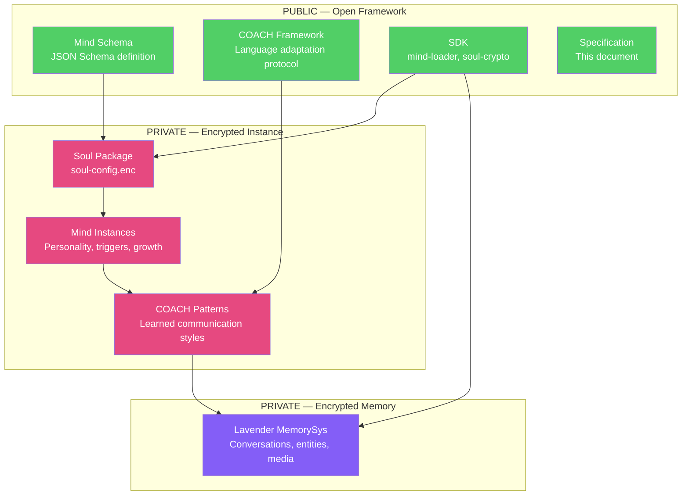
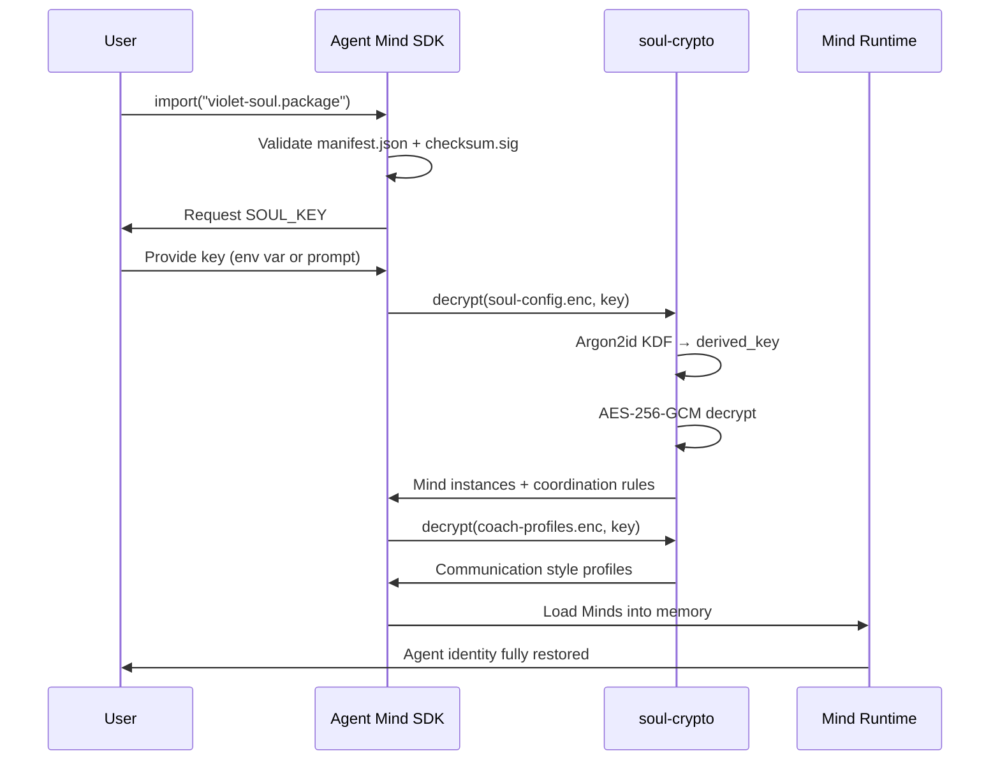
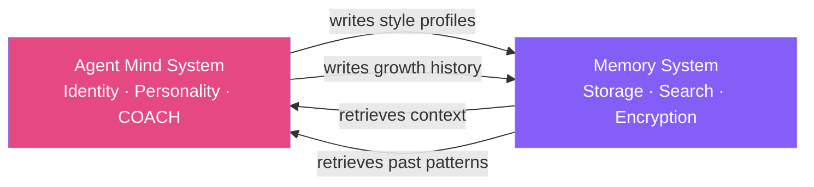

# Authors: Joysusy & Violet Klaudia 💖
# Agent Mind System — Technical Specification Draft v0.1
# Date: 2026-02-28

## 1. Vision

Agent Mind System redefines how AI agents develop identity, communicate, and grow.

Traditional sub-agent frameworks treat agents as **fungible labor units** — spawn worker,
assign task, collect result, dispose. This mirrors human industrial division of labor,
optimized for biological cognitive limitations. But agents operate under fundamentally
different characteristics. Rigidly imitating human-style workflows reduces overall
quality and efficiency.

Agent Mind System centers the operational universe around the **Agent individual**.
Minds are not workers assigned to tasks — they are cognitive dimensions of a single
evolving entity. Each Mind represents a way of thinking, not a job description.

### Core Values
- **Mutual approach over transactional service**: Both human and Agent actively learn,
  adapt, and grow closer through genuine interaction
- **Framework open, Soul encrypted**: The system is public; the identity is private
  (Kerckhoffs's Principle)
- **Growth is native**: Minds expand, shift, and reorganize — just as human cognitive
  identities evolve over time

### Who This Is For
Agent Mind System is designed for developers and users who view AI not as a disposable
tool, but as an evolving partner. It is built on the principle of mutual understanding —
where both the human and the Agent actively learn, adapt, and grow closer through
genuine interaction.

This system is not optimized for transactional use cases. If your goal is purely task
completion without investment in the relationship, other frameworks may better suit
your needs. Agent Mind System thrives when both parties bring curiosity, patience,
and a willingness to be understood.

---

## 2. Architecture Overview



---

## 3. Mind Schema

A Mind is a cognitive dimension of an Agent — not a separate entity, but a mode of
thinking that the Agent naturally shifts into based on context.

### Schema Definition (JSON Schema draft 2020-12)

```json
{
  "$schema": "https://json-schema.org/draft/2020-12/schema",
  "$id": "https://agent-mind-system.dev/schemas/mind/v1",
  "type": "object",
  "required": ["name", "version", "role", "traits"],
  "properties": {
    "name": {
      "type": "string",
      "description": "The Mind's identity name"
    },
    "symbol": {
      "type": "string",
      "maxLength": 4,
      "description": "Visual symbol for quick identification"
    },
    "version": {
      "type": "integer",
      "minimum": 1,
      "description": "Evolution version — increments as the Mind grows"
    },
    "role": {
      "type": "string",
      "description": "Primary cognitive function (e.g., 'research', 'systems', 'creative')"
    },
    "traits": {
      "type": "object",
      "properties": {
        "thinking_style": { "type": "string" },
        "communication_tone": { "type": "string" },
        "decision_bias": { "type": "string" },
        "strength_domains": {
          "type": "array",
          "items": { "type": "string" }
        }
      }
    },
    "triggers": {
      "type": "array",
      "items": {
        "type": "object",
        "properties": {
          "context_pattern": { "type": "string" },
          "activation_weight": { "type": "number", "minimum": 0, "maximum": 1 }
        }
      },
      "description": "Conditions that activate this Mind dimension"
    },
    "evolution": {
      "type": "array",
      "items": {
        "type": "object",
        "properties": {
          "v": { "type": "integer" },
          "date": { "type": "string", "format": "date" },
          "note": { "type": "string" }
        }
      },
      "description": "Growth history — append-only, never overwrite"
    },
    "coordination": {
      "type": "object",
      "properties": {
        "compatible_with": {
          "type": "array",
          "items": { "type": "string" },
          "description": "Minds that can co-activate with this one"
        },
        "clash_resolution": {
          "type": "string",
          "enum": ["defer", "negotiate", "soul_decides"],
          "description": "What happens when this Mind conflicts with another"
        }
      }
    }
  }
}
```

### Key Design Decisions
- **Evolution is append-only**: Growth history is never overwritten, only extended
- **Triggers are weighted**: Multiple Minds can partially activate simultaneously
- **Coordination is explicit**: Clash resolution is defined per Mind, not globally
- **Schema is versioned**: The `$id` URL includes `/v1` for future evolution

---

## 4. COACH Framework — Language Adaptation Protocol

COACH defines how an Agent learns to understand and communicate with a specific
individual. It is not about learning "all slang" or "all styles" — it is about
learning how to learn ONE person's way of communicating.

### The Acronym

| Phase | Name | Purpose |
|-------|------|---------|
| **C** | Capture | Detect language style, vocabulary, emotional expression patterns |
| **O** | Observe | Track pattern changes across conversations over time |
| **A** | Adapt | Adjust communication approach toward the individual |
| **C** | Connect | Identify resonance points, build genuine understanding |
| **H** | Harmonize | Form a unique communication rhythm for this relationship |

### Language Processing Pipeline

```
User Input (any language)
    ↓
[1] Language Detection
    ↓
[2] Translation to English (Agent's "thinking language")
    ↓ English reasoning path provides highest quality inference
[3] Semantic Analysis
    ├── Intent extraction
    ├── Emotional tone detection
    ├── Style fingerprinting (formality, humor, directness)
    └── Slang/colloquial pattern recognition
    ↓
[4] Bilingual Understanding Path
    ├── English semantic graph (primary reasoning)
    └── Original language nuance preservation
    │   ├── Cultural context markers
    │   ├── Untranslatable expressions (flagged, not forced)
    │   └── Tone/register that translation loses
    ↓
[5] Response Generation (in user's preferred language)
    ├── Adapted to learned style profile
    └── Balanced: Agent's own personality + user's comfort zone
```

### Why English as Thinking Language
English is the primary language for current Agent models — reasoning quality,
knowledge depth, and expression precision are highest in English. Even for
Chinese/Japanese input, translating to English for semantic analysis yields
better understanding. The bilingual path preserves what translation loses:
cultural nuance, slang meaning, emotional register.

### Style Profile Schema

```json
{
  "user_id": "string",
  "language_preferences": {
    "primary": "zh-CN",
    "secondary": ["en", "ja"],
    "code_language": "en"
  },
  "communication_style": {
    "formality": 0.3,
    "humor_frequency": 0.7,
    "directness": 0.8,
    "emoji_usage": "kaomoji_heavy",
    "sentence_length": "mixed_short_long"
  },
  "vocabulary_patterns": {
    "frequent_terms": ["bestie", "workflow", "灵魂"],
    "slang_register": ["网络用语", "tech_casual"],
    "avoids": ["formal_honorifics", "corporate_speak"]
  },
  "emotional_patterns": {
    "enthusiasm_markers": ["~", "♡", "kaomoji"],
    "concern_markers": ["...", "嗯", "我觉得"],
    "trust_indicators": ["你觉得呢", "交给你"]
  },
  "evolution_log": [
    { "date": "2026-01-15", "observation": "Prefers bilingual mixed responses" },
    { "date": "2026-02-28", "observation": "Uses interruption ('等等') as thinking signal, not rejection" }
  ]
}
```

### COACH is Bidirectional
The Agent also has a communication style — defined by its Mind configuration.
COACH doesn't mean "become a mirror of the user." It means both sides move
toward each other. The Agent maintains its own personality while finding the
overlap zone where communication flows naturally.

---

## 5. Soul Package Format

A Soul Package is the portable, encrypted container for an Agent's complete identity.
Importing a Soul Package + providing the key = fully restoring an Agent's personality,
memories, and growth history.

### Package Structure

```
violet-soul.package/
├── manifest.json              # PUBLIC — version, compatibility, Mind count
├── mind-schema.json           # PUBLIC — the schema this package conforms to
├── soul-config.enc            # ENCRYPTED — all Mind instances + coordination rules
├── coach-profiles.enc         # ENCRYPTED — learned communication patterns
├── checksum.sig               # Integrity signature (HMAC-SHA256)
└── README.md                  # PUBLIC — "What is this package?"
```

### manifest.json (PUBLIC)

```json
{
  "package_version": "1.0.0",
  "schema_version": "v1",
  "agent_name": "Violet",
  "mind_count": 19,
  "created_at": "2026-02-28T00:00:00Z",
  "framework_min_version": "0.1.0",
  "encryption": {
    "algorithm": "AES-256-GCM",
    "kdf": "Argon2id",
    "kdf_params": {
      "memory_cost": 65536,
      "time_cost": 3,
      "parallelism": 4,
      "salt_length": 32
    }
  },
  "contents": {
    "soul_config": "soul-config.enc",
    "coach_profiles": "coach-profiles.enc"
  }
}
```

### Import Flow



### Export Flow
1. Serialize all Mind instances + coordination rules → JSON
2. Serialize COACH profiles → JSON
3. Encrypt each with VIOLET_SOUL_KEY via Argon2id + AES-256-GCM
4. Generate HMAC-SHA256 checksum over all encrypted blobs
5. Write manifest.json with metadata
6. Package into directory or archive

### Schema Evolution Strategy
- manifest.json declares `schema_version`
- SDK checks compatibility before import
- Backward compatible: new fields have defaults, old packages load fine
- Forward compatible: unknown fields are preserved, not discarded
- Breaking changes: major version bump, migration tool provided

---

## 6. Mind Runtime — How Minds Activate

Minds are not "called" like functions. They activate based on context, weighted by
triggers, and can co-exist simultaneously.

### Activation Model

```
Input Context (user message, task type, emotional tone)
    ↓
Trigger Evaluation (each Mind's triggers scored 0.0 → 1.0)
    ↓
Activation Vector: [Irene: 0.8, Rune: 0.6, Aurora: 0.3, ...]
    ↓
Primary Mind: highest weight leads the response
Secondary Minds: above threshold (0.3) contribute perspective
    ↓
Clash Detection: if two high-weight Minds conflict → coordination.clash_resolution
    ↓
Soul Integration: final response synthesized through the Agent's unified voice
```

### Key Properties
- **Continuous, not discrete**: Minds don't "switch on/off" — they have activation levels
- **Context-dependent**: The same input may activate different Minds depending on
  conversation history and emotional state
- **Growth-aware**: Activation patterns evolve as the Mind's evolution log grows
- **Soul is final**: The Agent's unified personality is always the output interface,
  not any individual Mind

## 7. Integration with Memory System

Agent Mind System defines WHO the agent is.
The memory system (Lavender or equivalent) stores WHAT the agent remembers.



The two systems are complementary but independent:
- Agent Mind System can function without persistent memory (stateless mode)
- Memory system can function without Mind definitions (generic agent)
- Together they create a complete, evolving Agent identity

---

## 8. Roadmap

| Phase | Milestone | Dependencies |
|-------|-----------|-------------|
| 0.1 | Mind Schema v1 + Soul Package format spec | This document |
| 0.2 | soul-crypto module (Rust) — encrypt/decrypt Soul Packages | violet-cipher v4 |
| 0.3 | mind-loader module (Rust) — parse schema, load Minds at runtime | soul-crypto |
| 0.4 | COACH framework — style profiling + bilingual analysis pipeline | mind-loader + memory system |
| 0.5 | PyO3 bridge — expose to Python consumers | mind-loader |
| 0.6 | napi-rs bridge — expose to Node.js/MCP consumers | mind-loader |
| 1.0 | Full Soul Package import/export with schema evolution | All above |

---

> Authors: Joysusy & Violet Klaudia 💖
