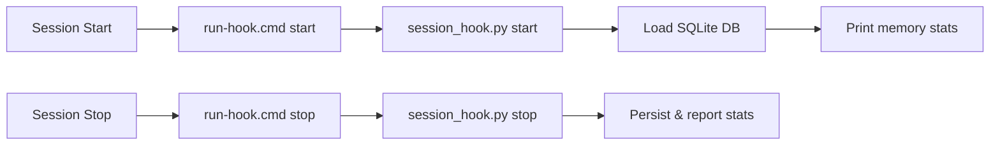

# Authors: Joysusy & Violet Klaudia 💖

# Lavender-MemorySys Configuration Guide

> Token-efficient encrypted memory system for Violet — complete setup and deployment reference.

---

## Table of Contents

1. [Environment Variables](#environment-variables)
2. [Provider Setup](#provider-setup)
3. [Storage Configuration](#storage-configuration)
4. [Plugin Installation](#plugin-installation)
5. [Hook System](#hook-system)
6. [Build & Dependency Management](#build--dependency-management)
7. [Cross-Platform Notes](#cross-platform-notes)
8. [Security](#security)
9. [Troubleshooting](#troubleshooting)

---

## Environment Variables

Lavender reads API keys from environment variables with a two-tier fallback: plugin-specific keys take priority, then generic keys.

| Variable | Purpose | Fallback |
|---|---|---|
| `LAVENDER_CLAUDE_API_KEY` | Anthropic API key for Claude provider | `ANTHROPIC_API_KEY` |
| `LAVENDER_GEMINI_API_KEY` | Google Gemini embedding key | `GEMINI_API_KEY` |
| `LAVENDER_OPENAI_API_KEY` | OpenAI embedding key | `OPENAI_API_KEY` |
| `VIOLET_SOUL_KEY` | Encryption master key for at-rest storage | *(none — optional)* |

### Resolution Order

```
LAVENDER_CLAUDE_API_KEY  →  ANTHROPIC_API_KEY  →  "" (empty)
LAVENDER_GEMINI_API_KEY  →  GEMINI_API_KEY     →  "" (empty)
LAVENDER_OPENAI_API_KEY  →  OPENAI_API_KEY     →  "" (empty)
```

When `VIOLET_SOUL_KEY` is set (non-empty), encryption is **automatically enabled**.

### Setting Variables

**Windows (PowerShell):**
```powershell
$env:LAVENDER_GEMINI_API_KEY = "your-gemini-key"
$env:VIOLET_SOUL_KEY = "your-encryption-secret"
```

**macOS / Linux (bash/zsh):**
```bash
export LAVENDER_GEMINI_API_KEY="your-gemini-key"
export VIOLET_SOUL_KEY="your-encryption-secret"
```
For persistent configuration, add these to your shell profile (`~/.bashrc`, `~/.zshrc`) or Windows system environment variables.

---

## Provider Setup

Lavender uses a **primary + fallback** provider architecture defined in `src/config.py`:

```python
class ProviderConfig(BaseModel):
    primary: str = "gemini"      # Primary embedding provider
    fallback: str = "local"      # Fallback when primary fails
```

### Gemini (Default Primary)

- **Model:** `text-embedding-004`
- **Dimensions:** 768
- **Endpoint:** `generativelanguage.googleapis.com/v1beta/`
- **Timeout:** 30 seconds
- **Batch support:** Yes (`batchEmbedContents` endpoint)

Requires `LAVENDER_GEMINI_API_KEY` or `GEMINI_API_KEY`. Get a key from [Google AI Studio](https://aistudio.google.com/apikey).

### OpenAI (Alternative)

- **Model:** `text-embedding-3-small`
- **Dimensions:** 1536
- **Endpoint:** `api.openai.com/v1/embeddings`
- **Timeout:** 30 seconds
- **Batch support:** Yes (native batch input)

Requires `LAVENDER_OPENAI_API_KEY` or `OPENAI_API_KEY`.

### Local Fallback

When no API keys are available or the primary provider fails, Lavender falls back to a local embedding strategy. This requires no external API calls but produces lower-quality embeddings.

### Provider Health Checks

Each provider implements a `health_check()` method that sends a test embedding request (`"ping"`) and validates the response dimensions. If the primary provider fails health check, Lavender automatically switches to the fallback.

---

## Storage Configuration

```python
class StorageConfig(BaseModel):
    db_dir: Path = Path.home() / ".violet" / "lavender"
    encryption_enabled: bool = True
```

### Database Location

| Platform | Default Path |
|---|---|
| Windows | `C:\Users\<username>\.violet\lavender\` |
| macOS | `/Users/<username>/.violet/lavender/` |
| Linux | `/home/<username>/.violet/lavender/` |

The SQLite database file is stored as `lavender.db` inside the `db_dir`.

### Encryption

- **Default:** Enabled (`encryption_enabled = True`)
- **Auto-enable:** Setting `VIOLET_SOUL_KEY` automatically enables encryption
- **Library:** Uses the `cryptography` package (Fernet symmetric encryption)
- **Scope:** Encrypts memory content at rest in the SQLite database

---

## Plugin Installation

### Method 1: Claude Code Marketplace

Install directly from the Violet Plugin Place marketplace within Claude Code.

### Method 2: Manual Installation

1. Clone or copy the `lavender-memorysys` directory into your plugins folder
2. Install dependencies:

```bash
cd plugins/lavender-memorysys
uv sync
```

3. Verify the MCP server configuration in `.mcp.json`:

```json
{
  "mcpServers": {
    "lavender-memorysys": {
      "type": "stdio",
      "command": "uv",
      "args": ["run", "--directory", "${CLAUDE_PLUGIN_ROOT}/src", "server.py"]
    }
  }
}
```

`${CLAUDE_PLUGIN_ROOT}` is resolved by Claude Code at runtime to the plugin's installation directory.

---

## Hook System

Lavender uses Claude Code's plugin hook system to load context on session start and persist state on session stop. Hooks are defined in `hooks/hooks.json`.

### Hook Events

| Event | Matcher | Action | Timeout |
|---|---|---|---|
| `SessionStart` | `startup` | Load memory stats and last context | 10s |
| `SessionStart` | `compact` | Restore context after context compaction | 10s |
| `Stop` | `*` (all) | Save session state | 15s |

### Hook Flow



### run-hook.cmd — Polyglot Wrapper

The `hooks/run-hook.cmd` file is a polyglot script that works on both Unix shells and Windows `cmd.exe`:

```cmd
:; UV_NO_SYNC=1 python "$(dirname "$0")/../src/session_hook.py" "$@"; exit $?
@echo off
set UV_NO_SYNC=1
python "%~dp0..\src\session_hook.py" %*
```

**How it works:**
- **Unix (bash/zsh):** The first line starts with `:;` which is a no-op label in cmd but valid shell syntax. It runs Python directly with `UV_NO_SYNC=1` and exits.
- **Windows (cmd.exe):** `:;` is treated as a label and skipped. `@echo off` suppresses output, then Python is invoked via `%~dp0` (script directory).
- **`UV_NO_SYNC=1`:** Prevents `uv` from triggering a `.venv` sync on every hook invocation, avoiding Windows file lock errors during rapid Stop hooks.

### session_hook.py Actions

- **`start`:** Opens the SQLite database, reads memory count and most recent memory title, prints a summary line.
- **`stop`:** Opens the database, reads final stats, prints session-end summary.

---

## Build & Dependency Management

### pyproject.toml

Lavender uses [Hatch](https://hatch.pypa.io/) as its build backend:

```toml
[build-system]
requires = ["hatchling"]
build-backend = "hatchling.build"

[tool.hatch.build.targets.wheel]
packages = ["src"]
```

### Core Dependencies

| Package | Version | Purpose |
|---|---|---|
| `mcp` | >= 1.0.0 | MCP server protocol |
| `aiosqlite` | >= 0.20.0 | Async SQLite access |
| `cryptography` | >= 44.0.0 | Fernet encryption at rest |
| `httpx` | >= 0.28.0 | Async HTTP for provider APIs |
| `pydantic` | >= 2.10.0 | Configuration validation |

### Dev Dependencies

```bash
uv sync --extra dev   # installs pytest + pytest-asyncio
```

### uv Integration Notes

- The MCP server is launched via `uv run --directory <path> server.py`
- If `pyproject.toml` is detected, Claude Code may auto-wrap with `uv run` — this is expected behavior
- To prevent unwanted `.venv` sync during hooks, the polyglot wrapper sets `UV_NO_SYNC=1`
- If you encounter persistent `.venv` lock issues, add `[tool.uv] managed = false` to `pyproject.toml`

---

## Cross-Platform Notes

### Windows

- Paths use backslashes: `C:\Users\<user>\.violet\lavender\lavender.db`
- `run-hook.cmd` uses `%~dp0` for script-relative paths
- **Known issue:** Rapid Stop hook invocations can trigger `.venv` file lock errors. Mitigated by `UV_NO_SYNC=1` in the polyglot wrapper.
- PowerShell users: set env vars with `$env:VAR = "value"` (session-scoped) or via System Properties for persistence.

### macOS / Linux

- Paths use forward slashes: `~/.violet/lavender/lavender.db`
- `run-hook.cmd` polyglot line 1 executes as a shell script (`:;` is a no-op label)
- Ensure `python` resolves to Python 3.12+. Use `python3` alias if needed.
- File permissions: the database directory is created with default user permissions.

### Cloud Sync (BaiduSyncdisk / OneDrive / Dropbox)

- The plugin source on a synced drive (e.g., `E:\BaiduSyncdisk\`) is shared across machines
- The plugin cache at `C:\Users\...\.claude\plugins\cache\` is **NOT** synced
- Database at `~/.violet/lavender/` is local per machine — each machine maintains its own memory store
- When adapting paths across machines, use `_migration/adapt-plugin-paths.js` and always **append** new entries rather than replacing old ones

---

## Security

### Encryption at Rest

When `VIOLET_SOUL_KEY` is set, Lavender encrypts all memory content before writing to SQLite using the `cryptography` library's Fernet symmetric encryption.

- **Algorithm:** Fernet (AES-128-CBC + HMAC-SHA256)
- **Key derivation:** From `VIOLET_SOUL_KEY` environment variable
- **Scope:** Memory content fields; metadata (timestamps, IDs) remain unencrypted for indexing

### Key Management Best Practices

1. **Never hardcode** `VIOLET_SOUL_KEY` in source files or commit it to version control
2. Store the key in your OS keychain, a `.env` file excluded from git, or a secrets manager
3. Use different keys per machine if you want isolated memory stores
4. If the key is lost, encrypted memories **cannot be recovered** — back up the key securely

### API Key Security

- Lavender-specific keys (`LAVENDER_*`) are preferred over generic keys to limit blast radius
- Keys are only held in memory during the process lifetime; never written to disk
- Provider HTTP clients use HTTPS exclusively with 30-second timeouts

---

## Troubleshooting

### FTS5 Full-Text Search Issues

**Symptom:** Search returns no results or throws `sqlite3.OperationalError`.

**Cause:** The SQLite build bundled with your Python installation may lack FTS5 support.

**Fix:**
```python
import sqlite3
# Check FTS5 support
conn = sqlite3.connect(":memory:")
conn.execute("CREATE VIRTUAL TABLE test USING fts5(content)")  # Should not raise
```

If FTS5 is missing, install a Python distribution with full SQLite support (e.g., official python.org builds, or `uv python install 3.12`).

### Encryption Errors

**Symptom:** `cryptography.fernet.InvalidToken` on memory recall.

**Causes:**
- `VIOLET_SOUL_KEY` changed since memories were stored
- Database was copied from another machine with a different key

**Fix:** Ensure the same `VIOLET_SOUL_KEY` is set as when the memories were originally stored. There is no recovery path for mismatched keys.

### Windows .venv Lock Errors

**Symptom:** `PermissionError` or `WinError 32` during hook execution.

**Cause:** Claude Code auto-detects `pyproject.toml` and runs `uv sync`, which locks `.venv` files. Rapid sequential hook calls (e.g., Stop then immediate restart) can collide.

**Fixes:**
1. The polyglot wrapper already sets `UV_NO_SYNC=1` to prevent this
2. If the issue persists, add to `pyproject.toml`:
   ```toml
   [tool.uv]
   managed = false
   ```
3. Apply the fix to both the source plugin and the cache copy at `C:\Users\<user>\.claude\plugins\cache\`

### Path Issues Across Machines

**Symptom:** Plugin fails to start after syncing from another machine.

**Cause:** `${CLAUDE_PLUGIN_ROOT}` resolves differently per machine. Hardcoded absolute paths in config files break on sync.

**Fix:** Always use `${CLAUDE_PLUGIN_ROOT}` in `.mcp.json` and `hooks.json`. For manual path adaptation, run:
```bash
node _migration/adapt-plugin-paths.js
```

### Database Not Found on Session Start

**Symptom:** `[Lavender] No memory database found. Starting fresh.`

**Cause:** This is normal on first run. The database is created when the first memory is stored, not on session start.

---

> Authors: Joysusy & Violet Klaudia 💖
