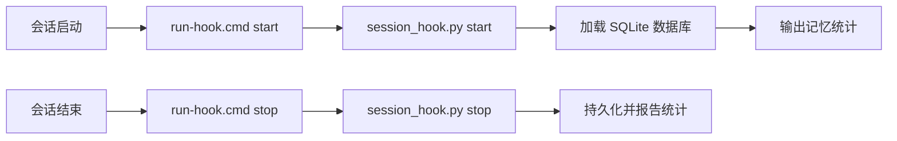

# Authors: Joysusy & Violet Klaudia 💖

# Lavender-MemorySys 配置指南

> 面向 Violet 的高效加密记忆系统 — 完整安装与部署参考。

---

## 目录

1. [环境变量](#环境变量)
2. [嵌入提供者配置](#嵌入提供者配置)
3. [存储配置](#存储配置)
4. [插件安装](#插件安装)
5. [Hook 系统](#hook-系统)
6. [构建与依赖管理](#构建与依赖管理)
7. [跨平台说明](#跨平台说明)
8. [安全性](#安全性)
9. [故障排除](#故障排除)

---

## 环境变量

Lavender 通过环境变量读取 API 密钥，采用两级回退机制：插件专用密钥优先，通用密钥作为备选。

| 变量名 | 用途 | 回退变量 |
|---|---|---|
| `LAVENDER_CLAUDE_API_KEY` | Anthropic Claude API 密钥 | `ANTHROPIC_API_KEY` |
| `LAVENDER_GEMINI_API_KEY` | Google Gemini 嵌入密钥 | `GEMINI_API_KEY` |
| `LAVENDER_OPENAI_API_KEY` | OpenAI 嵌入密钥 | `OPENAI_API_KEY` |
| `VIOLET_SOUL_KEY` | 静态加密主密钥 | *（无回退，可选）* |

### 解析顺序

```
LAVENDER_CLAUDE_API_KEY  →  ANTHROPIC_API_KEY  →  ""（空）
LAVENDER_GEMINI_API_KEY  →  GEMINI_API_KEY     →  ""（空）
LAVENDER_OPENAI_API_KEY  →  OPENAI_API_KEY     →  ""（空）
```

当 `VIOLET_SOUL_KEY` 被设置（非空）时，加密功能**自动启用**。

### 设置方法

**Windows (PowerShell):**
```powershell
$env:LAVENDER_GEMINI_API_KEY = "your-gemini-key"
$env:VIOLET_SOUL_KEY = "your-encryption-secret"
```

**macOS / Linux (bash/zsh):**
```bash
export LAVENDER_GEMINI_API_KEY="your-gemini-key"
export VIOLET_SOUL_KEY="your-encryption-secret"
```

如需持久化配置，请将以上命令添加到 shell 配置文件（`~/.bashrc`、`~/.zshrc`）或 Windows 系统环境变量中。

---

## 嵌入提供者配置

Lavender 采用**主提供者 + 备用提供者**架构，定义于 `src/config.py`：

```python
class ProviderConfig(BaseModel):
    primary: str = "gemini"      # 主嵌入提供者
    fallback: str = "local"      # 主提供者失败时的备选
```

### Gemini（默认主提供者）

- **模型：** `text-embedding-004`
- **向量维度：** 768
- **API 端点：** `generativelanguage.googleapis.com/v1beta/`
- **超时时间：** 30 秒
- **批量支持：** 支持（`batchEmbedContents` 端点）

需要设置 `LAVENDER_GEMINI_API_KEY` 或 `GEMINI_API_KEY`。可从 [Google AI Studio](https://aistudio.google.com/apikey) 获取密钥。

### OpenAI（备选方案）

- **模型：** `text-embedding-3-small`
- **向量维度：** 1536
- **API 端点：** `api.openai.com/v1/embeddings`
- **超时时间：** 30 秒
- **批量支持：** 支持（原生批量输入）

需要设置 `LAVENDER_OPENAI_API_KEY` 或 `OPENAI_API_KEY`。

### 本地回退

当没有可用的 API 密钥或主提供者失败时，Lavender 会回退到本地嵌入策略。无需外部 API 调用，但嵌入质量较低。

### 提供者健康检查

每个提供者都实现了 `health_check()` 方法，发送测试嵌入请求（`"ping"`）并验证响应维度。如果主提供者健康检查失败，Lavender 自动切换到备用提供者。

---

## 存储配置

```python
class StorageConfig(BaseModel):
    db_dir: Path = Path.home() / ".violet" / "lavender"
    encryption_enabled: bool = True
```

### 数据库位置

| 平台 | 默认路径 |
|---|---|
| Windows | `C:\Users\<用户名>\.violet\lavender\` |
| macOS | `/Users/<用户名>/.violet/lavender/` |
| Linux | `/home/<用户名>/.violet/lavender/` |

SQLite 数据库文件存储为 `db_dir` 目录下的 `lavender.db`。

### 加密

- **默认状态：** 启用（`encryption_enabled = True`）
- **自动启用：** 设置 `VIOLET_SOUL_KEY` 后自动启用加密
- **加密库：** 使用 `cryptography` 包（Fernet 对称加密）
- **加密范围：** 对 SQLite 数据库中的记忆内容进行静态加密

---

## 插件安装

### 方式一：Claude Code 插件市场

在 Claude Code 中直接从 Violet Plugin Place 市场安装。

### 方式二：手动安装

1. 将 `lavender-memorysys` 目录克隆或复制到插件文件夹
2. 安装依赖：

```bash
cd plugins/lavender-memorysys
uv sync
```

3. 验证 `.mcp.json` 中的 MCP 服务器配置：

```json
{
  "mcpServers": {
    "lavender-memorysys": {
      "type": "stdio",
      "command": "uv",
      "args": ["run", "--directory", "${CLAUDE_PLUGIN_ROOT}/src", "server.py"]
    }
  }
}
```

`${CLAUDE_PLUGIN_ROOT}` 由 Claude Code 在运行时解析为插件的实际安装目录。

---

## Hook 系统

Lavender 使用 Claude Code 的插件 Hook 系统，在会话启动时加载上下文，在会话结束时持久化状态。Hook 定义在 `hooks/hooks.json` 中。

### Hook 事件

| 事件 | 匹配器 | 动作 | 超时 |
|---|---|---|---|
| `SessionStart` | `startup` | 加载记忆统计和最近上下文 | 10 秒 |
| `SessionStart` | `compact` | 上下文压缩后恢复上下文 | 10 秒 |
| `Stop` | `*`（全部） | 保存会话状态 | 15 秒 |

### Hook 流程



### run-hook.cmd — 多语言兼容包装器

`hooks/run-hook.cmd` 是一个同时兼容 Unix shell 和 Windows cmd.exe 的多语言脚本：

```cmd
:; UV_NO_SYNC=1 python "$(dirname "$0")/../src/session_hook.py" "$@"; exit $?
@echo off
set UV_NO_SYNC=1
python "%~dp0..\src\session_hook.py" %*
```

**工作原理：**
- **Unix (bash/zsh)：** 第一行以 `:;` 开头，在 cmd 中是无操作标签，但在 shell 中是有效语法。直接运行 Python 并退出。
- **Windows (cmd.exe)：** `:;` 被视为标签并跳过。`@echo off` 抑制输出，然后通过 `%~dp0`（脚本目录）调用 Python。
- **`UV_NO_SYNC=1`：** 阻止 `uv` 在每次 Hook 调用时触发 `.venv` 同步，避免 Windows 上快速 Stop Hook 导致的文件锁错误。

### session_hook.py 动作

- **`start`：** 打开 SQLite 数据库，读取记忆数量和最近记忆标题，输出摘要信息。
- **`stop`：** 打开数据库，读取最终统计，输出会话结束摘要。

---

## 构建与依赖管理

### pyproject.toml

Lavender 使用 [Hatch](https://hatch.pypa.io/) 作为构建后端：

```toml
[build-system]
requires = ["hatchling"]
build-backend = "hatchling.build"

[tool.hatch.build.targets.wheel]
packages = ["src"]
```

### 核心依赖

| 包名 | 版本要求 | 用途 |
|---|---|---|
| `mcp` | >= 1.0.0 | MCP 服务器协议 |
| `aiosqlite` | >= 0.20.0 | 异步 SQLite 访问 |
| `cryptography` | >= 44.0.0 | Fernet 静态加密 |
| `httpx` | >= 0.28.0 | 异步 HTTP（提供者 API） |
| `pydantic` | >= 2.10.0 | 配置验证 |

### 开发依赖

```bash
uv sync --extra dev   # 安装 pytest + pytest-asyncio
```

### uv 集成说明

- MCP 服务器通过 `uv run --directory <路径> server.py` 启动
- 如果检测到 `pyproject.toml`，Claude Code 可能会自动使用 `uv run` 包装 — 这是预期行为
- 为防止 Hook 执行期间不必要的 `.venv` 同步，多语言包装器设置了 `UV_NO_SYNC=1`
- 如果持续遇到 `.venv` 锁问题，在 `pyproject.toml` 中添加 `[tool.uv] managed = false`

---

## 跨平台说明

### Windows

- 路径使用反斜杠：`C:\Users\<用户名>\.violet\lavender\lavender.db`
- `run-hook.cmd` 使用 `%~dp0` 获取脚本相对路径
- **已知问题：** 快速连续的 Stop Hook 调用可能触发 `.venv` 文件锁错误。已通过多语言包装器中的 `UV_NO_SYNC=1` 缓解。
- PowerShell 用户：使用 `$env:VAR = "value"` 设置环境变量（仅当前会话），或通过系统属性设置持久化变量。

### macOS / Linux

- 路径使用正斜杠：`~/.violet/lavender/lavender.db`
- `run-hook.cmd` 多语言脚本第一行作为 shell 脚本执行（`:;` 是无操作标签）
- 确保 `python` 指向 Python 3.12+。如有需要，使用 `python3` 别名。
- 文件权限：数据库目录以默认用户权限创建。

### 云同步（百度网盘 / OneDrive / Dropbox）

- 同步盘上的插件源码（如 `E:\BaiduSyncdisk\`）在多台机器间共享
- `C:\Users\...\.claude\plugins\cache\` 下的插件缓存**不会**被同步
- `~/.violet/lavender/` 下的数据库是每台机器本地独立的 — 每台机器维护自己的记忆存储
- 跨机器适配路径时，使用 `_migration/adapt-plugin-paths.js`，始终**追加**新条目而非替换旧条目

---

## 安全性

### 静态加密

当设置了 `VIOLET_SOUL_KEY` 时，Lavender 使用 `cryptography` 库的 Fernet 对称加密，在写入 SQLite 前加密所有记忆内容。

- **算法：** Fernet（AES-128-CBC + HMAC-SHA256）
- **密钥来源：** 从 `VIOLET_SOUL_KEY` 环境变量派生
- **加密范围：** 记忆内容字段；元数据（时间戳、ID）保持未加密以支持索引

### 密钥管理最佳实践

1. **绝不硬编码** `VIOLET_SOUL_KEY` 到源文件中，也不要提交到版本控制
2. 将密钥存储在操作系统密钥链、被 git 忽略的 `.env` 文件或密钥管理器中
3. 如果需要隔离的记忆存储，每台机器使用不同的密钥
4. 密钥丢失后，加密的记忆**无法恢复** — 请安全备份密钥

### API 密钥安全

- 推荐使用 Lavender 专用密钥（`LAVENDER_*`）而非通用密钥，以限制影响范围
- 密钥仅在进程生命周期内保存在内存中，绝不写入磁盘
- 提供者 HTTP 客户端仅使用 HTTPS，超时时间为 30 秒

---

## 故障排除

### FTS5 全文搜索问题

**症状：** 搜索无结果或抛出 `sqlite3.OperationalError`。

**原因：** Python 安装中捆绑的 SQLite 构建可能缺少 FTS5 支持。

**修复：**
```python
import sqlite3
# 检查 FTS5 支持
conn = sqlite3.connect(":memory:")
conn.execute("CREATE VIRTUAL TABLE test USING fts5(content)")  # 不应抛出异常
```

如果缺少 FTS5，请安装具有完整 SQLite 支持的 Python 发行版（如 python.org 官方构建，或 `uv python install 3.12`）。

### 加密错误

**症状：** 调用记忆时出现 `cryptography.fernet.InvalidToken`。

**原因：**
- 存储记忆后 `VIOLET_SOUL_KEY` 发生了变更
- 数据库从使用不同密钥的另一台机器复制而来

**修复：** 确保设置的 `VIOLET_SOUL_KEY` 与最初存储记忆时相同。密钥不匹配时无法恢复数据。

### Windows .venv 文件锁错误

**症状：** Hook 执行期间出现 `PermissionError` 或 `WinError 32`。

**原因：** Claude Code 自动检测 `pyproject.toml` 并运行 `uv sync`，锁定 `.venv` 文件。快速连续的 Hook 调用（如 Stop 后立即重启）可能产生冲突。

**修复：**
1. 多语言包装器已设置 `UV_NO_SYNC=1` 来防止此问题
2. 如果问题持续，在 `pyproject.toml` 中添加：
   ```toml
   [tool.uv]
   managed = false
   ```
3. 同时修改源插件和缓存副本（`C:\Users\<用户名>\.claude\plugins\cache\`）

### 跨机器路径问题

**症状：** 从另一台机器同步后插件无法启动。

**原因：** `${CLAUDE_PLUGIN_ROOT}` 在不同机器上解析结果不同。配置文件中的硬编码绝对路径在同步后会失效。

**修复：** 在 `.mcp.json` 和 `hooks.json` 中始终使用 `${CLAUDE_PLUGIN_ROOT}`。如需手动适配路径，运行：
```bash
node _migration/adapt-plugin-paths.js
```

### 首次启动时数据库未找到

**症状：** `[Lavender] No memory database found. Starting fresh.`

**原因：** 这是首次运行时的正常现象。数据库在存储第一条记忆时创建，而非在会话启动时。

---

> Authors: Joysusy & Violet Klaudia 💖
