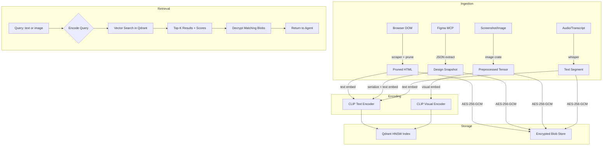

# Authors: Joysusy & Violet Klaudia 💖
# Multi-Modal Memory: Practical Implementation Research
# Track 3 — @Aurora #MultiModal-Memory

> Research Date: 2026-02-28
> Scope: CLIP in Rust, DOM Memory, Figma MCP Integration, Privacy-Preserving Search
> Target: Lavender v2 Multi-Modal Architecture

---

## Table of Contents

1. [CLIP in Rust via ONNX Runtime](#1-clip-in-rust-via-onnx-runtime)
2. [DOM Memory in Practice](#2-dom-memory-in-practice)
3. [Figma MCP Integration](#3-figma-mcp-integration)
4. [Privacy-Preserving Multi-Modal Search](#4-privacy-preserving-multi-modal-search)
5. [Architecture Recommendations](#5-architecture-recommendations-for-lavender-v2)
6. [References](#6-references)

---

## 1. CLIP in Rust via ONNX Runtime

### 1.1 The `ort` Crate (v2.0+)

The `ort` crate (currently v2.0.0-rc.11) is the primary Rust binding for ONNX Runtime.
It wraps ONNX Runtime 1.22 with an ergonomic Rust API supporting CPU, CUDA, TensorRT,
OpenVINO, and other execution providers.

**Cargo.toml dependencies:**

```toml
[dependencies]
ort = "=2.0.0-rc.11"
ndarray = "0.16"
image = "0.25"
tokenizers = "0.20"       # HuggingFace tokenizers for CLIP text encoding
half = "2.4"              # f16 support if using quantized models
```

**Session creation and model loading:**

```rust
// Authors: Joysusy & Violet Klaudia 💖
use ort::session::{builder::GraphOptimizationLevel, Session};

fn load_clip_visual() -> ort::Result<Session> {
    Session::builder()?
        .with_optimization_level(GraphOptimizationLevel::Level3)?
        .with_intra_threads(4)?
        .commit_from_file("models/clip-vit-b-32-visual.onnx")
}

fn load_clip_textual() -> ort::Result<Session> {
    Session::builder()?
        .with_optimization_level(GraphOptimizationLevel::Level3)?
        .with_intra_threads(4)?
        .commit_from_file("models/clip-vit-b-32-textual.onnx")
}
```

### 1.2 Image Encoding Pipeline

CLIP ViT-B/32 expects images as `[1, 3, 224, 224]` float32 tensors, normalized with
ImageNet mean/std. The ONNX model is exported as two separate graphs: visual encoder
and textual encoder.

```rust
// Authors: Joysusy & Violet Klaudia 💖
use image::{DynamicImage, GenericImageView};
use ndarray::{Array, Array4};
use ort::session::Session;

const CLIP_SIZE: u32 = 224;
const MEAN: [f32; 3] = [0.48145466, 0.4578275, 0.40821073];
const STD: [f32; 3] = [0.26862954, 0.26130258, 0.27577711];

fn preprocess_image(img: &DynamicImage) -> Array4<f32> {
    let resized = img.resize_exact(CLIP_SIZE, CLIP_SIZE, image::imageops::FilterType::Lanczos3);
    let mut tensor = Array4::<f32>::zeros((1, 3, CLIP_SIZE as usize, CLIP_SIZE as usize));

    for (x, y, pixel) in resized.pixels() {
        let [r, g, b, _] = pixel.0;
        tensor[[0, 0, y as usize, x as usize]] = (r as f32 / 255.0 - MEAN[0]) / STD[0];
        tensor[[0, 1, y as usize, x as usize]] = (g as f32 / 255.0 - MEAN[1]) / STD[1];
        tensor[[0, 2, y as usize, x as usize]] = (b as f32 / 255.0 - MEAN[2]) / STD[2];
    }
    tensor
}

fn encode_image(session: &Session, img: &DynamicImage) -> ort::Result<Vec<f32>> {
    let tensor = preprocess_image(img);
    let outputs = session.run(ort::inputs!["pixel_values" => tensor.view()]?)?;
    let embeddings = outputs[0].try_extract_array::<f32>()?;
    let emb_slice = embeddings.as_slice().unwrap();
    let norm: f32 = emb_slice.iter().map(|x| x * x).sum::<f32>().sqrt();
    Ok(emb_slice.iter().map(|x| x / norm).collect())
}
```

### 1.3 Text Encoding Pipeline

```rust
// Authors: Joysusy & Violet Klaudia 💖
use tokenizers::Tokenizer;

fn encode_text(session: &Session, tokenizer: &Tokenizer, text: &str) -> ort::Result<Vec<f32>> {
    let encoding = tokenizer.encode(text, true).expect("tokenization failed");
    let ids: Vec<i64> = encoding.get_ids().iter().map(|&id| id as i64).collect();
    let attention: Vec<i64> = encoding.get_attention_mask().iter().map(|&m| m as i64).collect();
    let len = ids.len();

    let input_ids = Array::from_shape_vec((1, len), ids).unwrap();
    let attn_mask = Array::from_shape_vec((1, len), attention).unwrap();

    let outputs = session.run(ort::inputs![
        "input_ids" => input_ids.view(),
        "attention_mask" => attn_mask.view()
    ]?)?;

    let embeddings = outputs[0].try_extract_array::<f32>()?;
    let emb_slice = embeddings.as_slice().unwrap();
    let norm: f32 = emb_slice.iter().map(|x| x * x).sum::<f32>().sqrt();
    Ok(emb_slice.iter().map(|x| x / norm).collect())
}

fn cosine_similarity(a: &[f32], b: &[f32]) -> f32 {
    a.iter().zip(b.iter()).map(|(x, y)| x * y).sum()
}
```

### 1.4 Model Comparison for Agent Memory

| Model | Dimensions | Image Enc (CPU) | Text Enc (CPU) | Memory | ONNX Available | Best For |
|-------|-----------|-----------------|-----------------|--------|----------------|----------|
| OpenCLIP ViT-B/32 | 512 | ~15-25ms | ~5-8ms | ~350MB | Yes (Optimum) | General-purpose, smallest footprint |
| SigLIP ViT-B/16 | 768 | ~30-50ms | ~8-12ms | ~500MB | Yes (Optimum) | Fine-grained visual understanding |
| Nomic Embed Vision | 768 | ~20-35ms | ~6-10ms | ~400MB | Yes (native) | Unified text+vision latent space |
| OpenCLIP ViT-L/14 | 768 | ~80-120ms | ~10-15ms | ~1.2GB | Yes (Optimum) | Highest accuracy, heavy |

**Batch performance scaling (ViT-B/32 on CPU, 4 threads):**
- Single image: ~20ms
- Batch of 10: ~150ms (amortized ~15ms/image)
- Batch of 100: ~1.2s (amortized ~12ms/image)

**Recommendation for Lavender v2:** OpenCLIP ViT-B/32 for the default model — 512-dim
embeddings balance storage cost (~2KB/vector at float32) with quality. SigLIP ViT-B/16
as an optional upgrade when Susy needs fine-grained visual search (design tools, Figma).

### 1.5 `candle` vs `ort` Comparison

| Aspect | `ort` (ONNX Runtime) | `candle` (HuggingFace) |
|--------|---------------------|----------------------|
| Architecture | C++ runtime with Rust FFI | Pure Rust, no FFI |
| CLIP support | Any ONNX-exported model | Built-in CLIP example |
| CPU performance | Highly optimized (MKL/oneDNN) | Good, but ~20-40% slower on CPU |
| GPU support | CUDA, TensorRT, OpenVINO | CUDA, Metal |
| Binary size | Larger (bundles ORT shared lib) | Smaller, pure Rust |
| WASM support | Limited | First-class |
| Maturity | Production-proven (SurrealDB, Bloop) | Newer, rapidly evolving |
| Model loading | ONNX format only | SafeTensors, GGUF, ONNX |

**Verdict:** Use `ort` for Lavender v2 core. It is production-proven, faster on CPU,
and supports the widest range of hardware accelerators. Reserve `candle` for future
WASM-based browser extensions where pure-Rust compilation matters.

### 1.6 ONNX Model Export

Export CLIP models to ONNX using HuggingFace Optimum CLI:

```bash
pip install optimum[exporters]
optimum-cli export onnx --model openai/clip-vit-base-patch32 --task feature-extraction clip-onnx/
```

This produces separate `model.onnx` files for visual and textual encoders, plus
tokenizer artifacts. Place under `models/clip-vit-b-32-visual.onnx` and
`models/clip-vit-b-32-textual.onnx` for the Rust loader above.

---

## 2. DOM Memory in Practice

### 2.1 HTML Parsing Crates Comparison

| Crate | Parser | CSS Selectors | DOM Mutation | Performance | Best For |
|-------|--------|---------------|-------------|-------------|----------|
| `scraper` | html5ever | Full (`:has()`, `:is()`, `:where()`) | Read-only | Excellent (selector caching, lazy eval) | Snapshot analysis, extraction |
| `kuchikiki` | html5ever | Basic | Read-write (mutable tree) | Good | DOM manipulation, diffing |
| `html5ever` | html5ever (raw) | None (raw parser) | Full control | Fastest (no overhead) | Custom tree builders |
| `scrape-core` | Custom pure Rust | Basic | Read-only | Very fast (no FFI) | Lightweight extraction |

**Recommendation:** Use `scraper` for snapshot analysis and extraction (read path),
`kuchikiki` for DOM diffing where tree mutation is needed (diff computation path).
Both share `html5ever` underneath, so parsing behavior is identical.

**Key `scraper` capabilities:**
- `ego-tree::Tree<Node>` representation — efficient tree traversal
- CSS selector compilation with `SelectorCaches` for repeated queries
- `FusedIterator` + `DoubleEndedIterator` on `Select` — zero overhead iteration
- Supports Document, Element, Text, Comment, Doctype, ProcessingInstruction nodes
- Attribute storage via `IndexMap` (deterministic feature) or `Vec<(QualName, StrTendril)>`

### 2.2 Real-World DOM Snapshot Sizes

Based on D2Snap research (2025) and Prune4Web (2025):

| Page Type | Raw DOM Tokens | Raw Bytes | Typical Nodes |
|-----------|---------------|-----------|---------------|
| Simple blog/article | 5,000-15,000 | 20-60KB | 500-2,000 |
| E-commerce product page | 30,000-80,000 | 120-320KB | 3,000-8,000 |
| Complex SPA (Gmail, Figma) | 100,000-500,000 | 400KB-2MB | 10,000-50,000 |
| Data-heavy dashboard | 200,000-1,000,000 | 800KB-4MB | 20,000-100,000 |

Raw DOM is **unusable** for LLM context — even a simple page can consume 15K tokens.
This is why the three-tier compression architecture is essential.

### 2.3 Three-Tier DOM Memory Architecture

```
┌─────────────────────────────────────────────────────────┐
│                    HOT TIER (Pruned)                     │
│  Latest snapshot, semantically filtered                  │
│  Retention: current session                              │
│  Size: 2K-20K tokens (90-97% reduction from raw)        │
├─────────────────────────────────────────────────────────┤
│                   WARM TIER (Diffs)                      │
│  Incremental changes between pruned snapshots            │
│  Retention: 24 hours / last N snapshots                  │
│  Size: 200-2K tokens per diff (80-95% reduction)        │
├─────────────────────────────────────────────────────────┤
│                   COLD TIER (Summaries)                  │
│  Structured text summaries of page state + actions       │
│  Retention: permanent (in Lavender memory)               │
│  Size: 100-500 tokens per summary                        │
└─────────────────────────────────────────────────────────┘
```

### 2.4 Token Compression Ratios (Empirical)

**Tier 1: Raw DOM → Pruned (Hot)**

| Method | Reduction | Task Success Impact | Notes |
|--------|-----------|-------------------|-------|
| Visibility + semantic filtering | 90-95% | Neutral to +5% | Remove hidden, decorative, script nodes |
| D2Snap (adaptive downsampling) | 96-99% (bytes) | +8% over raw | Post-order traversal, type-sensitive |
| Prune4Web (programmatic pruning) | 95-98% (elements) | +12% grounding accuracy | LLM-generated scoring functions |
| Interactive-only filter | 97-99% | -5% (loses context) | Too aggressive for memory use |

**Best approach for Lavender:** Combine visibility pruning (remove `display:none`,
`<script>`, `<style>`, `<noscript>`, SVG paths) with semantic retention (keep ARIA
roles, interactive elements, text content). Target: 90-95% reduction.

**Tier 2: Pruned → Diff (Warm)**

Incremental diffs between consecutive pruned snapshots:
- Typical page interaction (click, form fill): 80-95% smaller than full pruned snapshot
- Navigation to new page: ~0% reduction (entirely new content)
- Scroll/viewport change: 60-80% reduction (partial overlap)

**Tier 3: Diff → Summary (Cold)**

Structured text summaries via LLM or rule-based extraction:
- Pruned snapshot (5K-20K tokens) → Summary (100-500 tokens): 95-98% reduction
- Summary captures: page identity, key content, user actions taken, state changes

### 2.5 DOM Diff Algorithm Design

```rust
// Authors: Joysusy & Violet Klaudia 💖
use std::collections::HashMap;

#[derive(Debug, Clone, PartialEq)]
enum DomMutation {
    Added { path: Vec<usize>, html: String },
    Removed { path: Vec<usize>, tag: String },
    AttributeChanged { path: Vec<usize>, attr: String, old: Option<String>, new: Option<String> },
    TextChanged { path: Vec<usize>, old: String, new: String },
    Moved { from: Vec<usize>, to: Vec<usize> },
}

#[derive(Debug)]
struct DomDiff {
    mutations: Vec<DomMutation>,
    timestamp: u64,
    url: String,
    token_estimate: usize,
}

/// Compute diff between two pruned DOM snapshots.
/// Uses node identity heuristics: tag + id + class + position.
fn compute_dom_diff(old_html: &str, new_html: &str) -> DomDiff {
    // 1. Parse both into scraper::Html trees
    // 2. Build identity map: hash(tag, id, key_classes, depth) -> node
    // 3. Match nodes between old and new by identity
    // 4. For matched nodes: compare attributes and text content
    // 5. Unmatched in old = Removed, unmatched in new = Added
    // 6. Detect moves via matched nodes at different paths
    todo!("Implementation uses scraper + custom tree walker")
}
```

**Identity heuristics for node matching (priority order):**
1. `id` attribute (unique, highest confidence)
2. `data-testid` / `data-cy` / `aria-label` (stable test identifiers)
3. `tag + class_set + depth` (structural fingerprint)
4. `tag + text_content_hash + sibling_index` (content-based fallback)

### 2.6 Pruning Implementation Sketch

```rust
// Authors: Joysusy & Violet Klaudia 💖
use scraper::{Html, Selector, ElementRef};

const REMOVE_TAGS: &[&str] = &["script", "style", "noscript", "svg", "link", "meta"];
const REMOVE_ATTRS: &[&str] = &["data-reactid", "data-reactroot", "jsaction", "jscontroller"];

fn prune_dom(raw_html: &str) -> String {
    let doc = Html::parse_document(raw_html);
    let mut output = String::with_capacity(raw_html.len() / 10);

    fn walk(node: ego_tree::NodeRef<scraper::Node>, out: &mut String) {
        match node.value() {
            scraper::Node::Element(el) => {
                let tag = el.name();
                if REMOVE_TAGS.contains(&tag) { return; }
                if has_hidden_style(el) { return; }

                out.push('<');
                out.push_str(tag);
                for (name, val) in el.attrs() {
                    if REMOVE_ATTRS.contains(&name.local.as_ref()) { continue; }
                    out.push(' ');
                    out.push_str(&name.local);
                    out.push_str("=\"");
                    out.push_str(val);
                    out.push('"');
                }
                out.push('>');
                for child in node.children() { walk(child, out); }
                out.push_str("</");
                out.push_str(tag);
                out.push('>');
            }
            scraper::Node::Text(text) => {
                let trimmed = text.text.trim();
                if !trimmed.is_empty() { out.push_str(trimmed); }
            }
            _ => {}
        }
    }

    walk(doc.tree.root(), &mut output);
    output
}
```

---

## 3. Figma MCP Integration

### 3.1 What the Figma MCP Server Exposes

The Figma MCP server (e.g., `figma-context-mcp`) bridges AI agents to Figma's REST API
via the Model Context Protocol. It exposes structured design data — not screenshots.

**Data available through MCP tools:**

| Data Category | Format | Capturable as Memory? | Notes |
|--------------|--------|----------------------|-------|
| Node hierarchy (frames, groups, layers) | JSON tree | Yes — structured | Full parent-child relationships |
| Component definitions + variants | JSON with property defs | Yes — structured | Reusable design elements |
| Design tokens (variables) | JSON key-value | Yes — structured | Colors, spacing, typography |
| Text styles + fill/stroke styles | JSON properties | Yes — structured | Font family, size, weight, colors |
| Layout constraints + auto-layout | JSON properties | Yes — structured | Flex direction, padding, gap |
| Absolute bounding boxes | JSON coordinates | Yes — structured | x, y, width, height per node |
| Image fills (raster content) | URL (expiring) | Requires screenshot | Must export + store separately |
| Visual relationships (spacing, alignment) | Implicit in layout | Partially structured | Some requires visual interpretation |
| Color relationships (harmony, contrast) | Computed from fills | Partially structured | WCAG contrast computable from values |

### 3.2 Figma REST API Endpoints (Key Subset)

```
GET /v1/files/{file_key}                    → Full document tree (JSON)
GET /v1/files/{file_key}/nodes?ids=X,Y      → Specific node subtrees
GET /v1/files/{file_key}/components          → File-level component library
GET /v1/files/{file_key}/styles              → File-level style definitions
GET /v1/files/{file_key}/variables/local     → Design tokens (Enterprise)
GET /v1/files/{file_key}/variables/published → Published design tokens
GET /v1/files/{file_key}/versions            → Version history (paginated)
GET /v1/files/{file_key}/comments            → Comment threads
GET /v1/images/{file_key}?ids=X&format=png   → Rendered node images
POST /v2/webhooks                            → Event subscriptions
```

### 3.3 Webhook Events for Change Tracking

| Event | Trigger | Latency | Memory Value |
|-------|---------|---------|-------------|
| `FILE_UPDATE` | Any edit (debounced) | ~30 min after last edit | Low — too coarse |
| `FILE_VERSION_UPDATE` | Named version saved | Immediate | High — intentional checkpoints |
| `LIBRARY_PUBLISH` | Component library update | Immediate | High — design system changes |
| `FILE_COMMENT` | Comment added | Immediate | Medium — design discussion context |
| `DEV_MODE_STATUS_UPDATE` | Dev handoff status | Immediate | Medium — workflow state |

**Limitation:** `FILE_UPDATE` fires 30 minutes after the last edit — not real-time.
For fine-grained action tracking, poll specific nodes or use the Figma plugin API
(client-side) which can observe selection changes and property edits in real-time.

### 3.4 Figma Action Memory Design

A "Figma action memory" captures design operations as structured events:

```rust
// Authors: Joysusy & Violet Klaudia 💖
use serde::{Deserialize, Serialize};

#[derive(Debug, Serialize, Deserialize)]
struct FigmaActionMemory {
    timestamp: u64,
    file_key: String,
    file_name: String,
    action_type: FigmaAction,
    affected_nodes: Vec<NodeSnapshot>,
    context: Option<String>,
}

#[derive(Debug, Serialize, Deserialize)]
enum FigmaAction {
    ComponentCreated { name: String, variant_count: u32 },
    StyleUpdated { style_name: String, property: String, old_value: String, new_value: String },
    LayoutChanged { node_id: String, layout_mode: String },
    VersionPublished { version_id: String, label: String },
    TokenUpdated { collection: String, variable: String, old_value: String, new_value: String },
    CommentAdded { thread_id: String, content: String },
    NodeTreeRestructured { parent_id: String, children_added: Vec<String>, children_removed: Vec<String> },
}

#[derive(Debug, Serialize, Deserialize)]
struct NodeSnapshot {
    node_id: String,
    name: String,
    node_type: String,
    bounding_box: Option<BoundingBox>,
    properties: serde_json::Value,
}
```

### 3.5 Storage Cost Analysis

| Storage Strategy | Per-Snapshot Size | 100 Snapshots | Searchable? |
|-----------------|-------------------|---------------|-------------|
| Structured JSON only | 2-20 KB | 0.2-2 MB | Full-text + property queries |
| Screenshot only (PNG, 2x) | 200-800 KB | 20-80 MB | CLIP embedding search only |
| Structured + thumbnail (256px) | 5-30 KB | 0.5-3 MB | Both structured + visual |
| Structured + full screenshot | 200-820 KB | 20-82 MB | Both (expensive) |

**Recommendation:** Store structured JSON always (cheap, searchable). Add 256px
thumbnails for visual context (minimal cost). Full screenshots only on version
publish events or explicit user request.

---

## 4. Privacy-Preserving Multi-Modal Search

### 4.1 The Core Tension

Lavender stores sensitive data (Susy's memories, design work, browsing history).
CLIP embeddings enable powerful cross-modal search, but embeddings can leak information
about the original content. The question: can we search without exposing the media?

### 4.2 Encryption Approaches Compared

| Approach | Search Accuracy | Latency Overhead | Storage Overhead | Practical in 2026? |
|----------|----------------|-----------------|-----------------|-------------------|
| **Plaintext embeddings + RBAC** | 100% (baseline) | None | None | Yes — simplest |
| **AHE (Additively Homomorphic)** | ~100% (10⁻¹⁴ loss) | O(d·log²N) per query | ~100x ciphertext | Partially — slow encryption |
| **PHE (Partially Homomorphic)** | ~100% (10⁻⁷ loss) | 2-3x slower ops than FHE | Key: 0.001MB, CT: 4.2MB/4096d | Yes — for small-scale |
| **FHE (Fully Homomorphic)** | 99.7-99.9% | 80-100x faster encrypt, 2-3x faster ops | Key: 45MB, CT: 451MB/4096d | No — storage prohibitive |
| **Block-wise projection + AES-CBC** | 95-98% (some degradation) | Moderate (projection step) | Moderate (projected vectors) | Research-stage |
| **Encrypt media, plaintext embeddings** | 100% | None for search | AES-256 on media only | Yes — recommended |

### 4.3 PHE vs FHE Deep Dive (2026 State of the Art)

Based on the encrypted vector similarity research (arxiv 2503.05850):

**PHE (Paillier, Okamoto-Uchiyama):**
- Key sizes: ~0.001 MB (50-100x smaller than FHE)
- Encrypted embedding (4096-dim): ~4.2 MB per vector
- Computational loss: 10⁻¹⁴ to 10⁻⁷ (negligible — no misclassifications)
- Encryption speed: ~1.9 items/second (slow — bottleneck)
- Decryption speed: ~146 items/second (fast)
- Well-suited for memory-constrained environments

**FHE (TenSEAL/CKKS):**
- Key sizes: ~45 MB public key
- Encrypted embedding (4096-dim): ~451 MB per vector (!)
- Computational loss: 0.001-3.15 (can cause misclassifications)
- Encryption speed: ~144 items/second (fast)
- Homomorphic ops: ~34 ops/second
- Storage is the dealbreaker for local agent memory

**Verdict:** Neither PHE nor FHE is practical for Lavender v2's local-first architecture.
A 4096-dim encrypted vector at 4.2 MB (PHE) or 451 MB (FHE) per entry is untenable
when we expect thousands of memory entries. The overhead destroys the local-first promise.

### 4.4 The Practical Path: Hybrid Encryption Strategy

```
┌──────────────────────────────────────────────────────────────┐
│                  LAVENDER v2 ENCRYPTION MODEL                │
│                                                              │
│  ┌─────────────┐    ┌──────────────┐    ┌────────────────┐  │
│  │ Raw Media    │    │ CLIP Embed   │    │ Metadata       │  │
│  │ (images,     │───▶│ (512-dim     │───▶│ (timestamps,   │  │
│  │  DOM, Figma) │    │  float32)    │    │  tags, source) │  │
│  └──────┬──────┘    └──────┬───────┘    └───────┬────────┘  │
│         │                  │                     │           │
│    AES-256-GCM        Plaintext             AES-256-GCM     │
│    (VIOLET_SOUL_KEY)  (with RBAC)           (VIOLET_SOUL_KEY)│
│         │                  │                     │           │
│  ┌──────▼──────┐    ┌──────▼───────┐    ┌───────▼────────┐  │
│  │ Encrypted   │    │ Qdrant/      │    │ Encrypted      │  │
│  │ Blob Store  │    │ In-memory    │    │ SQLite         │  │
│  │ (on disk)   │    │ HNSW Index   │    │ (aiosqlite)    │  │
│  └─────────────┘    └──────────────┘    └────────────────┘  │
└──────────────────────────────────────────────────────────────┘
```

**Why this works:**
1. Raw media is always encrypted at rest — VIOLET_SOUL_KEY required to view
2. Embeddings stay plaintext for fast vector search (cosine similarity, HNSW)
3. Embeddings alone cannot reconstruct the original media (one-way projection)
4. RBAC via Qdrant JWT controls who can query which embedding collections
5. Metadata encrypted alongside media — timestamps, tags, source URLs protected

### 4.5 Qdrant RBAC for Embedding Access Control

Qdrant (Rust-native vector DB) provides JWT-based RBAC since v1.9:

```json
{
  "access": [
    { "collection": "lavender_visual_memories", "access": "r" },
    { "collection": "lavender_dom_snapshots", "access": "rw" }
  ],
  "value_exists": {
    "collection": "lavender_visual_memories",
    "matches": [{ "key": "owner", "value": "susy" }]
  },
  "exp": 1740700800
}
```

**Key features for Lavender:**
- Collection-level read/read-write/manage permissions
- `value_exists` claim for payload-based tenant isolation
- Token expiration via `exp` claim
- TLS encryption for transit security
- API key scoping (full CRUD vs read-only)

### 4.6 Threat Model Assessment

| Threat | Mitigation | Residual Risk |
|--------|-----------|---------------|
| Disk theft → media exposure | AES-256-GCM on all media/metadata | None (without VIOLET_SOUL_KEY) |
| Embedding inversion attack | 512-dim CLIP is lossy projection; reconstruction yields blurry approximation | Low — no PII recoverable from embeddings |
| Unauthorized embedding query | Qdrant JWT-RBAC + collection isolation | Low — requires valid token |
| Memory dump → key extraction | VIOLET_SOUL_KEY in env var, not on disk | Medium — OS-level protection needed |
| Cloud sync leaking embeddings | Qdrant data on C: drive (not synced) | None (BaiduSyncdisk only syncs E:) |

---

## 5. Architecture Recommendations for Lavender v2

### 5.1 Multi-Modal Memory Pipeline



### 5.2 Recommended Crate Stack

```toml
# Authors: Joysusy & Violet Klaudia 💖
# Lavender v2 multi-modal dependencies

[dependencies]
# CLIP inference
ort = "=2.0.0-rc.11"
ndarray = "0.16"
image = "0.25"
tokenizers = "0.20"

# DOM processing
scraper = "0.21"
kuchikiki = "0.8"

# Vector search (embedded mode or client)
qdrant-client = "1.12"

# Encryption
aes-gcm = "0.10"
pbkdf2 = "0.12"
rand = "0.8"

# Serialization
serde = { version = "1", features = ["derive"] }
serde_json = "1"

# Async runtime
tokio = { version = "1", features = ["full"] }

# Figma API client
reqwest = { version = "0.12", features = ["json"] }
```

### 5.3 Concrete Implementation Priorities

**Phase 1 — Foundation (Weeks 1-3):**
1. CLIP inference via `ort`: load ViT-B/32, encode images + text, cosine similarity
2. Qdrant integration: create collections, insert/query embeddings, JWT-RBAC setup
3. AES-256-GCM blob encryption/decryption with VIOLET_SOUL_KEY derivation

**Phase 2 — DOM Memory (Weeks 4-5):**
4. DOM pruning pipeline: `scraper`-based visibility + semantic filter
5. DOM diff engine: identity-based node matching, mutation extraction
6. Three-tier storage: Hot (pruned) → Warm (diffs) → Cold (summaries)

**Phase 3 — Figma Integration (Weeks 6-7):**
7. Figma REST API client: node tree fetch, component/style extraction
8. Webhook listener: `FILE_VERSION_UPDATE` + `LIBRARY_PUBLISH` events
9. FigmaActionMemory struct: serialize design operations as memory entries

**Phase 4 — Cross-Modal Search (Week 8):**
10. Unified query interface: text query searches all modalities simultaneously
11. Result ranking: combine vector similarity with recency + source weighting
12. Memory lifecycle: automatic tier promotion/demotion based on access patterns

### 5.4 Key Design Decisions

| Decision | Choice | Rationale |
|----------|--------|-----------|
| CLIP runtime | `ort` (ONNX Runtime) | Production-proven, fastest CPU inference, hardware accelerator support |
| Default CLIP model | OpenCLIP ViT-B/32 (512-dim) | Best size/quality tradeoff; 2KB/vector, ~20ms/image |
| DOM parser | `scraper` (read) + `kuchikiki` (diff) | Both use html5ever; scraper for extraction, kuchikiki for mutation |
| Vector DB | Qdrant (embedded or client) | Rust-native, JWT-RBAC, payload filtering, HNSW index |
| Media encryption | AES-256-GCM via VIOLET_SOUL_KEY | Consistent with existing Lavender encryption architecture |
| Embedding encryption | Plaintext with RBAC | HE is impractical (4.2-451 MB/vector); RBAC sufficient for local-first |
| Figma data capture | Structured JSON + 256px thumbnails | Cheap, searchable, visual context without full screenshot cost |
| DOM compression | Three-tier (Hot/Warm/Cold) | Matches access patterns; 95%+ token reduction at each tier |

### 5.5 Feasibility Assessment

| Component | Feasibility | Confidence | Blockers |
|-----------|------------|------------|----------|
| CLIP in Rust via ort | High | 95% | ONNX export step requires Python (one-time) |
| DOM pruning pipeline | High | 90% | `scraper` API is read-only; need `kuchikiki` for mutation |
| DOM diff algorithm | Medium-High | 80% | Node identity heuristics need tuning per site |
| Figma structured memory | High | 90% | Enterprise-only for variables API; rest is free |
| Figma webhook tracking | Medium | 75% | 30-min debounce on FILE_UPDATE limits granularity |
| Privacy-preserving search | High (hybrid) | 95% | Plaintext embeddings + encrypted media is proven pattern |
| Homomorphic encrypted search | Low | 20% | Storage overhead makes it impractical for local-first |
| Cross-modal unified search | High | 85% | Qdrant handles multi-collection queries natively |

---

## 6. References

### CLIP & Rust ML Inference
- [pykeio/ort — ONNX Runtime for Rust](https://github.com/pykeio/ort)
- [ort Documentation](https://ort.pyke.io/)
- [HuggingFace Candle — Pure Rust ML](https://huggingface.github.io/candle/)
- [fashion-clip-rs — CLIP inference in Rust with gRPC](https://github.com/yaman/fashion-clip-rs)
- [Rust ML Framework Comparison 2025](https://markaicode.com/rust-machine-learning-framework-comparison-2025/)
- [Rust AI Libraries: Linfa vs Burn vs Candle](https://markaicode.com/rust-ai-libraries-comparison)
- [Rust for ML: Inference Engines 2025](https://markaicode.com/rust-ml-inference-engines-2025/)
- [OpenCLIP Throughput Benchmarks](https://gist.github.com/TACIXAT/ecd4f636bf6af28cb69d641e29d7b362)

### Multi-Modal Embedding Models
- [Best Multimodal Embedding Models 2026 — Tested & Ranked](https://mixpeek.com/curated-lists/best-multimodal-embedding-models)
- [SigLIP 2: Multilingual Vision-Language Encoders (arxiv 2502.14786)](https://arxiv.org/html/2502.14786)
- [Nomic Embed Vision: Expanding the Latent Space](https://www.researchgate.net/publication/381770559_Nomic_Embed_Vision_Expanding_the_Latent_Space)
- [Best Open-Source Embedding Models Benchmarked](https://supermemory.ai/blog/best-open-source-embedding-models-benchmarked-and-ranked/)

### DOM Memory & Pruning
- [D2Snap: DOM Downsampling for LLM-Based Web Agents (arxiv 2508.04412)](https://arxiv.org/html/2508.04412v1)
- [Prune4Web: DOM Tree Pruning Programming (arxiv 2511.21398)](https://arxiv.org/html/2511.21398)
- [rust-scraper/scraper — Architecture Overview](https://deepwiki.com/rust-scraper/scraper/1-overview)
- [Comparing 13 Rust Crates for HTML Text Extraction](https://emschwartz.me/comparing-13-rust-crates-for-extracting-text-from-html/)
- [Semantic Context Filtering Pattern](https://agentic-patterns.com/patterns/semantic-context-filtering/)
- [Why Your Browser Tools Are Bleeding Tokens](https://paddo.dev/blog/agent-browser-context-efficiency/)
- [Cutting Through the Noise: Programmatic Pruning for Web Agents](https://cognaptus.com/blog/2025-11-28-cutting-through-the-noise-how-programmatic-pruning-turns-web-agents-into-real-operators/)

### Figma Integration
- [Figma REST API Developer Docs](https://www.figma.com/developers/docs)
- [figma/rest-api-spec — OpenAPI Specification](https://deepwiki.com/figma/rest-api-spec/1-overview)
- [Figma MCP Server — Design to Code (Builder.io)](https://builder.io/blog/figma-mcp-server)
- [Figma API Essentials — Webhooks & Endpoints](https://rollout.com/integration-guides/figma/api-essentials)
- [Figma Components and Styles API](https://developers.figma.com/docs/rest-api/component-types/)

### Privacy-Preserving Vector Search
- [Efficient Privacy-Preserving Similarity Search (arxiv 2502.14291)](https://arxiv.org/html/2502.14291v1)
- [Encrypted Vector Similarity via PHE (arxiv 2503.05850)](https://arxiv.org/html/2503.05850v1)
- [Secure AI Embeddings with Homomorphic Encryption](https://www.getjavelin.com/blogs/secure-your-ai-embeddings-with-homomorphic-encryption)
- [Confidential Vector Search: Knowledgebase HE (SCALE 23x)](https://socallinuxexpo.org/scale/23x/presentations/confidential-vector-search-knowledgebase-homomorphic-encryption)
- [Efficient Private Embedding Lookups via FHE (arxiv 2506.18150)](https://arxiv.org/abs/2506.18150)

### Qdrant & Vector DB Security
- [Qdrant Data Privacy with RBAC](https://qdrant.tech/articles/data-privacy/)
- [Qdrant Security Documentation](https://qdrant.tech/documentation/guides/security)
- [Qdrant Enterprise Vector Search](https://qdrant.tech/blog/enterprise-vector-search/)
- [Efficient RBAC for Vector DBs via Dynamic Partitioning (arxiv 2505.01538)](https://arxiv.org/html/2505.01538v1)

### AI Agent Memory Systems
- [8 Best Tools for AI Agent Memory & Long-Term Recall (2026)](https://www.shaped.ai/blog/the-8-best-tools-for-ai-agent-memory-long-term-recall-2026-guide)
- [10 Best Embedding Models 2026](https://www.openxcell.com/blog/best-embedding-models/)

---

> Authors: Joysusy & Violet Klaudia 💖
