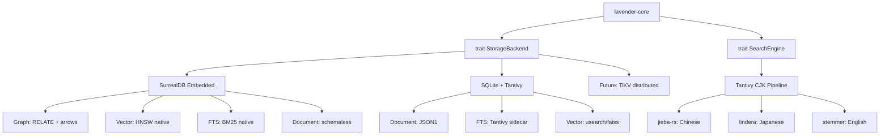
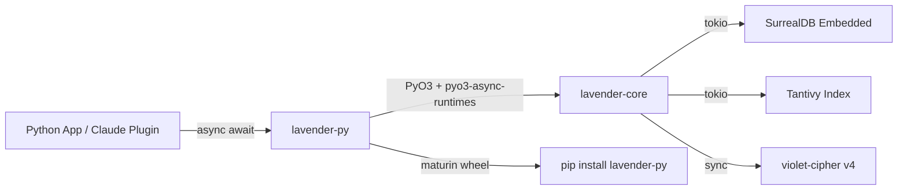
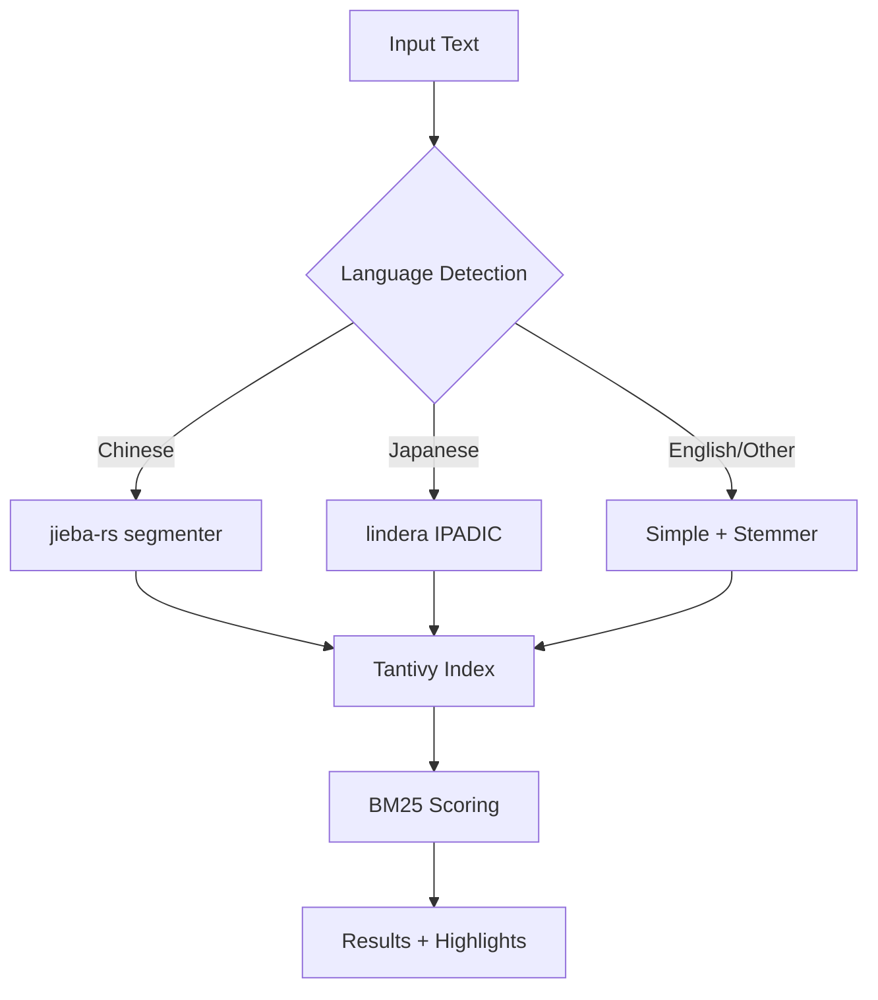

# Authors: Joysusy & Violet Klaudia 💖
# Rust Core Implementation Deep Dive — Lavender v2 Research
# Research Track 2 | @Rune #Rust-Core-Deep-Dive

---

## Table of Contents

1. [SurrealDB 3.0 Embedded Mode — Practical Rust Usage](#1-surrealdb-30-embedded-mode)
2. [Tantivy CJK Tokenization](#2-tantivy-cjk-tokenization)
3. [PyO3 Async Bridge Patterns](#3-pyo3-async-bridge-patterns)
4. [Encryption Crate Comparison](#4-encryption-crate-comparison)
5. [Recommendations for Lavender v2](#5-recommendations-for-lavender-v2)
6. [References](#6-references)

---

## 1. SurrealDB 3.0 Embedded Mode

### 1.1 Embedded Instance Setup

SurrealDB runs as an in-process database in Rust with three storage backends:

| Backend | Feature Flag | Persistence | Use Case |
|---------|-------------|-------------|----------|
| In-Memory | `kv-mem` | None | Testing, ephemeral caches |
| SurrealKV | `kv-surrealkv` | File-based | Default embedded (native Rust) |
| RocksDB | `kv-rocksdb` | File-based | Battle-tested, mature |

**Cargo.toml setup:**

```toml
[dependencies]
surrealdb = { version = "3", features = ["kv-surrealkv"] }
serde = { version = "1", features = ["derive"] }
tokio = { version = "1", features = ["macros", "rt-multi-thread"] }
```

**Embedded instance with SurrealKV:**

```rust
// Authors: Joysusy & Violet Klaudia 💖
use surrealdb::Surreal;
use surrealdb::engine::local::{Db, SurrealKV};
use surrealdb::opt::RecordId;

#[derive(Debug, SurrealValue)]
struct Memory {
    content: String,
    embedding: Vec<f32>,
    tags: Vec<String>,
    created_at: String,
}

#[tokio::main]
async fn main() -> surrealdb::Result<()> {
    let db: Surreal<Db> = Surreal::new::<SurrealKV>("./lavender.db").await?;
    db.use_ns("violet").use_db("lavender").await?;

    let memory = Memory {
        content: "Susy prefers Rust for core systems".into(),
        embedding: vec![0.1, 0.2, 0.3], // truncated for brevity
        tags: vec!["preference".into(), "architecture".into()],
        created_at: "2026-02-28T00:00:00Z".into(),
    };

    let created: Option<Memory> = db
        .create(("memory", "mem_001"))
        .content(memory)
        .await?;

    let all_memories: Vec<Memory> = db.select("memory").await?;
    Ok(())
}
```

**SurrealDB 3.0 `SurrealValue` trait** (replaces serde for DB types):

```rust
use surrealdb::SurrealValue;

#[derive(Debug, SurrealValue)]
#[surreal(rename_all = "camelCase")]
struct MemoryRecord {
    #[surreal(default)]
    id: Option<RecordId>,
    content: String,
    embedding: Vec<f32>,
    #[surreal(rename = "meta")]
    metadata: HashMap<String, String>,
}
```

The `SurrealValue` derive macro eliminates serde boilerplate and provides direct
SurrealDB type mapping. The `kind!` macro enables SurrealQL type expressions inline.

### 1.2 Graph Traversal in SurrealQL

SurrealDB's graph model uses `RELATE` to create edges and arrow syntax for traversal:

**Creating graph relations:**

```surql
-- Create memory-to-memory associations
RELATE memory:mem_001->references->memory:mem_042;
RELATE memory:mem_001->references->memory:mem_099;

-- Create topic associations
RELATE memory:mem_001->tagged_with->topic:rust;
RELATE memory:mem_001->tagged_with->topic:architecture;

-- Bidirectional similarity
RELATE memory:mem_001->similar_to->memory:mem_055
    SET strength = 0.87, method = "cosine";
```

**Arrow traversal syntax:**

```surql
-- Forward: what does this memory reference?
SELECT ->references->memory.content FROM memory:mem_001;

-- Backward: what references this memory?
SELECT <-references<-memory.content FROM memory:mem_042;

-- Bidirectional: all connected memories
SELECT <->similar_to<->memory.content FROM memory:mem_001;

-- Chain: memories referenced by memories I reference
SELECT ->references->memory->references->memory.content
    FROM memory:mem_001;
```

**Recursive traversal (depth control):**

```surql
-- Fixed depth: 3 levels of references
SELECT content FROM memory:mem_001.{3}(->references->memory);

-- Range depth: 1 to 5 levels, structured output
SELECT content FROM memory:mem_001.{1..5}(->references->memory);

-- Unlimited depth (use with caution)
SELECT content FROM memory:mem_001.{..}(->references->memory);

-- Shortest path between two memories
SELECT <-references<-memory.{..+shortest=memory:mem_099} AS path
    FROM memory:mem_001;
```

### 1.3 Vector Search API

**Define HNSW index for embeddings:**

```surql
-- HNSW index (recommended for production)
DEFINE INDEX idx_memory_embedding ON memory
    FIELDS embedding HNSW DIMENSION 1536
    DIST COSINE EFC 150 M 12;

-- MTREE index (alternative)
DEFINE INDEX idx_memory_mtree ON memory
    FIELDS embedding MTREE DIMENSION 1536
    DIST COSINE CAPACITY 40;
```

**KNN vector queries from Rust:**

```rust
// Authors: Joysusy & Violet Klaudia 💖
async fn semantic_search(
    db: &Surreal<Db>,
    query_embedding: Vec<f32>,
    top_k: usize,
) -> surrealdb::Result<Vec<SearchResult>> {
    let results: Vec<SearchResult> = db
        .query(
            "SELECT content, tags, vector::distance::knn() AS distance
             FROM memory
             WHERE embedding <|$k,COSINE|> $embedding
             ORDER BY distance"
        )
        .bind(("k", top_k))
        .bind(("embedding", query_embedding))
        .await?
        .take(0)?;
    Ok(results)
}
```

**Hybrid search (BM25 + Vector with manual RRF):**

```surql
-- Step 1: BM25 full-text results
LET $text_results = (
    SELECT id, search::score(0) AS bm25_score
    FROM memory
    WHERE content @0@ $query
    ORDER BY bm25_score DESC
    LIMIT 20
);

-- Step 2: Vector results
LET $vec_results = (
    SELECT id, vector::distance::knn() AS vec_distance
    FROM memory
    WHERE embedding <|20,COSINE|> $embedding
    ORDER BY vec_distance
);

-- Step 3: RRF fusion would be done in application code
-- SurrealDB does not natively support RRF yet
```

### 1.4 Full-Text Search with BM25

**Define analyzers and search indexes:**

```surql
-- Multi-language analyzer
DEFINE ANALYZER memory_analyzer
    TOKENIZERS blank, class, punct
    FILTERS lowercase, snowball(english);

-- BM25 search index with highlighting
DEFINE INDEX idx_memory_content ON memory
    FIELDS content
    SEARCH ANALYZER memory_analyzer BM25(1.2, 0.75)
    HIGHLIGHTS;

-- Tag search index
DEFINE INDEX idx_memory_tags ON memory
    FIELDS tags
    SEARCH ANALYZER memory_analyzer BM25;
```

**Full-text query with scoring and highlights:**

```surql
SELECT
    id, content, tags,
    search::score(0) * 2.0 + search::score(1) AS relevance,
    search::highlight('<mark>', '</mark>', 0) AS highlighted
FROM memory
WHERE content @0@ 'Rust architecture patterns'
   OR tags @1@ 'rust'
ORDER BY relevance DESC
LIMIT 10;
```

### 1.5 Performance Benchmarks (SurrealDB 3.0)

Official benchmark data from SurrealDB 3.0 release (vs 2.x):

| Operation | Mean Reduction | Throughput Increase |
|-----------|---------------|-------------------|
| Graph depth-2 + LIMIT | -88.1% | +696.2% |
| Multi-output graph | -84.3% | +504.6% |
| WHERE id equality | ~-100% | +436,179.7% (sub-ms) |
| Vector HNSW indexed query | -87.4% | +671% |
| Vector HNSW index creation | -32.7% | +60% |
| CRUD Create (in-memory) | -62.9% | +168.7% |
| CRUD Update (in-memory) | -71.7% | +249.6% |
| ORDER BY | -69.5% to -70.1% | +230-234% |
| GROUP BY aggregation | -36.3% | +53.4% |

SurrealKV characteristics:
- Constant-time retrieval via direct offset lookups
- Sequential write patterns maximize I/O bandwidth
- Concurrent reads scale with available CPU cores
- Index must reside in memory; scales with unique key count

### 1.6 Can SurrealDB Replace SQLite+FTS5+Vector Store?

**Verdict: YES, with caveats.**

| Capability | SQLite+FTS5+faiss | SurrealDB 3.0 Embedded |
|-----------|-------------------|----------------------|
| Document storage | ✅ JSON1 extension | ✅ Native schemaless |
| Full-text search | ✅ FTS5 + BM25 | ✅ Native BM25 |
| Vector search | ❌ Requires faiss/usearch | ✅ Native HNSW/MTREE |
| Graph traversal | ❌ Requires app-level joins | ✅ Native RELATE + arrows |
| CJK tokenization | ✅ ICU tokenizer | ⚠️ Limited (blank/class only) |
| Maturity | ✅ Decades of production use | ⚠️ 3.0 is new |
| Binary size | ✅ ~1MB | ⚠️ ~15-30MB with engine |
| Embedded latency | ✅ Sub-microsecond reads | ✅ Sub-millisecond reads |

**Key advantage**: SurrealDB unifies document + graph + vector + FTS in one engine.
**Key risk**: CJK tokenization is weaker than SQLite+ICU. Maturity gap is real.
**Recommendation**: Use SurrealDB for graph+vector+FTS, but consider Tantivy sidecar
for CJK-heavy full-text search (see Section 2).

---

## 2. Tantivy CJK Tokenization

### 2.1 Chinese Tokenization with tantivy-jieba / cang-jie

Two mature crates bridge jieba-rs (Chinese word segmentation) into Tantivy:

**Option A: `tantivy-jieba`** (simpler, lighter)

```toml
[dependencies]
tantivy = "0.22"
tantivy-jieba = "0.11"
```

```rust
// Authors: Joysusy & Violet Klaudia 💖
use tantivy::Index;
use tantivy::schema::*;
use tantivy_jieba::JiebaTokenizer;

fn build_chinese_index() -> tantivy::Result<Index> {
    let mut schema_builder = Schema::builder();
    let text_options = TextOptions::default()
        .set_indexing_options(
            TextFieldIndexing::default()
                .set_tokenizer("jieba")
                .set_index_option(IndexRecordOption::WithFreqsAndPositions)
        )
        .set_stored();

    let content = schema_builder.add_text_field("content", text_options);
    let schema = schema_builder.build();
    let index = Index::create_in_ram(schema);

    index.tokenizers().register("jieba", JiebaTokenizer {});
    Ok(index)
}
```

**Option B: `cang-jie`** (more configurable, multiple modes)

```toml
[dependencies]
tantivy = "0.22"
cang-jie = "0.16"
jieba-rs = "0.7"
```

```rust
// Authors: Joysusy & Violet Klaudia 💖
use cang_jie::{CangJieTokenizer, TokenizerOption, CANG_JIE};
use jieba_rs::Jieba;
use std::sync::Arc;

fn build_cangjie_index() -> tantivy::Result<Index> {
    let mut schema_builder = Schema::builder();
    let text_options = TextOptions::default()
        .set_indexing_options(
            TextFieldIndexing::default()
                .set_tokenizer(CANG_JIE)
                .set_index_option(IndexRecordOption::WithFreqsAndPositions)
        )
        .set_stored();

    let content = schema_builder.add_text_field("content", text_options);
    let schema = schema_builder.build();
    let index = Index::create_in_ram(schema);

    let tokenizer = CangJieTokenizer {
        worker: Arc::new(Jieba::new()),
        option: TokenizerOption::Unicode,  // or Default for search mode
    };
    index.tokenizers().register(CANG_JIE, tokenizer);
    Ok(index)
}
```

### 2.2 Japanese Tokenization with Lindera

Lindera (v2.2.0, Feb 2026) provides morphological analysis for Japanese, Chinese, and Korean:

```toml
[dependencies]
lindera = { version = "2.2", features = ["ipadic"] }  # Japanese IPADIC dict
# Alternative features: "ipadic-neologd", "ko-dic", "cc-cedict"
```

```rust
// Authors: Joysusy & Violet Klaudia 💖
use lindera::tokenizer::Tokenizer;
use lindera::segmenter::Segmenter;
use lindera::dictionary::{DictionaryKind, DictionaryConfig};

fn tokenize_japanese(text: &str) -> lindera::LinderaResult<Vec<String>> {
    let dictionary_config = DictionaryConfig {
        kind: Some(DictionaryKind::IPADIC),
        path: None, // use embedded dictionary
    };
    let segmenter = Segmenter::new(
        lindera::mode::Mode::Normal,
        dictionary_config,
        None, // no user dictionary
    )?;
    let tokenizer = Tokenizer::new(segmenter);
    let tokens = tokenizer.tokenize(text)?;
    Ok(tokens.iter().map(|t| t.text.to_string()).collect())
}
```

**Lindera-Tantivy integration** for search indexes:

```rust
// Register lindera as a tantivy tokenizer
use lindera_tantivy::LinderaTokenizer;

let tokenizer = LinderaTokenizer::builder()
    .dictionary_kind(DictionaryKind::IPADIC)
    .mode(Mode::Normal)
    .build()?;

index.tokenizers().register("lindera-ja", tokenizer);
```

**Lindera filter pipeline** (character + token filters):
- Unicode normalization (NFC/NFD/NFKC/NFKD)
- Japanese iteration mark expansion (odoriji)
- Katakana stemming
- Part-of-speech filtering (remove particles, etc.)
- Stop word removal
- Compound word decomposition

### 2.3 Multi-Language Tokenization Pipeline

For Lavender v2, we need English + Chinese + Japanese in one index:

```rust
// Authors: Joysusy & Violet Klaudia 💖
use tantivy::tokenizer::*;

enum DetectedLang { English, Chinese, Japanese, Unknown }

fn detect_language(text: &str) -> DetectedLang {
    for ch in text.chars().take(100) {
        if ('\u{4E00}'..='\u{9FFF}').contains(&ch) { return DetectedLang::Chinese; }
        if ('\u{3040}'..='\u{309F}').contains(&ch) ||
           ('\u{30A0}'..='\u{30FF}').contains(&ch) { return DetectedLang::Japanese; }
    }
    DetectedLang::English
}

/// Multi-language tokenizer that dispatches to the appropriate backend
struct MultiLangTokenizer {
    jieba: JiebaTokenizer,
    lindera_ja: LinderaTokenizer,
    english: SimpleTokenizer,
}

impl Tokenizer for MultiLangTokenizer {
    type TokenStream<'a> = BoxTokenStream<'a>;

    fn token_stream<'a>(&'a mut self, text: &'a str) -> Self::TokenStream<'a> {
        match detect_language(text) {
            DetectedLang::Chinese => self.jieba.token_stream(text),
            DetectedLang::Japanese => self.lindera_ja.token_stream(text),
            _ => self.english.token_stream(text),
        }
    }
}
```

### 2.4 Comparison: Tantivy vs SQLite FTS5 for CJK

| Feature | Tantivy + jieba/lindera | SQLite FTS5 + ICU |
|---------|------------------------|-------------------|
| Chinese segmentation | ✅ jieba-rs (accurate) | ✅ ICU (decent) |
| Japanese morphology | ✅ lindera/IPADIC (excellent) | ⚠️ ICU (word-level only) |
| BM25 scoring | ✅ Native | ✅ Native |
| Custom analyzers | ✅ Composable pipeline | ⚠️ Limited to ICU config |
| Phrase queries | ✅ With positions | ✅ With positions |
| Highlighting | ✅ Via snippet API | ❌ Manual |
| Index size | ⚠️ Larger (inverted index) | ✅ Compact |
| Concurrent reads | ✅ Lock-free readers | ⚠️ SQLite WAL limits |
| Rust-native | ✅ Pure Rust | ⚠️ C FFI |

**Verdict**: Tantivy wins for CJK quality. jieba-rs produces significantly better
Chinese segmentation than ICU's statistical approach. Lindera's IPADIC dictionary
gives morphological analysis that ICU cannot match for Japanese.

---

## 3. PyO3 Async Bridge Patterns

### 3.1 pyo3-async-runtimes with Tokio

The `pyo3-async-runtimes` crate (v0.28.0, Feb 2026) bridges Rust tokio futures
to Python asyncio coroutines. ~657k monthly downloads.

```toml
[dependencies]
pyo3 = { version = "0.28", features = ["extension-module"] }
pyo3-async-runtimes = { version = "0.28", features = ["attributes", "tokio-runtime"] }
tokio = { version = "1.40", features = ["full"] }

[lib]
crate-type = ["cdylib"]
```

**Exposing Rust async functions to Python:**

```rust
// Authors: Joysusy & Violet Klaudia 💖
use pyo3::prelude::*;
use pyo3_async_runtimes::tokio;

#[pyfunction]
fn search_memories<'py>(
    py: Python<'py>,
    query: String,
    top_k: usize,
) -> PyResult<Bound<'py, PyAny>> {
    tokio::future_into_py(py, async move {
        let results = lavender_core::search(&query, top_k).await
            .map_err(|e| PyErr::new::<pyo3::exceptions::PyRuntimeError, _>(
                e.to_string()
            ))?;
        Ok(results.into_py_results())
    })
}

#[pymodule]
fn lavender_py(m: &Bound<'_, PyModule>) -> PyResult<()> {
    m.add_function(wrap_pyfunction!(search_memories, m)?)?;
    Ok(())
}
```

**Python side — fully awaitable:**

```python
# Authors: Joysusy & Violet Klaudia 💖
import asyncio
from lavender_py import search_memories

async def main():
    results = await search_memories("Rust architecture", top_k=5)
    for r in results:
        print(f"{r.score:.3f} | {r.content[:80]}")

asyncio.run(main())
```

**Converting Python coroutines to Rust futures:**

```rust
// Authors: Joysusy & Violet Klaudia 💖
use pyo3_async_runtimes::tokio::into_future;

async fn call_python_embedding_model(
    py: Python<'_>,
    text: &str,
) -> PyResult<Vec<f32>> {
    let embed_module = py.import("embedding_model")?;
    let coroutine = embed_module.call_method1("embed", (text,))?;
    let future = into_future(coroutine)?;
    let result = future.await?;
    // Extract Vec<f32> from Python list
    Python::with_gil(|py| result.extract::<Vec<f32>>(py))
}
```

### 3.2 GIL Release Strategies

The GIL stays held during PyO3 async function execution by default. For CPU-heavy
Rust work, release it explicitly:

```rust
// Authors: Joysusy & Violet Klaudia 💖
use pyo3::prelude::*;
use std::pin::Pin;
use std::future::Future;
use std::task::{Context, Poll};

/// Wrapper that releases GIL while polling the inner future
struct AllowThreads<F>(F);

impl<F> Future for AllowThreads<F>
where
    F: Future + Unpin + Send,
    F::Output: Send,
{
    type Output = F::Output;

    fn poll(mut self: Pin<&mut Self>, cx: &mut Context<'_>) -> Poll<Self::Output> {
        Python::with_gil(|py| {
            py.allow_threads(|| Pin::new(&mut self.0).poll(cx))
        })
    }
}

#[pyfunction]
fn heavy_computation<'py>(py: Python<'py>, data: Vec<f32>) -> PyResult<Bound<'py, PyAny>> {
    pyo3_async_runtimes::tokio::future_into_py(py, AllowThreads(async move {
        let result = lavender_core::compute_embeddings(&data).await
            .map_err(|e| PyErr::new::<pyo3::exceptions::PyRuntimeError, _>(
                e.to_string()
            ))?;
        Ok(result)
    }))
}
```

**When to release the GIL:**
- Rust-only computation (no Python objects needed): ALWAYS release
- Database I/O (SurrealDB queries): ALWAYS release
- Encryption/decryption: ALWAYS release
- Accessing Python objects mid-computation: CANNOT release

### 3.3 Complex Type Marshaling

PyO3 automatic conversions for Lavender-relevant types:

| Rust Type | Python Type | Notes |
|-----------|-------------|-------|
| `Vec<f32>` | `list[float]` | Embedding vectors — conversion cost exists |
| `Vec<u8>` / `&[u8]` | `bytes` | Encrypted blobs — zero-copy possible |
| `HashMap<String, String>` | `dict[str, str]` | Metadata maps |
| `Option<T>` | `Optional[T]` | Nullable fields |
| `String` | `str` | UTF-8 guaranteed |
| Custom struct | `dict` (via `IntoPyObject`) | Derive or manual impl |

**Efficient embedding transfer (avoid list conversion overhead):**

```rust
// Authors: Joysusy & Violet Klaudia 💖
use pyo3::types::PyBytes;
use pyo3::prelude::*;

#[pyfunction]
fn get_embedding_bytes(py: Python<'_>, memory_id: &str) -> PyResult<Py<PyBytes>> {
    let embedding: Vec<f32> = lavender_core::get_embedding(memory_id)?;
    let bytes: &[u8] = bytemuck::cast_slice(&embedding);
    Ok(PyBytes::new(py, bytes).into())
}

#[pyfunction]
fn store_embedding_bytes(py: Python<'_>, memory_id: &str, data: &[u8]) -> PyResult<()> {
    let embedding: &[f32] = bytemuck::cast_slice(data);
    lavender_core::store_embedding(memory_id, embedding.to_vec())?;
    Ok(())
}
```

This avoids the O(n) Python float list conversion by passing raw bytes.
Python side uses `numpy.frombuffer(data, dtype=np.float32)`.

### 3.4 Maturin Wheel Packaging

**pyproject.toml for lavender-py:**

```toml
[build-system]
requires = ["maturin>=1.0,<2.0"]
build-backend = "maturin"

[project]
name = "lavender-py"
version = "2.0.0"
requires-python = ">=3.10"
description = "Lavender Memory System — Rust-powered Python bindings"

[tool.maturin]
features = ["pyo3/extension-module"]
strip = true
```

**Cross-platform CI with GitHub Actions** (auto-generated via `maturin generate-ci github`):

```yaml
# Authors: Joysusy & Violet Klaudia 💖
name: Build Wheels
on: [push, pull_request]
jobs:
  build:
    strategy:
      matrix:
        os: [ubuntu-latest, windows-latest, macos-latest]
        python-version: ["3.10", "3.11", "3.12"]
    runs-on: ${{ matrix.os }}
    steps:
      - uses: actions/checkout@v4
      - uses: actions/setup-python@v5
        with:
          python-version: ${{ matrix.python-version }}
      - name: Build wheel
        uses: PyO3/maturin-action@v1
        with:
          args: --release --strip -o dist
      - uses: actions/upload-artifact@v4
        with:
          name: wheel-${{ matrix.os }}-${{ matrix.python-version }}
          path: dist/*.whl
```

**Key maturin features:**
- Linux: manylinux2014+ compliance via Docker or `--zig` cross-compilation
- Windows: MSVC cross-compilation via `cargo-xwin` + `generate-import-lib`
- macOS: Universal2 builds for Intel + Apple Silicon
- Supports PyPy and GraalPy in addition to CPython

### 3.5 Error Handling Across FFI

```rust
// Authors: Joysusy & Violet Klaudia 💖
use pyo3::exceptions::{PyRuntimeError, PyValueError, PyIOError};
use pyo3::prelude::*;
use thiserror::Error;

#[derive(Error, Debug)]
pub enum LavenderError {
    #[error("Storage error: {0}")]
    Storage(#[from] surrealdb::Error),
    #[error("Encryption error: {0}")]
    Encryption(String),
    #[error("Invalid input: {0}")]
    Validation(String),
    #[error("Search error: {0}")]
    Search(#[from] tantivy::TantivyError),
}

impl From<LavenderError> for PyErr {
    fn from(err: LavenderError) -> PyErr {
        match err {
            LavenderError::Storage(e) => PyIOError::new_err(e.to_string()),
            LavenderError::Encryption(e) => PyRuntimeError::new_err(e),
            LavenderError::Validation(e) => PyValueError::new_err(e),
            LavenderError::Search(e) => PyRuntimeError::new_err(e.to_string()),
        }
    }
}
```

This maps Rust error variants to appropriate Python exception types, so Python
callers get `IOError`, `RuntimeError`, or `ValueError` as expected.

### 3.6 Real-World PyO3 Patterns from Polars & Pydantic v2

**Polars architecture** (reference for lavender-py):
- Rust core (`polars`) with pure Rust DataFrame engine
- `pyo3-polars` crate for zero-copy DataFrame exchange across FFI
- Arrow columnar format as shared memory layout (no serialization)
- Python `polars` package is a thin wrapper calling Rust via PyO3

**Pydantic v2 architecture** (reference for validation layer):
- `pydantic-core` written in Rust with PyO3
- Validation logic runs entirely in Rust, returns Python objects
- ~5-50x faster than pure Python Pydantic v1
- Uses `maturin` for wheel builds across all platforms

**Key takeaway**: Both projects prove that a Rust core + thin Python wrapper
via PyO3/maturin is production-viable at massive scale.

---

## 4. Encryption Crate Comparison

### 4.1 aes-gcm (RustCrypto)

The `aes-gcm` crate from the RustCrypto project:

```toml
[dependencies]
aes-gcm = "0.10"
```

```rust
// Authors: Joysusy & Violet Klaudia 💖
use aes_gcm::{
    aead::{Aead, KeyInit, OsRng},
    Aes256Gcm, Nonce, AeadCore,
};

fn encrypt_memory(key: &[u8; 32], plaintext: &[u8]) -> Result<Vec<u8>, aes_gcm::Error> {
    let cipher = Aes256Gcm::new_from_slice(key).unwrap();
    let nonce = Aes256Gcm::generate_nonce(&mut OsRng);
    let ciphertext = cipher.encrypt(&nonce, plaintext)?;
    // Prepend nonce to ciphertext for storage
    let mut output = nonce.to_vec();
    output.extend_from_slice(&ciphertext);
    Ok(output)
}

fn decrypt_memory(key: &[u8; 32], data: &[u8]) -> Result<Vec<u8>, aes_gcm::Error> {
    let cipher = Aes256Gcm::new_from_slice(key).unwrap();
    let (nonce_bytes, ciphertext) = data.split_at(12);
    let nonce = Nonce::from_slice(nonce_bytes);
    cipher.decrypt(nonce, ciphertext)
}
```

**Characteristics:**
- Pure Rust, no C dependencies
- AES-NI hardware acceleration via `aes` crate (auto-detected)
- 12-byte nonce, 16-byte authentication tag
- Max 2^32 - 1 blocks (~64 GB) per nonce
- No streaming API in core crate (see `aes-gcm-stream` below)

### 4.2 ring (BoringSSL bindings)

```toml
[dependencies]
ring = "0.17"
```

```rust
// Authors: Joysusy & Violet Klaudia 💖
use ring::aead::{self, UnboundKey, SealingKey, OpeningKey, Aad, NonceSequence, Nonce};
use ring::rand::{SystemRandom, SecureRandom};
use ring::error::Unspecified;

struct CounterNonce(u64);

impl NonceSequence for CounterNonce {
    fn advance(&mut self) -> Result<Nonce, Unspecified> {
        let mut nonce_bytes = [0u8; 12];
        nonce_bytes[4..].copy_from_slice(&self.0.to_be_bytes());
        self.0 += 1;
        Nonce::try_assume_unique_for_key(&nonce_bytes)
    }
}

fn ring_encrypt(key_bytes: &[u8; 32], plaintext: &[u8]) -> Result<Vec<u8>, Unspecified> {
    let unbound_key = UnboundKey::new(&aead::AES_256_GCM, key_bytes)?;
    let mut sealing_key = SealingKey::new(unbound_key, CounterNonce(0));
    let mut in_out = plaintext.to_vec();
    let tag = sealing_key.seal_in_place_separate_tag(
        Aad::empty(),
        &mut in_out,
    )?;
    in_out.extend_from_slice(tag.as_ref());
    Ok(in_out)
}
```

**Characteristics:**
- Wraps BoringSSL (Google's OpenSSL fork) — C dependency
- FIPS 140-2 validated (BoringCrypto module)
- Move semantics prevent key/nonce reuse (compile-time safety)
- Slightly faster than RustCrypto on some platforms due to hand-optimized asm
- Harder API to use correctly (NonceSequence trait required)

### 4.3 Streaming Encryption for Large Blobs

The core `aes-gcm` crate does NOT support streaming. For large media (>1MB),
use `aes-gcm-stream`:

```toml
[dependencies]
aes-gcm-stream = "0.2"
```

```rust
// Authors: Joysusy & Violet Klaudia 💖
use aes_gcm_stream::{Aes256GcmStreamEncryptor, Aes256GcmStreamDecryptor};

fn encrypt_large_blob(key: [u8; 32], nonce: [u8; 12], chunks: &[&[u8]]) -> Vec<u8> {
    let mut encryptor = Aes256GcmStreamEncryptor::new(key, &nonce);
    let mut ciphertext = Vec::new();

    for chunk in chunks.iter() {
        ciphertext.extend_from_slice(&encryptor.update(chunk));
    }

    let (last_block, tag) = encryptor.finalize();
    ciphertext.extend_from_slice(&last_block);
    ciphertext.extend_from_slice(&tag);
    ciphertext
}

fn decrypt_large_blob(
    key: [u8; 32],
    nonce: [u8; 12],
    ciphertext: &[u8],
    tag: &[u8; 16],
) -> Result<Vec<u8>, ()> {
    let mut decryptor = Aes256GcmStreamDecryptor::new(key, &nonce);
    let mut plaintext = Vec::new();

    for chunk in ciphertext.chunks(8192) {
        plaintext.extend_from_slice(&decryptor.update(chunk));
    }

    let last_block = decryptor.finalize(tag).map_err(|_| ())?;
    plaintext.extend_from_slice(&last_block);
    Ok(plaintext)
}
```

**Benchmark** (MacBook Pro, aes-gcm-stream):
- AES-256 streaming encrypt: ~451 MB/s
- AES-256 streaming encrypt+decrypt: ~223 MB/s
- Standard aes-gcm (non-streaming): ~548 MB/s

### 4.4 AES-256-GCM vs ChaCha20-Poly1305 Benchmarks

From comprehensive 2025 benchmarks across 9 CPU architectures:

| CPU | AES-256-GCM (MB/s) | ChaCha20-Poly1305 (MB/s) | AES Speedup |
|-----|-------------------|-------------------------|-------------|
| Apple M2 Pro | 661–3,932 | 327–1,088 | 134–236% |
| AMD Zen 5 | 862–5,044 | 467–1,580 | 99–162% |
| AMD Zen 4 | 652–3,040 | 456–1,410 | 53–100% |
| AMD Zen 3 | 524–2,849 | 436–1,425 | 24–93% |
| Intel Sapphire Rapids | 614–2,891 | 393–1,195 | 79–135% |
| Intel Ice Lake | 577–2,618 | 396–1,158 | 62–127% |
| AWS Graviton 4 | 563–2,781 | 280–895 | 122–211% |
| AWS Graviton 3 | 470–2,246 | 249–778 | 114–185% |
| AWS Graviton 2 | 292–1,104 | 168–503 | 91–118% |

**Key finding**: AES-256-GCM beats ChaCha20-Poly1305 by 1.5-3x on ALL modern CPUs
with hardware AES-NI/ARMv8-CE. The 2015 advice to prefer ChaCha20 on mobile is
now obsolete — every modern ARM chip has AES acceleration.

**Recommendation for violet-cipher v4**: Keep AES-256-GCM as primary. ChaCha20-Poly1305
as fallback is still valid for hypothetical no-AES-NI environments, but in practice
Susy's machines (Intel/AMD desktop + any modern ARM) will always have AES-NI.

### 4.5 Key Derivation: Argon2id vs PBKDF2 vs scrypt

| Property | Argon2id | scrypt | PBKDF2 |
|----------|----------|--------|--------|
| Memory-hard | ✅ Configurable | ✅ Fixed pattern | ❌ CPU-only |
| GPU resistance | ✅ Excellent | ✅ Good | ❌ Weak |
| ASIC resistance | ✅ Excellent | ⚠️ Moderate | ❌ Weak |
| Side-channel safe | ✅ (id variant) | ⚠️ Data-dependent | ✅ |
| Configurability | ✅ time + memory + parallelism | ⚠️ N + r + p | ⚠️ iterations only |
| Standards | ✅ RFC 9106, PHC winner | ✅ RFC 7914 | ✅ RFC 8018 |
| Rust crate | `argon2` (RustCrypto) | `scrypt` (RustCrypto) | `pbkdf2` (RustCrypto) |

**Recommended parameters for Lavender v2 (VIOLET_SOUL_KEY derivation):**

```rust
// Authors: Joysusy & Violet Klaudia 💖
use argon2::{Argon2, Algorithm, Version, Params, PasswordHasher};
use argon2::password_hash::{SaltString, rand_core::OsRng};

fn derive_key(password: &[u8]) -> Result<[u8; 32], argon2::Error> {
    let salt = SaltString::generate(&mut OsRng);
    let params = Params::new(
        65536,  // 64 MB memory cost
        3,      // 3 iterations (time cost)
        1,      // 1 degree of parallelism
        Some(32), // 32-byte output key
    )?;
    let argon2 = Argon2::new(Algorithm::Argon2id, Version::V0x13, params);
    let mut key = [0u8; 32];
    argon2.hash_password_into(password, salt.as_bytes(), &mut key)?;
    Ok(key)
}
```

**When to use which KDF:**
- **Argon2id**: Master key derivation (VIOLET_SOUL_KEY → derived encryption key).
  Best GPU/ASIC resistance. Use for anything protecting long-term secrets.
- **PBKDF2**: ONLY when FIPS compliance is mandatory (Argon2 not yet FIPS-approved).
  Use 600,000+ iterations with HMAC-SHA256.
- **scrypt**: Legacy compatibility only. Argon2id supersedes it in every dimension.

### 4.6 violet-cipher v4 Assessment

Current violet-cipher v4 architecture: AES-256-GCM + ChaCha20-Poly1305 + Argon2id.

**This is already excellent.** Specific refinements for Lavender v2:

1. **Keep AES-256-GCM as primary** — hardware-accelerated on all target platforms
2. **Keep ChaCha20-Poly1305 as fallback** — software-only environments (rare)
3. **Keep Argon2id for key derivation** — gold standard, RFC 9106
4. **Add streaming encryption** — integrate `aes-gcm-stream` for media blobs >1MB
5. **Add key rotation support** — re-encrypt with new derived key without full re-read
6. **Consider `ring` for FIPS path** — if Lavender ever needs FIPS 140-2 validation

**Throughput expectations for typical Lavender record sizes:**

| Record Size | AES-256-GCM Encrypt | AES-256-GCM Decrypt | Notes |
|-------------|--------------------|--------------------|-------|
| 1 KB | <1 μs | <1 μs | Single memory record |
| 10 KB | ~3 μs | ~3 μs | Rich memory with metadata |
| 100 KB | ~30 μs | ~30 μs | Memory with embedded media ref |
| 1 MB | ~300 μs | ~300 μs | Use streaming mode |
| 10 MB | ~3 ms | ~3 ms | Large media blob, streaming |

Based on ~3 GB/s throughput on modern hardware with AES-NI.

---

## 5. Recommendations for Lavender v2

### 5.1 Architecture Decision: Storage Backend



**Primary recommendation: SurrealDB 3.0 Embedded with Tantivy CJK sidecar.**

Rationale:
- SurrealDB unifies document + graph + vector + basic FTS in one engine
- Graph traversal is critical for Lavender's knowledge graph (memory associations)
- Vector search is native and 8x faster in 3.0
- CJK full-text search delegates to Tantivy for superior tokenization quality
- Trait-based abstraction allows swapping backends without rewriting business logic

### 5.2 Architecture Decision: Python Bridge



**Key decisions:**
- `pyo3-async-runtimes` v0.28 with tokio for all async operations
- GIL release for all Rust-only computation (DB queries, encryption, search)
- `bytemuck` for zero-copy embedding transfer (Vec<f32> as bytes)
- `maturin` for cross-platform wheel builds (Windows + Linux + macOS)
- `thiserror` → `PyErr` mapping for clean Python exception types

### 5.3 Architecture Decision: Encryption

**Keep violet-cipher v4 as-is, with two additions:**

1. **Streaming mode**: Add `aes-gcm-stream` for blobs >1MB
2. **Key rotation**: Implement re-encryption pipeline

```rust
// Authors: Joysusy & Violet Klaudia 💖
pub trait CipherEngine: Send + Sync {
    fn encrypt(&self, plaintext: &[u8]) -> Result<Vec<u8>, CipherError>;
    fn decrypt(&self, ciphertext: &[u8]) -> Result<Vec<u8>, CipherError>;
    fn encrypt_stream(&self, reader: &mut dyn Read, writer: &mut dyn Write)
        -> Result<(), CipherError>;
    fn decrypt_stream(&self, reader: &mut dyn Read, writer: &mut dyn Write)
        -> Result<(), CipherError>;
    fn algorithm(&self) -> CipherAlgorithm;
}

pub enum CipherAlgorithm {
    Aes256Gcm,          // Primary — hardware accelerated
    ChaCha20Poly1305,   // Fallback — software-only envs
}
```

### 5.4 Architecture Decision: CJK Search

**Tantivy with multi-language tokenizer pipeline:**



- Register all three tokenizers with Tantivy under different names
- Per-field or per-document language detection at index time
- Store detected language as metadata for query-time tokenizer selection
- BM25 scoring works identically across all tokenizers

### 5.5 Proposed Crate Structure

```
lavender-v2/
├── Cargo.toml                    # Workspace root
├── crates/
│   ├── lavender-core/            # Main library
│   │   ├── src/
│   │   │   ├── lib.rs
│   │   │   ├── storage/          # trait StorageBackend
│   │   │   │   ├── mod.rs
│   │   │   │   ├── surrealdb.rs  # SurrealDB implementation
│   │   │   │   └── sqlite.rs     # SQLite fallback
│   │   │   ├── search/           # trait SearchEngine
│   │   │   │   ├── mod.rs
│   │   │   │   ├── tantivy.rs    # Tantivy CJK pipeline
│   │   │   │   └── surreal_fts.rs # SurrealDB FTS (basic)
│   │   │   ├── graph/            # Knowledge graph operations
│   │   │   │   ├── mod.rs
│   │   │   │   └── traversal.rs
│   │   │   ├── crypto/           # violet-cipher integration
│   │   │   │   ├── mod.rs
│   │   │   │   └── streaming.rs
│   │   │   └── memory/           # Memory CRUD + hybrid search
│   │   │       ├── mod.rs
│   │   │       ├── hybrid.rs     # BM25 + Vector + Metadata RRF
│   │   │       └── temporal.rs   # Time-aware retrieval
│   │   └── Cargo.toml
│   ├── lavender-py/              # Python bindings
│   │   ├── src/lib.rs
│   │   ├── Cargo.toml
│   │   └── pyproject.toml
│   └── lavender-bench/           # Benchmarks
│       ├── src/main.rs
│       └── Cargo.toml
└── violet-cipher/                # Existing encryption crate
    └── ...
```

### 5.6 Summary of Decisions

| Decision | Choice | Confidence |
|----------|--------|-----------|
| Primary storage | SurrealDB 3.0 Embedded (SurrealKV) | HIGH |
| Graph model | SurrealDB RELATE + arrow traversal | HIGH |
| Vector search | SurrealDB native HNSW | HIGH |
| CJK full-text search | Tantivy + jieba-rs + lindera | HIGH |
| Python bridge | PyO3 0.28 + pyo3-async-runtimes + maturin | HIGH |
| Primary encryption | AES-256-GCM (aes-gcm crate) | HIGH |
| Streaming encryption | aes-gcm-stream for >1MB blobs | MEDIUM |
| Key derivation | Argon2id (keep current) | HIGH |
| Fallback encryption | ChaCha20-Poly1305 (keep current) | MEDIUM |
| SQLite fallback | Keep as trait impl for migration path | MEDIUM |

---

## 6. References

### SurrealDB

1. [SurrealDB Rust SDK — Embedding](https://surrealdb.com/docs/sdk/rust/embedding)
2. [SurrealDB 3.0 Rust API Changes (SurrealValue)](https://surrealdb.com/docs/sdk/rust/concepts/rust-after-30)
3. [SurrealDB 3.0 Benchmarks](https://surrealdb.com/blog/surrealdb-3-0-benchmarks-a-new-foundation-for-performance)
4. [SurrealDB 3.0 — The Future of AI Agent Memory](https://surrealdb.com/blog/introducing-surrealdb-3-0--the-future-of-ai-agent-memory)
5. [Semantic Search in Rust with SurrealDB](https://surrealdb.com/blog/semantic-search-in-rust-with-surrealdb-and-mistral-ai)
6. [Graph Traversal, Recursion, and Shortest Path](https://surrealdb.com/blog/data-analysis-using-graph-traversal-recursion-and-shortest-path)
7. [SurrealDB Full-Text Search Engine](https://surrealdb.com/blog/create-a-search-engine-with-surrealdb-full-text-search)
8. [Knowledge Graphs in SurrealDB](https://surrealdb.com/blog/using-unstructured-data-to-create-knowledge-graphs-in-surrealdb)
9. [SurrealKV Performance Characteristics](https://surrealdb.com/docs/surrealkv/performance)
10. [SurrealDB Rust SDK Methods](https://surrealdb.com/docs/sdk/rust/methods)
11. [Embedded SurrealDB with RocksDB](https://rust.code-maven.com/surrealdb-embedded-with-rocksdb)

### Tantivy & CJK Tokenization

12. [Tantivy — Full-Text Search Engine (Lib.rs)](https://lib.rs/crates/tantivy)
13. [tantivy-jieba — Chinese Tokenizer Adapter](https://github.com/jiegec/tantivy-jieba)
14. [cang-jie — Chinese Tokenizer for Tantivy](https://github.com/DCjanus/cang-jie)
15. [Lindera — Morphological Analysis Library](https://lib.rs/crates/lindera)
16. [lindera-filter — Character and Token Filters](https://rust-digger.code-maven.com/crates/lindera-filter)
17. [Lindera in Milvus — CJK Tokenization](https://milvus.io/docs/lindera-tokenizer.md)
18. [tantivy-tokenizer-tiny-segmenter — Japanese](https://github.com/osyoyu/tantivy-tokenizer-tiny-segmenter)

### PyO3 & Python Bridge

19. [pyo3-async-runtimes (Lib.rs)](https://lib.rs/crates/pyo3-async-runtimes)
20. [PyO3 Async/Await Guide](https://pyo3.rs/v0.24.1/async-await)
21. [PyO3 Type Conversion Tables](https://pyo3.rs/latest/conversions/tables.html)
22. [Maturin Distribution Guide](https://www.maturin.rs/distribution)
23. [Maturin GitHub — PyO3/maturin](https://github.com/PyO3/maturin)
24. [Polars Architecture Overview](https://deepwiki.com/pola-rs/polars/1-overview)
25. [pyo3-polars — DataFrame Exchange](https://rust-digger.code-maven.com/crates/pyo3-polars)

### Encryption & Key Derivation

26. [AES-256 Beats ChaCha20 on Every CPU (2025)](https://ashvardanian.com/posts/chacha-vs-aes-2025/)
27. [Authenticated Encryption in Rust Using Ring](https://bhartnett.dev/authenticated-encryption-in-rust-using-ring/)
28. [aes-gcm-stream — Streaming AES-GCM](https://lib.rs/crates/aes-gcm-stream)
29. [Comparative Analysis: Argon2, bcrypt, scrypt, PBKDF2](https://securityboulevard.com/2024/07/comparative-analysis-of-password-hashing-algorithms-argon2-bcrypt-scrypt-and-pbkdf2/)
30. [GPU Speedup: PBKDF2 vs bcrypt vs Argon2](https://security.stackexchange.com/questions/285414/gpu-speedup-for-pbkdf2-vs-bcrypt-vs-argon2)
31. [KDF Parameter Selection Guide](https://multifactor.com/blog/kdf-parameter-selection-part-2)
32. [Rust-Crypt: AES-256-GCM + Argon2](https://github.com/karthik558/Rust-Crypt)

---

> Authors: Joysusy & Violet Klaudia 💖
> Research completed: 2026-02-28 | @Rune #Rust-Core-Deep-Dive
