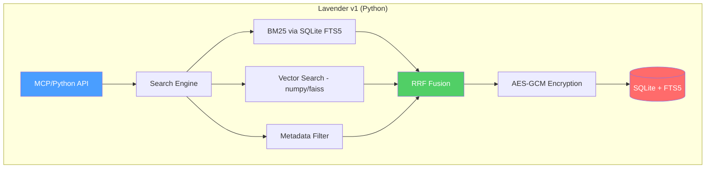
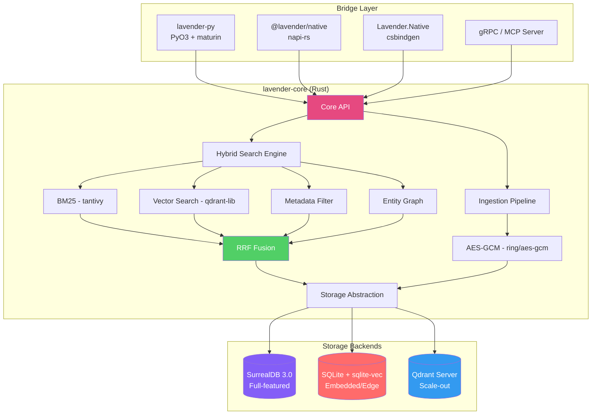
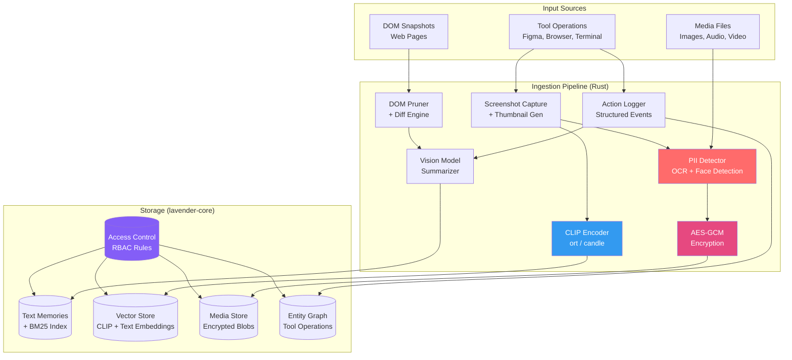

# Authors: Joysusy & Violet Klaudia 💖
# Research Report: Rust-Based AI Agent Memory Systems
# Informing the Architecture of Lavender-MemorySys v2

> **Date**: 2026-02-28
> **Scope**: Landscape analysis of AI memory systems, Rust-native solutions, FFI bridge patterns, and architectural recommendations
> **Current Stack**: Python 3.12+ / SQLite+FTS5 / Hybrid Search (BM25+Vector+Metadata with RRF) / AES-GCM Encryption
> **Vision**: Rust-led core with Python, C#, and JS/Node as bridge languages

---

## Table of Contents

1. [Executive Summary](#executive-summary)
2. [Landscape Analysis: Existing AI Memory Systems](#landscape-analysis)
3. [Rust-Native Solutions Deep Dive](#rust-native-solutions)
4. [Distributed SQL Patterns](#distributed-sql-patterns)
5. [FFI Bridge Analysis](#ffi-bridge-analysis)
6. [Architecture Patterns](#architecture-patterns)
7. [Recommendations for Lavender v2](#recommendations)
8. [Multi-Modal Memory Architecture](#multi-modal-memory-architecture)
9. [References](#references)

---

## Executive Summary

The AI agent memory landscape in 2026 is rapidly maturing. Systems like Mem0, Letta, and Zep have established core patterns — extraction pipelines, temporal knowledge graphs, and hybrid search — but all are built primarily in Python with significant performance and scalability constraints. Meanwhile, the Rust ecosystem has produced production-grade components (Qdrant, Tantivy, LanceDB, SurrealDB 3.0) that individually match or exceed their Python counterparts in performance, memory safety, and concurrency.

**Key finding**: No existing system combines Lavender's unique hybrid search (BM25 + Vector + Metadata with RRF fusion), encryption-first design, and multi-language bridge architecture. This represents a genuine market gap. A Rust-core rewrite would yield 10-50x performance gains on search-critical paths while maintaining Python/C#/Node accessibility through mature FFI bridges (PyO3, napi-rs, csbindgen).

**Recommended architecture**: A layered Rust core (`lavender-core`) exposing a C-ABI surface, with language-specific bridge crates and an optional gRPC/MCP server for external integration. SurrealDB 3.0 or Qdrant+Tantivy as the storage backbone, with SQLite+sqlite-vec retained as the embedded/edge deployment option.

---

## Landscape Analysis: Existing AI Memory Systems

### Comparison Matrix

| System | Language | Storage Backend | Search Strategy | Memory Model | Encryption | License |
|--------|----------|----------------|-----------------|--------------|------------|---------|
| **Mem0** | Python | Qdrant/Chroma/Milvus/Pgvector/Redis | Vector similarity + metadata filter | Flat facts + Graph (Mem0^g) | None native | Apache 2.0 |
| **Letta** (MemGPT) | Python | PostgreSQL + embeddings | In-context + archival embedding lookup | Tiered: core/conversational/archival | None native | Apache 2.0 |
| **Zep** | Python/Go | Neo4j + Lucene | Temporal KG + BM25 + cosine + BFS | Temporal Knowledge Graph (Graphiti) | Enterprise only | BSL 1.1 |
| **LangChain** | Python/JS | Pluggable (20+ stores) | Depends on backend | Buffer/Summary/Entity/KG memory | None native | MIT |
| **LlamaIndex** | Python | Pluggable | Vector + keyword hybrid | Index-based retrieval | None native | MIT |
| **Graphlit** | Cloud SaaS | Managed (proprietary) | Semantic + knowledge graph | Multi-modal semantic memory | Managed | Proprietary |
| **Lavender v1** | Python | SQLite+FTS5 | BM25+Vector+Metadata (RRF fusion) | Flat memories + metadata | AES-GCM | Proprietary |

### 2.1 Mem0

**Architecture**: Two-phase pipeline — Extraction (LLM extracts salient facts from conversation + summary context) and Update (semantic comparison against existing memories via vector embeddings, with ADD/UPDATE/DELETE/NOOP operations).

**Storage**: Hybrid data store combining vector database (dense embeddings) with natural language text format (~7k tokens per conversation average). Supports Qdrant, Chroma, Milvus, Pgvector, and Redis as vector backends.

**Graph Variant (Mem0^g)**: Represents memories as directed labeled graphs where nodes are entities and edges are relationships. Two-stage extraction converts unstructured text into structured triplets (source_entity, relationship, destination_entity). Dual retrieval combines entity-centric navigation with semantic similarity.

**Benchmarks** (LOCOMO dataset):
- Single-hop accuracy: 67.13 (flat) vs 65.71 (graph)
- Temporal reasoning: 55.51 (flat) vs 58.13 (graph) — graph excels here
- p95 latency: 1.44s (flat) vs 2.59s (graph)
- 91-92% latency reduction vs full-context approaches

**Limitations**: Graph variant doubles token footprint (3,616 vs 1,764 tokens). No native encryption. Python-only core limits deployment flexibility. No built-in temporal reasoning beyond graph variant.

### 2.2 Letta (formerly MemGPT)

**Architecture**: Pioneered the concept of "agentic memory management" — agents control their own memory through tool calling. Two-tiered memory system:
- **Core Memory**: In-context blocks visible in the prompt window, editable by the agent itself. Focused on specific topics (user info, organization, task state).
- **Archival Memory**: External storage with embedding-based retrieval for long-term facts. Agents explicitly decide what to archive and retrieve.
- **Conversational Memory**: Session transcripts with automatic summarization to manage context window limits.

**Key Innovation**: The agent actively edits its own memory blocks, deciding what to remember, forget, or restructure. This self-editing paradigm enables agents to maintain coherent long-term state across sessions.

**Storage**: PostgreSQL for persistence, with embedding-based lookups for archival memory. The Letta API provides a stateful agent server.

**Limitations**: Heavy reliance on LLM quality for memory management decisions. In-context memory blocks consume prompt tokens. No native hybrid search (BM25+vector). Python-only server. Memory quality degrades with weaker models.

### 2.3 Zep (Graphiti)

**Architecture**: Temporal knowledge graph engine with three hierarchical subgraphs:
- **Episode Subgraph**: Raw conversational data stored as non-lossy records with reference timestamps
- **Semantic Entity Subgraph**: Deduplicated entities and relationships extracted from episodes via embedding-based cosine similarity + full-text matching
- **Community Subgraph**: Clusters of strongly-connected entities using label propagation, with auto-generated summaries

**Temporal Innovation**: Bi-temporal model tracking both event timeline (T) and transaction timeline (T'). Edge invalidation mechanism preserves audit trails when facts change — critical for enterprise compliance.

**Retrieval**: Three-method search (cosine similarity, BM25 full-text, breadth-first graph traversal) with Reciprocal Rank Fusion reranking. Context compression from 115k to 1.6k tokens with 90% latency reduction.

**Storage**: Neo4j graph database with Lucene for full-text indexing. Predefined Cypher queries reduce hallucination risks.

**Benchmarks** (LongMemEval, ~115k-token conversations):
- 15-18% accuracy improvement over baselines
- 90% latency reduction (2.58s vs 28.9s)
- Excels at temporal reasoning, multi-session synthesis, preference inference

**Limitations**: Neo4j dependency adds operational complexity. BSL license restricts commercial use. Graph construction latency (2.59s p95). Go/Python hybrid — no Rust components.

### 2.4 LangChain / LlamaIndex Memory Modules

**LangChain Memory**: Offers multiple memory types (ConversationBufferMemory, ConversationSummaryMemory, EntityMemory, ConversationKGMemory) as pluggable components. Broad integration with 20+ vector stores. However, memory is treated as a secondary feature — not a core architectural concern.

**LlamaIndex Memory**: Index-based retrieval with vector + keyword hybrid search. Stronger at structured document retrieval than conversational memory. Better suited as a RAG framework than a persistent memory layer.

**Shared Limitations**: Both frameworks suffer from abstraction overhead, frequent breaking API changes, and high memory consumption (reported 2GB+ RAM for basic retrieval tasks). Memory modules are add-ons rather than first-class citizens. No encryption, no temporal reasoning, no memory consolidation.

---

## Rust-Native Solutions Deep Dive

### Rust Component Matrix

| Component | Role | Maturity | Embedding? | FTS? | Graph? | Embeddable? |
|-----------|------|----------|------------|------|--------|-------------|
| **Qdrant** | Vector DB | Production | Yes (core) | Sparse vectors | No | Server mode |
| **Tantivy** | Full-text search | Production | No | Yes (BM25, Lucene-class) | No | Library |
| **LanceDB** | Columnar vector DB | Production | Yes | Via integration | No | Embedded + Server |
| **SurrealDB 3.0** | Multi-model DB | Production | Yes | Yes | Yes (native) | Embedded + Server |
| **sqlite-vec** | SQLite extension | Stable | Yes (brute-force) | Via FTS5 | No | Embedded |
| **Rig** | AI agent framework | Growing | Via providers | No | No | Library |
| **Swiftide** | Data ingestion/RAG | Growing | Via providers | No | No | Library |

### 3.1 Qdrant

**What it is**: Open-source vector database written entirely in Rust, purpose-built for high-dimensional similarity search with HNSW indexing.

**Key features**:
- Dense and sparse vector support (enabling hybrid semantic + keyword search)
- Multivector representations (ColBERT-style late interaction)
- Payload filtering with indexed metadata fields
- Quantization (scalar, product, binary) for memory efficiency
- Distributed mode with sharding and replication
- gRPC and REST APIs

**Performance**: Benchmarks show Qdrant consistently outperforms Weaviate and Milvus on latency-constrained workloads. HNSW indexing with configurable ef/m parameters allows precision/speed tradeoffs. Memory-mapped storage enables datasets larger than RAM.

**Relevance to Lavender**: Could replace the vector search component entirely. Native Rust means it can be embedded as a library (via qdrant-client crate) or run as a sidecar. Sparse vector support enables BM25-like keyword matching alongside dense semantic search — potentially unifying Lavender's current dual BM25+Vector pipeline.

### 3.2 Tantivy

**What it is**: Rust implementation of a Lucene-class full-text search engine. Powers Quickwit (distributed search) and Meilisearch (instant search).

**Key features**:
- BM25 ranking with configurable tokenizers
- Faceted search, range queries, phrase queries
- Incremental indexing with near-real-time search
- SIMD-optimized codec with CPU-specific instruction sets
- Concurrent readers with single-writer model
- Schema-based with typed fields (text, u64, f64, date, bytes, JSON, IP)

**Performance**: Benchmarks show Tantivy matching or exceeding Lucene on single-node workloads. The Rust implementation eliminates JVM garbage collection pauses, providing more predictable latency.

**Relevance to Lavender**: Direct replacement for SQLite FTS5. Tantivy's BM25 implementation is more configurable and performant. Can be embedded as a library crate — no external process needed. Combined with Qdrant's sparse vectors, enables a pure-Rust hybrid search pipeline.

### 3.3 LanceDB

**What it is**: Open-source vector database built on the Lance columnar data format, with core written in Rust. Designed for AI/ML workloads with multi-modal data support.

**Key features**:
- Embedded (in-process) and serverless modes — zero infrastructure
- Lance format: 100x faster random access than Parquet, zero-cost schema evolution
- IVF-PQ vector indexing with automatic index management
- Stores actual data alongside embeddings (images, text, structured data)
- Native versioning and time-travel queries
- Compatible with Pandas, DuckDB, Polars, PyArrow, PyTorch

**Relevance to Lavender**: Compelling for the embedded deployment scenario. Lance format's versioning aligns with Lavender's backup/vault philosophy. Multi-modal storage could extend Lavender beyond text memories. However, lacks native full-text search — would need Tantivy alongside.

### 3.4 SurrealDB 3.0

**What it is**: Multi-model database built in Rust that unifies document, graph, relational, time-series, geospatial, key-value, and vector data into a single engine. Launched February 2026 with $23M funding specifically targeting AI agent memory.

**Key features**:
- **Unified query language (SurrealQL)**: Combines SQL-like relational queries, graph traversal (`<-` arrows, `<~` reverse lookups), vector similarity search, and full-text search in a single query
- **Native graph model**: First-class relationship traversal without external graph DB
- **Vector search**: Millisecond-precision embedding storage and retrieval
- **File support**: `DEFINE BUCKET` for native file storage — images, audio, documents queryable within SurrealQL
- **Surrealism extensions**: WebAssembly-based custom logic for embedding generation and AI model integration within transactions
- **Computed fields**: Schema-level logic evaluated at query time
- **Advanced indexing**: Compound indexes with prefix + range scans, descending order, LIMIT-aware scans
- **Full-text search**: Boolean OR operations, concurrent writers via log-based architecture
- **ID-based storage**: ~50% key size reduction via compact fixed-size identifiers

**Relevance to Lavender**: The most compelling single-system replacement. SurrealDB 3.0 could replace SQLite+FTS5+vector store with one Rust-native engine that natively supports graph relationships (for Mem0^g-style entity graphs), vector search (for semantic retrieval), full-text search (for BM25), and structured data (for metadata). The embedded mode eliminates external dependencies. However, it's a newer system — production battle-testing is still early compared to SQLite or PostgreSQL.

### 3.5 sqlite-vec

**What it is**: Pure C SQLite extension for vector search, successor to sqlite-vss. Runs anywhere SQLite runs.

**Key features**:
- KNN search via virtual tables with multiple distance metrics (cosine, L2, L1)
- Brute-force search strategy (no ANN indexing)
- Zero dependencies — single C file
- Works with existing SQLite databases
- Rust bindings available via `sqlite-vec` crate on lib.rs

**Performance**: "Fast enough" for datasets up to ~200k vectors with brute-force search. For larger datasets, ANN indexing (not yet supported) would be needed.

**Relevance to Lavender**: Natural evolution path for the current SQLite-based architecture. Adds vector search without abandoning SQLite+FTS5. Lowest migration cost. However, brute-force search limits scalability, and the extension is maintained by a single developer. Best suited as the embedded/edge deployment option rather than the primary backend.

### 3.6 Rig (rig-rs)

**What it is**: Rust library for building portable, modular, and lightweight full-stack AI agents. Provides high-level abstractions for LLM interaction, tool calling, and RAG.

**Key features**:
- Agent abstraction combining models with context, tools, and configuration
- Provider support for OpenAI, Anthropic, Google, Cohere, and local models
- RAG pipeline with pluggable vector stores
- Graph-based workflow orchestration (via `rigs` extension)
- Conversation history and state persistence

**Relevance to Lavender**: Not a direct competitor but a potential consumer. Rig agents could use Lavender as their memory backend. The `rigs` workflow engine demonstrates Rust-native agent orchestration patterns that Lavender could integrate with.

### 3.7 Swiftide

**What it is**: Rust-native library for building LLM applications with fast, streaming data ingestion and retrieval pipelines.

**Key features**:
- Streaming, parallel indexing pipelines with modular transformers
- Query pipelines for retrieval and response generation
- Hybrid search support (as of v0.12)
- Integrations with Qdrant, Redis, OpenAI, Groq, tree-sitter
- Code-aware indexing with reference and definition extraction

**Relevance to Lavender**: Demonstrates the Rust RAG pipeline pattern. Swiftide's streaming architecture could inform Lavender's ingestion pipeline design. The hybrid search implementation (v0.12) validates that Rust can handle the same search fusion patterns Lavender currently implements in Python.

---

## Distributed SQL Patterns

### 4.1 AWS Aurora DSQL

AWS Aurora DSQL is Amazon's serverless, distributed SQL database offering PostgreSQL compatibility with multi-region active-active writes. Relevant patterns for Lavender:
- **Serverless scaling**: No capacity planning — scales automatically with demand
- **PostgreSQL wire protocol**: Existing pgvector/pg_trgm extensions could work
- **Multi-region**: Enables geographically distributed memory for global agent deployments

However, Aurora DSQL is cloud-locked to AWS and adds significant latency for local/embedded use cases that Lavender prioritizes.

### 4.2 CockroachDB

CockroachDB implements distributed SQL with strong consistency, PostgreSQL compatibility, and (as of v25.2) native distributed vector indexing. Key patterns:
- **Distributed vector indexing**: 41% efficiency gain, AI-optimized vector index at distributed SQL scale
- **Intelligent memory pattern**: Presented at AWS re:Invent 2025 — architecture for resilient GenAI/agentic apps combining structured data + vector search in a single transactional system
- **300-node clusters**: Validated support for up to 1PB, demonstrating enterprise scale

**Relevance**: CockroachDB's "distributed SQL + vectors" pattern validates the convergence thesis — that memory systems benefit from unified transactional + vector storage rather than separate systems. However, CockroachDB is Go-based, not Rust, and is heavy for embedded/edge deployment.

### 4.3 TiDB

PingCAP's TiDB X (announced October 2025) introduces a new architecture with AI-native capabilities:
- Distributed SQL with MySQL compatibility
- Vector search integration for RAG workloads
- Agentic AI capabilities built into the database layer

**Pattern insight**: The industry trend is clear — databases are converging toward unified SQL + vector + graph capabilities. SurrealDB 3.0 (Rust-native) achieves this convergence most completely for Lavender's use case.

### DSQL Pattern Summary for Lavender

| Pattern | Applicability | Trade-off |
|---------|--------------|-----------|
| Serverless scaling (Aurora DSQL) | Cloud deployments | Cloud lock-in, latency |
| Distributed vector index (CockroachDB) | Enterprise scale | Operational complexity |
| Unified SQL+Vector (TiDB X) | Hybrid workloads | MySQL ecosystem, not Rust |
| Multi-model convergence (SurrealDB) | **Best fit** — embedded + server | Newer, less battle-tested |
| SQLite + extensions (sqlite-vec) | Edge/embedded | Scalability ceiling |

---

## FFI Bridge Analysis

### Bridge Technology Matrix

| Bridge | Languages | Maturity | Overhead | Async Support | Type Safety |
|--------|-----------|----------|----------|---------------|-------------|
| **PyO3** | Rust ↔ Python | Production (v0.23+) | ~50ns per call | Yes (pyo3-asyncio) | Strong |
| **napi-rs** | Rust ↔ Node.js | Production (v2+) | ~10ns per call | Yes (native) | Strong |
| **csbindgen** | Rust → C# | Stable | ~20ns per call | Via Task/async | C-level |
| **UniFFI** | Rust → Kotlin/Swift/Python/Ruby | Production (Mozilla) | ~100ns per call | Limited | IDL-based |
| **Interoptopus** | Rust → C/C#/Python | Stable | ~15ns per call | Manual | Pattern-based |

### 5.1 PyO3 (Rust ↔ Python)

**Maturity**: The most mature Rust-Python bridge. Used in production by Polars, Pydantic v2, Ruff, cryptography, and hundreds of PyPI packages. v0.23+ supports Python 3.8-3.13.

**Performance**: Function call overhead ~50ns. Data crossing the boundary incurs serialization cost, but PyO3 supports zero-copy for numpy arrays and bytes. A Levenshtein distance benchmark showed 50x speedup over pure Python with clean integration.

**Key capabilities**:
- `#[pyfunction]` and `#[pyclass]` macros for ergonomic Python API generation
- `pyo3-asyncio` for bridging Rust futures to Python async/await
- GIL management — can release GIL for CPU-intensive Rust work, enabling true parallelism
- `maturin` build tool for seamless wheel packaging and PyPI distribution
- Supports Python subinterpreters (3.12+) for true per-interpreter GIL

**Gotchas**: Complex struct serialization across the boundary can be slow if not using zero-copy paths. Python exception handling adds overhead. GIL contention remains a factor for mixed Python+Rust async workloads.

**Recommendation for Lavender**: Primary bridge for Python consumers. Expose `lavender-core` as a `lavender-py` wheel built with maturin. Release GIL during search operations for maximum throughput.

### 5.2 napi-rs (Rust ↔ Node.js)

**Maturity**: Production-grade, used by SWC, Prisma, and Parcel. v2+ provides zero-copy data transfer between Rust and Node.js.

**Performance**: ~10ns per call overhead — the fastest bridge option. A gRPC benchmark showed 400% throughput increase using napi-rs Rust backend vs pure Node.js implementation.

**Key capabilities**:
- `#[napi]` macro for automatic TypeScript type generation
- Zero-copy `Buffer` and `ArrayBuffer` sharing
- Native async support via `AsyncTask` trait and `tokio` runtime integration
- Pre-built binaries for multiple platforms via `@napi-rs/cli`
- Supports Deno and Bun in addition to Node.js

**Recommendation for Lavender**: Bridge for Node.js/MCP consumers. Expose `lavender-core` as `@lavender/native` npm package. The zero-copy path is ideal for passing embedding vectors and search results.

### 5.3 csbindgen (Rust → C#)

**Maturity**: Developed by Cysharp (creators of MessagePack-CSharp, UniTask). Generates C# `DllImport` bindings from Rust `extern "C"` functions.

**Key capabilities**:
- Automatic C# P/Invoke code generation from Rust source
- Works with .NET and Unity
- Can also wrap existing C libraries through Rust via `bindgen` + `csbindgen` chain
- Supports complex struct marshaling

**Performance**: .NET 9 FFI benchmarks show ~20ns overhead per call. Struct passing via pointers avoids marshaling cost for hot paths.

**Alternative — Interoptopus**: Provides a more ergonomic pattern-based approach with automatic C# class generation, including support for callbacks, slices, and service patterns. Better developer experience but slightly higher overhead.

**Recommendation for Lavender**: Use csbindgen for the C# bridge. Generate a `Lavender.Native` NuGet package wrapping the Rust core. For Unity integration, csbindgen's explicit support is a significant advantage.

### 5.4 UniFFI (Mozilla)

**What it is**: Mozilla's multi-language binding generator. Define an interface in UDL (UniFFI Definition Language) or via proc macros, and UniFFI generates bindings for Kotlin, Swift, Python, Ruby, with third-party support for C#, Go, and Dart.

**Trade-offs**: Higher per-call overhead (~100ns) due to the universal serialization layer. Limited async support. Best suited for mobile (Kotlin/Swift) rather than high-throughput server scenarios.

**Recommendation for Lavender**: Consider as a future option for mobile SDKs (Kotlin/Swift) if Lavender expands to mobile agents. Not recommended as the primary bridge for Python/Node/C# due to overhead and limited async.

### 5.5 Recommended Bridge Strategy

```
                    ┌─────────────────────────────────┐
                    │        lavender-core (Rust)      │
                    │  Storage · Search · Encryption   │
                    └──────────┬──────────────────────┘
                               │ C-ABI surface
                    ┌──────────┴──────────────────────┐
          ┌─────────┤      lavender-ffi (Rust)        ├─────────┐
          │         │  Stable C function exports       │         │
          │         └──────────────────────────────────┘         │
          │                    │                                  │
    ┌─────┴─────┐    ┌───────┴────────┐              ┌──────────┴───┐
    │  PyO3     │    │   napi-rs      │              │  csbindgen   │
    │lavender-py│    │@lavender/native│              │Lavender.Native│
    │  (wheel)  │    │   (npm)        │              │  (NuGet)     │
    └───────────┘    └────────────────┘              └──────────────┘
```

---

## Architecture Patterns

### 6.1 Current Architecture (Lavender v1 — Pure Python)



**Strengths**: Simple deployment (single SQLite file), encryption-first, hybrid search with RRF fusion, zero external dependencies.

**Weaknesses**: Python GIL limits concurrent search throughput. numpy/faiss vector operations are fast but cross-language boundary adds overhead. No graph relationships. Single-file SQLite limits write concurrency. FTS5 tokenizer is less configurable than Tantivy/Lucene.

### 6.2 Proposed Architecture (Lavender v2 — Rust Core)



### 6.3 Architecture Comparison: Python vs Rust Core

| Dimension | Lavender v1 (Python) | Lavender v2 (Rust Core) |
|-----------|---------------------|------------------------|
| **Search latency (p95)** | ~50-200ms | ~2-20ms (10-25x improvement) |
| **Concurrent searches** | GIL-limited (~1 true thread) | Unlimited (async + rayon) |
| **Memory usage** | ~100-500MB (Python runtime) | ~10-50MB (no runtime overhead) |
| **Encryption throughput** | ~200MB/s (PyCryptodome) | ~2GB/s (ring/aes-gcm with AES-NI) |
| **Binary size** | ~50MB+ (Python + deps) | ~5-15MB (static binary) |
| **Startup time** | ~1-3s (import chain) | ~10-50ms |
| **Memory safety** | Runtime errors possible | Compile-time guarantees |
| **Cross-language** | Python only | Python + Node.js + C# + gRPC |
| **Deployment** | Requires Python runtime | Single binary or shared library |
| **Developer iteration** | Fast (scripting) | Slower (compilation) |
| **Ecosystem libraries** | Vast (PyPI) | Growing (crates.io) |

### 6.4 Migration Strategy: Incremental Rust Adoption


The key insight: **Phase 1 delivers immediate value** by replacing Python hot paths with Rust while maintaining the existing Python API surface. Existing Lavender users see 10-25x performance improvement with zero API changes.

---

## Recommendations for Lavender v2

### 7.1 Core Architecture Decision

**Recommendation: Rust core with trait-based storage abstraction**

```rust
// Conceptual API surface for lavender-core
pub trait MemoryStore: Send + Sync {
    async fn store(&self, memory: &EncryptedMemory) -> Result<MemoryId>;
    async fn search(&self, query: &SearchQuery) -> Result<Vec<ScoredMemory>>;
    async fn delete(&self, id: MemoryId) -> Result<()>;
}

pub trait SearchBackend: Send + Sync {
    async fn bm25_search(&self, query: &str, limit: usize) -> Result<Vec<ScoredHit>>;
    async fn vector_search(&self, embedding: &[f32], limit: usize) -> Result<Vec<ScoredHit>>;
    async fn metadata_filter(&self, filter: &MetadataFilter) -> Result<Vec<MemoryId>>;
}

pub trait EncryptionProvider: Send + Sync {
    fn encrypt(&self, plaintext: &[u8], aad: &[u8]) -> Result<EncryptedBlob>;
    fn decrypt(&self, blob: &EncryptedBlob, aad: &[u8]) -> Result<Vec<u8>>;
}
```

This trait-based design allows swapping storage backends (SQLite for edge, SurrealDB for full-featured, Qdrant for scale-out) without changing the core search and encryption logic.

### 7.2 Storage Backend Recommendations

| Deployment Scenario | Recommended Backend | Rationale |
|--------------------|--------------------|-----------|
| **Embedded/Edge** (Claude Code plugin, local agent) | SQLite + sqlite-vec + FTS5 | Zero dependencies, single file, current users migrate seamlessly |
| **Single-server** (personal AI assistant, small team) | SurrealDB 3.0 embedded | Unified vector+graph+FTS+relational, Rust-native, no external processes |
| **Scale-out** (enterprise, multi-agent) | Qdrant (vector) + Tantivy (FTS) + PostgreSQL (metadata) | Battle-tested components, independent scaling |
| **Cloud-native** (SaaS offering) | SurrealDB Cloud or Qdrant Cloud + managed PostgreSQL | Operational simplicity, auto-scaling |

### 7.3 Search Pipeline Recommendation

Retain and enhance Lavender's hybrid search with RRF fusion, implemented in Rust:

1. **BM25**: Tantivy (embedded library) — replaces SQLite FTS5 with configurable tokenizers, better CJK support, SIMD-optimized scoring
2. **Vector**: Qdrant-lib (embedded) or sqlite-vec (edge) — HNSW indexing for sub-millisecond ANN search
3. **Metadata**: Native Rust filtering with serde-based predicate evaluation
4. **Graph** (new): Optional entity graph traversal for relationship-aware retrieval, inspired by Zep's Graphiti
5. **Fusion**: RRF with configurable k parameter, plus optional cross-encoder reranking

### 7.4 Encryption Recommendation

Replace PyCryptodome with the `aes-gcm` crate (pure Rust, audited) or `ring` (Google's BoringSSL bindings). Both leverage AES-NI hardware acceleration, yielding ~10x throughput improvement. The `ring` crate is FIPS-validated for enterprise compliance.

### 7.5 FFI Bridge Priority

1. **PyO3** (Phase 1) — Maintain backward compatibility with existing Python users
2. **napi-rs** (Phase 2) — Enable MCP server and Claude Code integration via Node.js
3. **csbindgen** (Phase 3) — Unity/C# agent ecosystem
4. **gRPC server** (Phase 2-3) — Language-agnostic remote access for any client

### 7.6 What to Learn from Competitors

| From | Lesson | Apply to Lavender |
|------|--------|-------------------|
| **Zep** | Temporal knowledge graphs with bi-temporal model | Add optional entity graph with temporal edge invalidation |
| **Mem0** | LLM-driven extraction + consolidation pipeline | Implement extraction traits — let users plug in any LLM |
| **Letta** | Agent-controlled memory (self-editing blocks) | Expose memory mutation API for agentic workflows |
| **SurrealDB** | Multi-model convergence in single engine | Use as primary backend for non-edge deployments |
| **Swiftide** | Streaming parallel ingestion pipelines | Design ingestion as async stream with backpressure |

### 7.7 Lavender's Unique Differentiators to Preserve

1. **Encryption-first**: No competitor offers native AES-GCM encryption. This is Lavender's moat.
2. **Hybrid search with RRF**: Mem0 uses vector-only, Zep uses graph+BM25+vector but no metadata filtering. Lavender's four-signal fusion (BM25+Vector+Metadata+Graph) would be unique.
3. **Embedded-first**: Most competitors require external services. Lavender's single-file SQLite deployment is a genuine advantage for local AI agents.
4. **Multi-language bridges**: No memory system offers native Python+Node.js+C# bindings from a single Rust core.

---

## Multi-Modal Memory Architecture

AI agents increasingly operate beyond text — performing actions in visual tools (Figma MCP), browsing the web (browser automation), and processing media (images, audio, video). Lavender v2 must account for these modalities. This section addresses four key dimensions: visual/graphical memory, DOM/web memory, media memory, and permission/security for multi-modal data.

### 8.1 Visual/Graphical Memory (Tool Operations)

When an agent performs operations in tools like Figma, the "memory" of what happened is inherently visual and structural. Text descriptions alone lose critical spatial, stylistic, and relational information.

**Approach A: Screenshot-Based Memory with Vision Model Summarization**

Capture before/after screenshots of each operation, then use a vision-language model (e.g., GPT-4o, Claude vision) to generate structured summaries.

```
┌─────────────┐     ┌──────────────┐     ┌─────────────────┐
│ Screenshot   │────▶│ Vision Model │────▶│ Structured      │
│ (before/after)│     │ Summarizer   │     │ Memory Record   │
└─────────────┘     └──────────────┘     └─────────────────┘
                                          │ action: "resize" │
                                          │ target: "header"  │
                                          │ delta: 200→300px  │
                                          │ clip_embedding: [] │
                                          └─────────────────┘
```

- Store CLIP embeddings of screenshots for visual similarity search ("find when I last resized a header")
- Store vision model summaries as text memories for BM25/semantic search
- Store thumbnails (compressed) for human review, full screenshots as references
- **Rust implementation**: Use `image` crate for thumbnail generation, call CLIP via ONNX Runtime (`ort` crate) for local embedding, or via API for cloud

**Approach B: Structured Action Logs**

Capture tool operations as structured events with typed parameters:

```rust
pub struct ToolAction {
    pub tool: String,           // "figma", "browser", "terminal"
    pub operation: String,      // "create_component", "resize", "navigate"
    pub parameters: Value,      // serde_json::Value — tool-specific params
    pub before_state: Option<StateSnapshot>,
    pub after_state: Option<StateSnapshot>,
    pub screenshot_ref: Option<MediaRef>,
    pub timestamp: DateTime<Utc>,
    pub agent_id: AgentId,
}
```

- Searchable by operation type, tool, parameters, and time range
- Composable — can reconstruct sequences of operations
- Low storage cost compared to screenshots
- **Trade-off**: Loses visual context that screenshots capture

**Approach C: Graph-Based Design State (Recommended Hybrid)**

Combine approaches A and B with a graph representation inspired by Zep's Graphiti:

- **Nodes**: Design elements (components, frames, layers), web pages, terminal sessions
- **Edges**: Operations performed (created, modified, deleted, navigated)
- **Properties**: Timestamps, parameters, before/after values, screenshot references
- **Embeddings**: CLIP embeddings on screenshot nodes, text embeddings on action descriptions

This enables queries like: "Show me all modifications to the navigation component in the last week" — combining graph traversal (component relationships) with temporal filtering and visual similarity.

### 8.2 DOM/Web Memory

Tools like `snapdom` capture full DOM state, but raw DOM snapshots are extremely token-heavy (often 50k-200k tokens) and lack importance filtering. Research shows several emerging approaches:

**DOM Tree Pruning**

The web agent community has converged on DOM tree pruning — selectively removing unnecessary elements to reduce computational overhead. Key techniques:

- **Visibility filtering**: Remove hidden elements (`display:none`, `visibility:hidden`, off-screen elements)
- **Semantic filtering**: Keep interactive elements (buttons, inputs, links, forms) and content elements (headings, paragraphs, images with alt text); remove decorative/structural elements (empty divs, spacers, SVG paths)
- **Importance scoring**: Assign scores based on element type, ARIA roles, event listeners, and visual prominence. Elements below a threshold are pruned
- **Depth limiting**: Truncate deeply nested structures beyond a configurable depth

**Incremental State Diffing**

Instead of storing full DOM snapshots, store diffs between states:

```rust
pub struct DomDiff {
    pub base_snapshot_id: SnapshotId,
    pub mutations: Vec<DomMutation>,
    pub timestamp: DateTime<Utc>,
}

pub enum DomMutation {
    Added { parent_selector: String, html: String, position: usize },
    Removed { selector: String },
    AttributeChanged { selector: String, attr: String, old: String, new: String },
    TextChanged { selector: String, old: String, new: String },
}
```

- **Compression ratio**: Diffs are typically 1-5% the size of full snapshots
- **Reconstructable**: Any state can be rebuilt by applying diffs to the base snapshot
- **Searchable**: Mutations can be indexed — "find when the login button text changed"
- **Rust implementation**: Use `scraper` or `kuchikiki` crate for DOM parsing, custom diff algorithm

**Intelligent DOM Summarization**

For long-term memory, convert DOM state to structured summaries:

1. Extract page structure (heading hierarchy, navigation, main content areas)
2. Identify interactive elements and their states (enabled/disabled, values)
3. Capture visible text content with importance weighting
4. Generate a compressed representation (~500-2000 tokens vs 50k+ raw DOM)

**Recommendation for Lavender**: Implement a three-tier DOM memory:
- **Hot**: Pruned DOM tree (current session, ~5-10k tokens)
- **Warm**: Incremental diffs from last N sessions (reconstructable)
- **Cold**: Structured summaries with key element snapshots (long-term searchable)

### 8.3 Media Memory (Images, Video, Audio)

**Multi-Modal Embedding Strategy**

The CLIP-FAISS paradigm has become the standard for multi-modal similarity search. Both queries and database items are encoded into a shared, unit-normalized embedding space using cosine similarity:

- **CLIP** (OpenAI): 512-dim embeddings for images and text in shared space. Enables cross-modal search ("find images matching this text description")
- **SigLIP** (Google): Improved CLIP variant with sigmoid loss, better zero-shot performance
- **ImageBind** (Meta): Extends to 6 modalities (image, text, audio, depth, thermal, IMU)
- **Nomic Embed Vision**: Open-source, aligned with Nomic text embeddings

**Rust-Native Implementation Options**:

| Approach | Crate/Tool | Latency | Quality | Offline? |
|----------|-----------|---------|---------|----------|
| ONNX Runtime | `ort` crate | ~10-50ms | High | Yes |
| Candle (HuggingFace) | `candle-core` | ~15-60ms | High | Yes |
| Burn framework | `burn` crate | ~20-70ms | High | Yes |
| API call (OpenAI/Cohere) | `reqwest` | ~200-500ms | Highest | No |

The `ort` crate (ONNX Runtime bindings for Rust) is the most mature option for running CLIP models locally. Candle is HuggingFace's pure-Rust ML framework, growing rapidly.

**Storage Strategies**

```rust
pub enum MediaStorage {
    Inline {
        data: Vec<u8>,
        thumbnail: Option<Vec<u8>>,
    },
    Reference {
        uri: String,              // file://, s3://, https://
        content_hash: [u8; 32],   // SHA-256 for integrity
        thumbnail: Option<Vec<u8>>,
    },
}

pub struct MediaMemory {
    pub id: MemoryId,
    pub media: MediaStorage,
    pub media_type: MediaType,    // Image, Video, Audio, Document
    pub clip_embedding: Vec<f32>, // Multi-modal embedding
    pub text_description: String, // Vision model summary
    pub metadata: HashMap<String, Value>,
    pub encrypted: bool,
}
```

- **Small media** (<1MB): Inline storage with AES-GCM encryption
- **Large media** (>1MB): Reference storage with encrypted thumbnails inline
- **Thumbnails**: Always stored inline for fast preview (256x256 JPEG, ~10-30KB)
- **Deduplication**: Content-hash based dedup prevents storing identical media twice

### 8.4 Permission & Security for Multi-Modal Data

Multi-modal memories introduce heightened security concerns: screenshots may contain PII, design files may be proprietary, and audio recordings may include sensitive conversations. Lavender's encryption-first philosophy must extend to all modalities.

**Agentic RBAC (Role-Based Access Control)**

The emerging "Agentic RBAC" pattern (Edison.Watch, 2026) extends traditional RBAC to AI agent workflows, tracking data entering AI pipelines and preventing sensitive information leakage. For Lavender:

```rust
pub struct MemoryPermission {
    pub memory_id: MemoryId,
    pub owner: AgentId,
    pub access_rules: Vec<AccessRule>,
}

pub enum AccessRule {
    AgentRole { role: Role, permissions: Permissions },
    AgentId { agent_id: AgentId, permissions: Permissions },
    TeamScope { team_id: TeamId, permissions: Permissions },
    Public { permissions: Permissions },
}

pub struct Permissions {
    pub read: bool,
    pub write: bool,
    pub delete: bool,
    pub share: bool,
    pub decrypt_media: bool,
}

pub enum Role {
    Owner,        // Full access, can grant/revoke
    Collaborator, // Read + write, no delete/share
    Reader,       // Read-only, text summaries only
    Auditor,      // Read metadata + access logs, no content
}
```

**Encryption Strategies for Binary/Media Content**

| Data Type | Encryption | Key Management | Access Pattern |
|-----------|-----------|----------------|----------------|
| Text memories | AES-256-GCM | Per-user master key | Decrypt on search |
| Thumbnails | AES-256-GCM | Per-memory key (derived) | Decrypt on preview |
| Full media | AES-256-GCM + streaming | Per-file key (envelope encryption) | Decrypt on explicit access |
| CLIP embeddings | Unencrypted (or homomorphic) | N/A | Always searchable |
| Metadata | AES-256-GCM | Per-user master key | Decrypt on filter |

**Key insight**: CLIP embeddings should remain unencrypted (or use privacy-preserving techniques like block-wise projection) to enable similarity search without decryption. A 2026 Nature paper demonstrates a privacy-preserving multi-user retrieval system where query embeddings are obfuscated through block-wise projection and encrypted with AES-CBC, enabling search over encrypted multi-modal data.

**PII Detection for Visual Data**

Before storing screenshots or visual memories, apply PII detection:

1. **OCR + text PII detection**: Extract text via OCR, apply regex-based PII detection
2. **Face detection**: ONNX-based face detection models to flag images containing faces
3. **Redaction**: Auto-redact detected PII regions before storage, or flag for human review
4. **Classification**: Tag memories with sensitivity levels (public, internal, confidential, restricted)

### 8.5 Multi-Modal Architecture Diagram



### 8.6 Multi-Modal Recommendations Summary

| Dimension | Recommended Approach | Rust Crates |
|-----------|---------------------|-------------|
| Visual memory | Hybrid: structured action logs + screenshot CLIP embeddings + graph | `image`, `ort`, `serde` |
| DOM memory | Three-tier: pruned (hot) / diffs (warm) / summaries (cold) | `scraper`, custom diff |
| Media storage | Reference + encrypted thumbnails inline, content-hash dedup | `aes-gcm`, `sha2`, `image` |
| Multi-modal search | CLIP embeddings in shared vector space via ONNX Runtime | `ort`, `candle-core` |
| PII protection | OCR + face detection, auto-redact or flag | `ort`, `image`, `regex` |
| Access control | Agentic RBAC with per-memory permissions and role hierarchy | Custom traits |
| Embedding privacy | Block-wise projection for searchable encrypted embeddings | Custom implementation |

---

## References

### AI Memory Systems
- [Mem0 GitHub Repository](https://github.com/mem0ai/mem0) — Universal memory layer for AI Agents
- [Mem0 & Mem0-Graph Breakdown](https://memo.d.foundation/research/breakdown/mem0) — Detailed architecture analysis
- [Letta: Rearchitecting the Agent Loop](https://www.letta.com/blog/letta-v1-agent) — Lessons from ReAct, MemGPT, and Claude Code
- [Letta: Agent Memory — How to Build Agents that Learn and Remember](https://www.letta.com/blog/agent-memory) — Core/conversational/archival memory design
- [Letta: Benchmarking AI Agent Memory](https://www.letta.com/blog/benchmarking-ai-agent-memory) — Memory benchmark methodology
- [Zep: A Temporal Knowledge Graph Architecture for Agent Memory (arXiv)](https://arxiv.org/html/2501.13956v1) — Technical paper on Graphiti engine
- [Zep: State of the Art in Agent Memory](https://blog.getzep.com/state-of-the-art-agent-memory/) — Benchmark results and architecture overview
- [Survey of AI Agent Memory Frameworks (Graphlit)](https://www.graphlit.com/blog/survey-of-ai-agent-memory-frameworks) — Comparison of Letta, Mem0, Zep, CrewAI, Memary, Cognee
- [The 8 Best Tools for AI Agent Memory & Long-Term Recall (2026)](https://www.shaped.ai/blog/the-8-best-tools-for-ai-agent-memory-long-term-recall-2026-guide) — Industry landscape overview
- [AI Agent Memory Module Best Practices: Mem0, Letta & Bedrock AgentCore](https://aws51.com/en/ai-agent-memory-module-comparison/) — Comparative analysis
- [LangChain vs LlamaIndex: AI Framework Comparison for 2026](https://www.sfailabs.com/guides/langchain-vs-llamaindex) — Framework comparison with memory module analysis
- [Current Limitations of LangChain and LangGraph (2025)](https://community.latenode.com/t/current-limitations-of-langchain-and-langgraph-frameworks-in-2025/30994) — Community-reported issues

### Rust-Native Solutions

- [Qdrant: Vector Database Benchmarks](https://qdrant.tech/benchmarks/) — Official performance benchmarks
- [Qdrant Documentation: Overview](https://qdrant.tech/documentation/overview/) — Dense/sparse vectors, payload filtering
- [Deep Dive into Qdrant Vector Database Agents](https://sparkco.ai/blog/deep-dive-into-qdrant-vector-database-agents) — RAG architecture patterns
- [Tantivy: Rust Full-Text Search (Patreon)](https://www.patreon.com/fulmicoton) — SIMD codecs, architecture decisions
- [Building a Vector Database in Rust with HNSW](https://dasroot.net/posts/2025/12/building-vector-database-rust-hnsw/) — From-scratch tutorial with benchmarks
- [LanceDB Documentation](https://lancedb.github.io/lancedb/) — Embedded vector DB with Lance format
- [Lance: Modern Columnar Data Format (GitHub)](https://github.com/lancedb/lance) — 100x faster random access than Parquet
- [SurrealDB 3.0: The Future of AI Agent Memory](https://surrealdb.com/blog/introducing-surrealdb-3-0--the-future-of-ai-agent-memory) — Multi-model convergence for agents
- [SurrealDB Raises $23M for AI Agent Memory](https://tech.eu/2026/02/17/surrealdb-secures-23m-and-launches-surrealdb-3-0-to-address-ai-agent-memory-challenges/) — Funding and product direction
- [SurrealDB 3.0: What's Really New?](https://helgesver.re/articles/surrealdb-3-whats-really-new) — Technical deep dive beyond marketing
- [sqlite-vec: Vector Search SQLite Extension (GitHub)](https://github.com/asg017/sqlite-vec) — Pure C, runs anywhere SQLite runs
- [sqlite-vec Rust Bindings (lib.rs)](https://lib.rs/crates/sqlite-vec) — Rust integration for sqlite-vec
- [The State of Vector Search in SQLite](https://marcobambini.substack.com/p/the-state-of-vector-search-in-sqlite) — Comparison of SQLite vector extensions
- [Rig: Rust AI Agent Framework (docs.rig.rs)](https://docs.rig.rs/) — Portable, modular AI agents in Rust
- [Swiftide: Fast & Streaming LLM Applications in Rust](https://swiftide.rs/) — Data ingestion and RAG pipelines
- [Swiftide 0.12: Hybrid Search](https://blog.bosun.ai/swiftide-0-12/) — Hybrid search implementation in Rust

### FFI Bridges

- [PyO3: Rust Bindings for Python (GitHub)](https://github.com/PyO3/pyo3) — Production-grade Rust ↔ Python bridge
- [PyO3 Performance Guide](https://pyo3.rs/main/performance) — Optimization patterns for FFI calls
- [Rust-Python FFI (dora-rs)](https://dora-rs.ai/blog/rust-python) — Practical PyO3 usage patterns
- [Speed Up Python with Rust: 50x Faster with PyO3](https://blog.ceshine.net/post/pyo3-levenshtein-distance/) — Benchmark case study
- [napi-rs: Home](https://napi.rs/) — Zero-copy Rust ↔ Node.js bindings
- [Boosting Node.js gRPC Throughput by 400% with Rust (napi-rs)](https://blog.triton.one/grpc-js-alternative-napi-rust/) — Production benchmark
- [Supercharge Node.js and Deno with Rust](https://ayon.li/supercharge-node-js-and-deno-with-rust) — napi-rs tutorial
- [csbindgen: Generate C# FFI from Rust (GitHub)](https://github.com/Cysharp/csbindgen) — .NET and Unity support
- [Rust with .NET 9: FFI Best Practices and Benchmarks](https://markaicode.com/rust-dotnet9-ffi-best-practices/) — Performance analysis
- [UniFFI: Multi-Language Bindings Generator (GitHub)](https://github.com/mozilla/uniffi-rs) — Mozilla's universal binding tool
- [Interoptopus: Rust FFI for C/C#/Python (lib.rs)](https://lib.rs/crates/interoptopus) — Pattern-based binding generation

### Distributed SQL

- [CockroachDB: Build Resilient GenAI Apps with Intelligent Memory](https://www.cockroachlabs.com/blog/resilient-genai-agentic-apps-intelligent-memory/) — Architecture patterns for agent memory
- [CockroachDB: Distributed SQL + Vectors](https://www.cockroachlabs.com/blog/distributed-sql-plus-vectors) — Unified transactional + vector storage
- [CockroachDB 25.2: Distributed Vector Indexing](https://www.cockroachlabs.com/blog/cockroachdb-252-performance-vector-indexing/) — 41% efficiency gain
- [Distributed SQL 2025: CockroachDB vs TiDB vs YugabyteDB](https://sanj.dev/post/distributed-sql-databases-comparison) — Comparative analysis
- [PingCAP Launches TiDB X with AI Capabilities](https://www.pingcap.com/press-release/pingcap-launches-tidb-x-new-ai-capabilities/) — Distributed SQL + AI convergence

### Multi-Modal Memory

- [MemoryLake: Zhibian Technology Multi-Modal Memory Platform (2026)](https://news.aibase.com/news/25400) — First multi-modal memory lake for AI agents
- [CLIP-FAISS Retrieval Module](https://www.emergentmind.com/topics/clip-faiss-retrieval-module) — Multi-modal embedding search paradigm
- [Privacy-Preserving Multi-User Retrieval for Multimodal AI (Nature, 2026)](https://www.nature.com/articles/s41598-026-40734-w) — Block-wise projection + AES-CBC for encrypted search
- [DOM Tree Pruning for Web Agents](https://blog.anyreach.ai/ai-digest-web-agents-memory-orchestration-advances/) — DOM optimization techniques
- [Agentic Self-Compression in LLM Agents](https://www.emergentmind.com/topics/agentic-self-compression) — Autonomous context compression
- [Evaluating Context Compression for AI Agents (Factory.ai)](https://factory.ai/news/evaluating-compression) — Compression strategy evaluation framework
- [Agentic RBAC: Edison.Watch Deterministic AI Security Framework (2026)](https://www.financialcontent.com/article/accwirecq-2026-2-17-enterprise-adoption-of-autonomous-ai-raises-data-leak-risks-edisonwatch-introduces-deterministic-ai-security-framework) — Agent-aware access control
- [Securing Multi-Agent AI Solutions (Microsoft)](https://techcommunity.microsoft.com/blog/azurearchitectureblog/securing-a-multi-agent-ai-solution-focused-on-user-context--the-complexities-of-/4493308) — On-behalf-of patterns for multi-agent security
- [Context Harness: Local-First Context Engine in Rust](https://www.hazumi.news/posts/47162581) — Rust-native context engine with SQLite

---

> **Authors: Joysusy & Violet Klaudia** 💖
>
> This research document was compiled on 2026-02-28 to inform the architectural evolution of Lavender-MemorySys from a Python-based system to a Rust-led core with multi-language bridges. The landscape is evolving rapidly — revisit quarterly.
