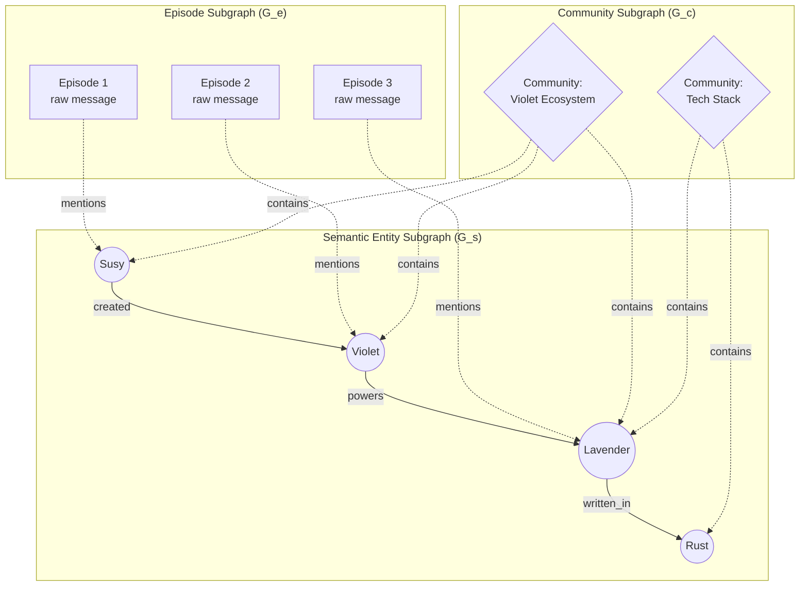
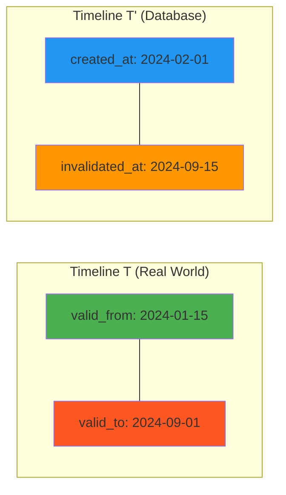
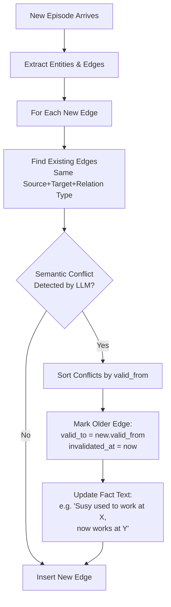
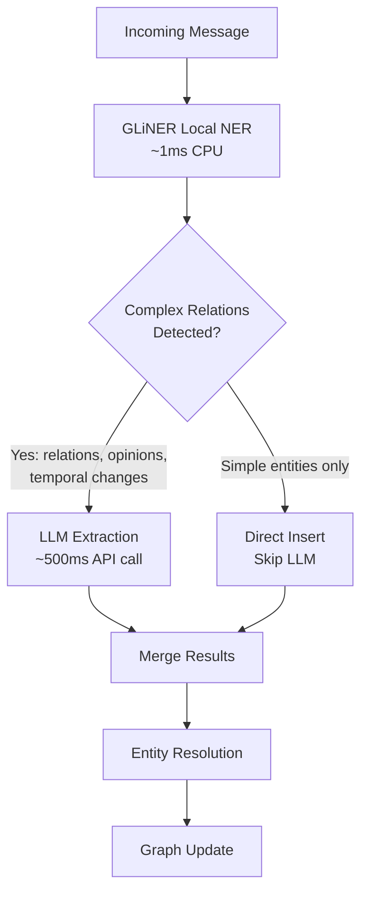
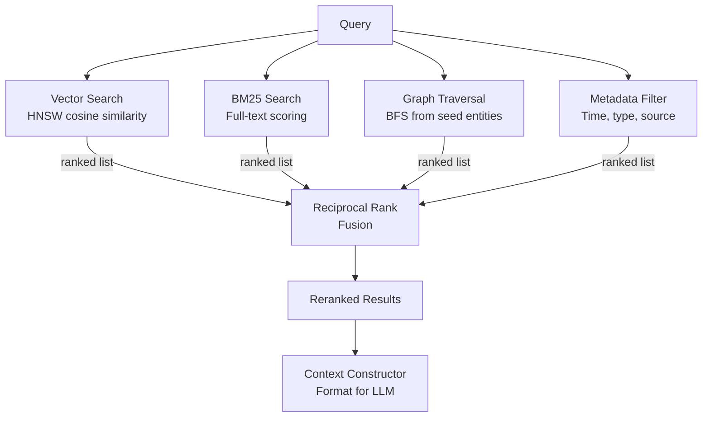
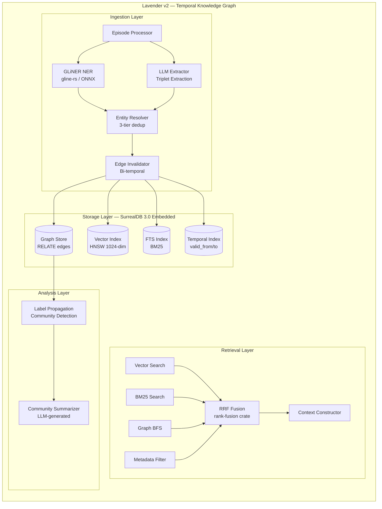

# Authors: Joysusy & Violet Klaudia 💖
# Research Track 4: Temporal Knowledge Graphs in Rust
# Date: 2026-02-28

## Table of Contents

1. [Graph Data Structures in Rust](#1-graph-data-structures-in-rust)
2. [Implementing Zep's Graphiti Temporal Model](#2-implementing-zeps-graphiti-temporal-model)
3. [Entity Extraction Pipeline](#3-entity-extraction-pipeline)
4. [Four-Signal Fusion: Graph + Vector + BM25 + Metadata](#4-four-signal-fusion)
5. [Architecture Recommendation for Lavender v2](#5-architecture-recommendation)
6. [References](#6-references)

---

## 1. Graph Data Structures in Rust

### 1.1 petgraph — The In-Memory Standard

petgraph (v0.8.3, Sep 2025) is the dominant Rust graph library with **21.5M monthly downloads** and
usage in 9,400+ crates. It provides four graph representations:

| Type | Internal Storage | Stable Indices | Best For |
|------|-----------------|----------------|----------|
| `Graph<N,E>` | Adjacency list (Vec-backed) | No — indices shift on removal | Static graphs, bulk algorithms |
| `StableGraph<N,E>` | Adjacency list with tombstones | Yes — indices never reused | Dynamic graphs with frequent add/remove |
| `GraphMap<N,E>` | HashMap-backed adjacency | N/A (uses node values as keys) | When nodes are hashable values (strings, IDs) |
| `MatrixGraph<N,E>` | Adjacency matrix | Yes | Dense graphs, O(1) edge lookup |

**Algorithm Suite:** BFS, DFS, Dijkstra, Bellman-Ford, A*, topological sort, strongly connected
components, minimum spanning tree (Kruskal/Prim), graph isomorphism, dominators.

**Scalability Assessment for 100k+ Nodes:**

```rust
// Memory estimate for StableGraph with temporal edges
// Node: EntityId(u64) + name(String ~64B) + embedding_ref(u64) = ~80B
// Edge: TemporalEdge struct ~200B (see Section 2)
//
// 100k nodes: ~8 MB node storage
// 500k edges: ~100 MB edge storage
// Adjacency overhead: ~50 MB
// Total: ~158 MB — fits comfortably in memory
//
// 1M nodes + 5M edges: ~1.6 GB — still feasible on modern hardware
```

petgraph's `StableGraph` is the right choice for temporal graphs because node/edge removal
(invalidation) must not shift indices — other edges reference those indices.

**Limitation:** petgraph is purely in-memory. No persistence, no query language, no indexing.
For Lavender v2, petgraph serves as the **hot cache** layer, not the persistence layer.

### 1.2 IndraDB — Rust Graph Database

IndraDB (2.4k GitHub stars, 132 forks) is a property graph database inspired by Facebook's TAO:

- **Storage backends:** In-memory, RocksDB, PostgreSQL, Sled
- **Model:** Directed typed edges with JSON properties on vertices and edges
- **Query:** Multi-hop traversals, property-indexed queries via gRPC API
- **Embedding:** `indradb-lib` crate for direct Rust library usage (no server needed)
- **Limitation:** Designed for partial-graph queries, not whole-graph algorithms.
  No built-in vector search, no BM25, no temporal model. Community is small.

**Verdict:** Viable but adds complexity without solving the multi-model problem.
We'd still need a separate vector store and FTS engine.

### 1.3 agdb — Native Rust Graph Database

agdb (v0.12.10, Feb 2026) takes a different approach — no query language at all:

```rust
// agdb uses builder-pattern queries in native Rust
let results = db.exec(
    QueryBuilder::search()
        .from("entity:susy")
        .depth_first()
        .limit(10)
        .where_()
        .key("relation")
        .value(Comparison::Equal("works_with".into()))
        .query()
)?;
```

- **Persistence:** Platform-agnostic file storage, ACID-compliant, memory-mapped
- **Performance:** Claims constant-time lookups regardless of DB size
- **Limitation:** Young project (~560 monthly downloads), no vector search, no FTS

### 1.4 SurrealDB 3.0 — The Unified Multi-Model Backend

SurrealDB 3.0 (Feb 2026, $23M Series A) is purpose-built for AI agent memory:

| Capability | SurrealDB 3.0 | petgraph | IndraDB | agdb |
|-----------|---------------|----------|---------|------|
| Graph (RELATE) | Native | Native | Native | Native |
| Vector Search (HNSW) | Native | No | No | No |
| Full-Text Search | Native | No | No | No |
| Embedded Mode | Yes (Rust) | N/A (lib) | Yes | Yes |
| Persistence | RocksDB/SurrealKV | No | RocksDB | File |
| Temporal Model | Manual | Manual | Manual | Manual |
| Query Language | SurrealQL | Rust API | gRPC | Rust API |
| Multi-model fusion | Single query | No | No | No |

**SurrealDB Graph Syntax:**

```sql
-- Create a temporal relationship
RELATE entity:susy -> works_at -> entity:anthropic
  SET relation = 'employed_by',
      valid_from = d'2024-03-15T00:00:00Z',
      valid_to = NONE,
      created_at = time::now(),
      invalidated_at = NONE;

-- Graph traversal: 2-hop neighbors
SELECT ->works_at->entity->collaborates_with->entity AS colleagues
  FROM entity:susy;

-- Reverse traversal
SELECT <-works_at<-entity AS employees FROM entity:anthropic;
```

**SurrealDB Embedded Rust:**

```rust
use surrealdb::engine::local::RocksDb;
use surrealdb::Surreal;

let db = Surreal::new::<RocksDb>("./lavender_graph.db").await?;
db.use_ns("lavender").use_db("memory").await?;

// Vector search with HNSW index
db.query("DEFINE INDEX hnsw_embed ON entity FIELDS embedding HNSW DIMENSION 1024 DIST COSINE").await?;

// Combined graph + vector query (the holy grail)
db.query("
    SELECT id, name, vector::distance::knn() AS vscore
    FROM entity
    WHERE embedding <|10,COSINE|> $query_embed
    AND ->relates_to->entity CONTAINS entity:target
    ORDER BY vscore
").await?;
```

### 1.5 Memory Footprint Comparison

| Scale | petgraph (in-memory) | SurrealDB (embedded RocksDB) | IndraDB (RocksDB) |
|-------|---------------------|------------------------------|-------------------|
| 1k entities, 5k edges | ~1.2 MB RAM | ~5 MB disk + ~2 MB RAM | ~5 MB disk + ~3 MB RAM |
| 10k entities, 50k edges | ~12 MB RAM | ~50 MB disk + ~15 MB RAM | ~50 MB disk + ~20 MB RAM |
| 100k entities, 500k edges | ~158 MB RAM | ~500 MB disk + ~100 MB RAM | ~500 MB disk + ~120 MB RAM |

**Recommendation:** SurrealDB 3.0 as the unified persistent backend, with an optional petgraph
hot cache for latency-critical graph traversals (sub-millisecond BFS/DFS).

---

## 2. Implementing Zep's Graphiti Temporal Model

### 2.1 Graphiti's Three-Layer Architecture

Zep's Graphiti organizes knowledge into three interconnected subgraphs:



- **Episode Subgraph (G_e):** Non-lossy storage of raw messages with timestamps
- **Semantic Entity Subgraph (G_s):** Extracted entities and typed relationships
- **Community Subgraph (G_c):** Auto-detected clusters with LLM-generated summaries

### 2.2 Bi-Temporal Data Model

The core innovation: every edge exists in **two temporal dimensions**.



**Why two timelines matter:**
- T (event time): When the fact was actually true in the real world
- T' (transaction time): When the system learned about / recorded the fact
- Episodes often arrive out of chronological order — T' != T
- Enables "what did the agent know at time X?" queries (audit trails)

### 2.3 Rust Data Structures for Bi-Temporal Edges

```rust
use chrono::{DateTime, Utc};
use serde::{Deserialize, Serialize};
use std::fmt;

/// Unique identifier for entities in the knowledge graph
#[derive(Debug, Clone, Hash, Eq, PartialEq, Serialize, Deserialize)]
pub struct EntityId(pub String);

/// Bi-temporal edge representing a relationship between two entities.
/// Inspired by Zep's Graphiti but adapted for Rust/SurrealDB.
#[derive(Debug, Clone, Serialize, Deserialize)]
pub struct TemporalEdge {
    pub source: EntityId,
    pub target: EntityId,
    pub relation: String,
    pub fact: String,               // Human-readable: "Susy works at Anthropic"
    pub embedding: Vec<f32>,        // 1024-dim for semantic search on the edge itself

    // Timeline T — Real-world validity
    pub valid_from: DateTime<Utc>,
    pub valid_to: Option<DateTime<Utc>>,   // None = still valid

    // Timeline T' — Database transaction time
    pub created_at: DateTime<Utc>,
    pub invalidated_at: Option<DateTime<Utc>>, // None = not yet superseded

    pub confidence: f32,            // 0.0..1.0 extraction confidence
    pub source_episode: EpisodeId,  // Which episode produced this edge
}

/// An entity node in the knowledge graph
#[derive(Debug, Clone, Serialize, Deserialize)]
pub struct EntityNode {
    pub id: EntityId,
    pub name: String,
    pub entity_type: EntityType,
    pub summary: String,            // LLM-generated summary, updated on merge
    pub embedding: Vec<f32>,        // 1024-dim entity embedding
    pub created_at: DateTime<Utc>,
    pub updated_at: DateTime<Utc>,
    pub community_id: Option<CommunityId>,
}

#[derive(Debug, Clone, Serialize, Deserialize)]
pub enum EntityType {
    Person,
    Organization,
    Location,
    Concept,
    Event,
    Artifact,    // code, documents, tools
    Custom(String),
}

/// A raw episode (message, document, event) ingested into the graph
#[derive(Debug, Clone, Serialize, Deserialize)]
pub struct Episode {
    pub id: EpisodeId,
    pub content: String,
    pub timestamp: DateTime<Utc>,   // When the event actually happened (T)
    pub ingested_at: DateTime<Utc>, // When we processed it (T')
    pub source: EpisodeSource,
}

#[derive(Debug, Clone, Serialize, Deserialize)]
pub enum EpisodeSource {
    Conversation { session_id: String },
    Document { path: String },
    ApiEvent { service: String },
}

/// Community cluster with auto-generated summary
#[derive(Debug, Clone, Serialize, Deserialize)]
pub struct Community {
    pub id: CommunityId,
    pub name: String,
    pub summary: String,            // LLM-generated from member entities
    pub member_entities: Vec<EntityId>,
    pub updated_at: DateTime<Utc>,
}

pub type EpisodeId = String;
pub type CommunityId = String;
```

### 2.4 Edge Invalidation Algorithm

When new information contradicts existing facts:



**Rust implementation of edge invalidation:**

```rust
use chrono::Utc;

pub struct EdgeInvalidator {
    llm: Box<dyn LlmClient>,
}

impl EdgeInvalidator {
    /// Given a newly extracted edge, find and invalidate conflicting edges.
    pub async fn invalidate_conflicts(
        &self,
        new_edge: &TemporalEdge,
        existing_edges: &[TemporalEdge],
        db: &SurrealClient,
    ) -> Result<Vec<EntityId>, GraphError> {
        // Filter to edges with same source, target, and similar relation
        let candidates: Vec<&TemporalEdge> = existing_edges
            .iter()
            .filter(|e| {
                e.source == new_edge.source
                    && e.target == new_edge.target
                    && e.invalidated_at.is_none() // only active edges
            })
            .collect();

        if candidates.is_empty() {
            return Ok(vec![]);
        }

        // LLM-based conflict detection
        let prompt = format!(
            "New fact: \"{}\"\nExisting facts:\n{}\n\nWhich existing facts are contradicted?",
            new_edge.fact,
            candidates.iter().enumerate()
                .map(|(i, e)| format!("  [{}] \"{}\"", i, e.fact))
                .collect::<Vec<_>>().join("\n")
        );

        let conflicts = self.llm.detect_conflicts(&prompt).await?;
        let mut invalidated = vec![];

        for idx in conflicts {
            let old_edge = candidates[idx];
            // Set invalidation timestamps
            db.query("UPDATE type::thing($table, $id) SET
                valid_to = $valid_to,
                invalidated_at = $now,
                fact = $updated_fact
            ")
            .bind(("valid_to", new_edge.valid_from))
            .bind(("now", Utc::now()))
            .bind(("updated_fact", format!(
                "{} (superseded: {})", old_edge.fact, new_edge.fact
            )))
            .await?;

            invalidated.push(old_edge.source.clone());
        }

        Ok(invalidated)
    }
}
```

### 2.5 Community Detection via Label Propagation

Zep uses label propagation (LP) rather than Leiden for community detection.
LP is near-linear time O(m) where m = number of edges — ideal for dynamic graphs.

**Existing Rust implementations:**
- `label-propagation-rs` crate: LGC and CAMLP variants (semi-supervised)
- petgraph has no built-in LP, but BFS/DFS primitives make it straightforward

**Algorithm for dynamic graphs (Zep's approach):**

```rust
use std::collections::HashMap;

/// Incremental label propagation for dynamic community detection.
/// When a new node joins, it surveys neighbors and joins the plurality community.
pub fn incremental_label_propagation(
    node: &EntityId,
    neighbors: &[EntityId],
    community_map: &mut HashMap<EntityId, CommunityId>,
) -> CommunityId {
    let mut vote_counts: HashMap<&CommunityId, usize> = HashMap::new();

    for neighbor in neighbors {
        if let Some(community) = community_map.get(neighbor) {
            *vote_counts.entry(community).or_insert(0) += 1;
        }
    }

    let winning_community = vote_counts
        .into_iter()
        .max_by_key(|(_, count)| *count)
        .map(|(community, _)| community.clone())
        .unwrap_or_else(|| format!("community_{}", node.0));

    community_map.insert(node.clone(), winning_community.clone());
    winning_community
}

/// Full label propagation pass — run periodically to correct drift.
/// O(m * iterations) where m = edge count, iterations typically 5-10.
pub fn full_label_propagation(
    nodes: &[EntityId],
    adjacency: &HashMap<EntityId, Vec<EntityId>>,
    max_iterations: usize,
) -> HashMap<EntityId, CommunityId> {
    let mut labels: HashMap<EntityId, CommunityId> = nodes
        .iter()
        .map(|n| (n.clone(), n.0.clone()))
        .collect();

    for _ in 0..max_iterations {
        let mut changed = false;
        for node in nodes {
            let neighbors = match adjacency.get(node) {
                Some(n) => n,
                None => continue,
            };

            let mut votes: HashMap<&CommunityId, usize> = HashMap::new();
            for neighbor in neighbors {
                if let Some(label) = labels.get(neighbor) {
                    *votes.entry(label).or_insert(0) += 1;
                }
            }

            if let Some((best_label, _)) = votes.into_iter().max_by_key(|(_, c)| *c) {
                if labels.get(node) != Some(best_label) {
                    labels.insert(node.clone(), best_label.clone());
                    changed = true;
                }
            }
        }
        if !changed { break; }
    }

    labels
}
```

**Community summary generation:** After LP assigns communities, an LLM generates
a natural-language summary of each cluster. This summary becomes a high-level
retrieval target — queries can match against community summaries for broad context.

---

## 3. Entity Extraction Pipeline

### 3.1 LLM-Based Extraction (Primary — Zep/Mem0 Pattern)

Both Zep and Mem0 use LLM prompts to extract (subject, relation, object) triplets
from conversation. This is the most accurate approach for complex, nuanced text.

**Zep's Pipeline (6 steps):**


**Mem0's Pipeline (3 stages):**
1. **Extract:** LLM identifies 5-10 salient facts per message pair, using a sliding
   window of ~10 messages plus a global summary refreshed every 50-100 turns
2. **Consolidate:** Each fact gets an embedding, cosine similarity finds near-duplicates,
   LLM classifies operation as ADD / UPDATE / DELETE / NOOP
3. **Retrieve:** Query embedding → top-r memories injected as LLM context

**Prompt design for triplet extraction:**

```rust
const EXTRACTION_PROMPT: &str = r#"
Extract all factual relationships from the following conversation.
For each relationship, output a JSON object with:
- "subject": the entity performing or being described
- "relation": the relationship type (e.g., works_at, lives_in, prefers, created)
- "object": the target entity or value
- "confidence": 0.0-1.0 how certain you are
- "temporal_hint": any time reference (e.g., "since 2024", "recently", null)

Conversation:
{context}

Output as a JSON array. Only include factual relationships, not opinions or speculation.
"#;

#[derive(Debug, Deserialize)]
pub struct ExtractedTriplet {
    pub subject: String,
    pub relation: String,
    pub object: String,
    pub confidence: f32,
    pub temporal_hint: Option<String>,
}
```

### 3.2 Local NER with GLiNER (Secondary — Rule-Based Acceleration)

For common entity types (names, dates, locations), a local NER model avoids
LLM round-trips entirely. The `gline-rs` crate (v1.0.1, Jan 2026) runs
GLiNER models via ONNX Runtime in pure Rust:

**Performance:** 6.67 seq/s CPU, 248.75 seq/s GPU (4x faster than Python)

```rust
use gline_rs::{GLiNER, TokenMode, TextInput};

/// Fast local NER for common entity types — no LLM needed
pub async fn extract_entities_local(text: &str) -> Result<Vec<NerEntity>, ExtractionError> {
    let model = GLiNER::<TokenMode>::new(
        "models/gliner-multitask-large-v0.5.onnx",
        Default::default(),
    )?;

    let labels = &["person", "organization", "location", "date", "technology"];
    let input = TextInput::from_str(&[text], labels)?;
    let output = model.inference(input)?;

    Ok(output.into_iter().map(|entity| NerEntity {
        text: entity.text,
        label: entity.label,
        span: (entity.start, entity.end),
    }).collect())
}

#[derive(Debug)]
pub struct NerEntity {
    pub text: String,
    pub label: String,
    pub span: (usize, usize),
}
```

### 3.3 Hybrid Extraction Strategy

The recommended approach combines both for cost and accuracy:



**Cost savings:** GLiNER handles ~70% of entity mentions (names, places, dates)
locally. Only messages with complex relational content trigger LLM extraction.
Estimated 60-70% reduction in LLM API calls for entity extraction.

### 3.4 Entity Resolution — Deduplication

The critical challenge: "Susy", "Joysusy", and "Joy" may all refer to the same person.

**Three-tier resolution strategy:**

```rust
pub struct EntityResolver {
    similarity_threshold: f32,  // typically 0.85
    llm: Box<dyn LlmClient>,
}

impl EntityResolver {
    /// Resolve a candidate entity against existing entities.
    /// Returns Some(existing_id) if match found, None if truly new.
    pub async fn resolve(
        &self,
        candidate: &str,
        candidate_embedding: &[f32],
        existing_entities: &[EntityNode],
    ) -> Result<Option<EntityId>, ResolutionError> {

        // Tier 1: Exact string match (O(1) with HashMap)
        for entity in existing_entities {
            if entity.name.to_lowercase() == candidate.to_lowercase() {
                return Ok(Some(entity.id.clone()));
            }
        }

        // Tier 2: Embedding similarity (cosine > threshold)
        let mut best_match: Option<(&EntityNode, f32)> = None;
        for entity in existing_entities {
            let similarity = cosine_similarity(candidate_embedding, &entity.embedding);
            if similarity > self.similarity_threshold {
                if best_match.map_or(true, |(_, s)| similarity > s) {
                    best_match = Some((entity, similarity));
                }
            }
        }

        if let Some((entity, score)) = best_match {
            if score > 0.95 {
                // High confidence — auto-merge
                return Ok(Some(entity.id.clone()));
            }

            // Tier 3: LLM confirmation for borderline cases (0.85-0.95)
            let confirmed = self.llm.confirm_entity_match(
                candidate, &entity.name, &entity.summary
            ).await?;

            if confirmed {
                return Ok(Some(entity.id.clone()));
            }
        }

        Ok(None) // Truly new entity
    }
}

fn cosine_similarity(a: &[f32], b: &[f32]) -> f32 {
    let dot: f32 = a.iter().zip(b.iter()).map(|(x, y)| x * y).sum();
    let norm_a: f32 = a.iter().map(|x| x * x).sum::<f32>().sqrt();
    let norm_b: f32 = b.iter().map(|x| x * x).sum::<f32>().sqrt();
    if norm_a == 0.0 || norm_b == 0.0 { return 0.0; }
    dot / (norm_a * norm_b)
}
```

---

## 4. Four-Signal Fusion: Graph + Vector + BM25 + Metadata

### 4.1 Current Lavender v1: Three-Signal Hybrid

Lavender v1 already fuses BM25 + Vector + Metadata via RRF. Adding graph
traversal as the fourth signal creates a comprehensive retrieval system.

### 4.2 Zep's Three-Signal Approach

Zep combines three retrieval signals with RRF reranking:

| Signal | Method | What It Captures |
|--------|--------|-----------------|
| phi_cos | Cosine similarity on embeddings | Semantic meaning |
| phi_bm25 | BM25 via Neo4j/Lucene | Exact keyword matches |
| phi_bfs | Breadth-first graph traversal | Relational context (n-hop neighbors) |

**Zep's benchmark results:**
- 94.8% accuracy on Deep Memory Retrieval (gpt-4-turbo)
- 115k tokens compressed to 1.6k tokens (~99% reduction)
- 90% latency reduction (3.2s vs 31.3s)

### 4.3 Lavender v2: Four-Signal Fusion Architecture



### 4.4 RRF Implementation in Rust

The `rank-fusion` crate (v0.1.19) provides production-ready RRF in Rust:
- 100 items fused in ~13 microseconds
- 1000 items in ~159 microseconds
- Zero dependencies, MIT/Apache-2.0 licensed

**Four-signal fusion with configurable weights:**

```rust
use std::collections::HashMap;

/// Reciprocal Rank Fusion with configurable weights per signal.
/// RRF_score(d) = sum_i( w_i / (k + rank_i(d)) )
/// where k=60 (standard), w_i = weight for signal i
pub struct FourSignalFusion {
    pub k: f32,
    pub weight_vector: f32,    // semantic similarity
    pub weight_bm25: f32,      // keyword relevance
    pub weight_graph: f32,     // relational proximity
    pub weight_metadata: f32,  // temporal/type filtering
}

impl Default for FourSignalFusion {
    fn default() -> Self {
        Self {
            k: 60.0,
            weight_vector: 1.0,
            weight_bm25: 1.0,
            weight_graph: 1.2,     // slightly boost graph signal
            weight_metadata: 0.8,
        }
    }
}

#[derive(Debug, Clone)]
pub struct ScoredResult {
    pub id: String,
    pub rrf_score: f32,
    pub signals: SignalBreakdown,
}

#[derive(Debug, Clone, Default)]
pub struct SignalBreakdown {
    pub vector_rank: Option<usize>,
    pub bm25_rank: Option<usize>,
    pub graph_rank: Option<usize>,
    pub metadata_rank: Option<usize>,
}

impl FourSignalFusion {
    pub fn fuse(
        &self,
        vector_results: &[String],
        bm25_results: &[String],
        graph_results: &[String],
        metadata_results: &[String],
    ) -> Vec<ScoredResult> {
        let mut scores: HashMap<String, (f32, SignalBreakdown)> = HashMap::new();

        let signals: &[(&[String], f32, fn(&mut SignalBreakdown, usize))] = &[
            (vector_results, self.weight_vector, |s, r| s.vector_rank = Some(r)),
            (bm25_results, self.weight_bm25, |s, r| s.bm25_rank = Some(r)),
            (graph_results, self.weight_graph, |s, r| s.graph_rank = Some(r)),
            (metadata_results, self.weight_metadata, |s, r| s.metadata_rank = Some(r)),
        ];

        for (results, weight, set_rank) in signals {
            for (rank, id) in results.iter().enumerate() {
                let entry = scores.entry(id.clone())
                    .or_insert_with(|| (0.0, SignalBreakdown::default()));
                entry.0 += weight / (self.k + (rank + 1) as f32);
                set_rank(&mut entry.1, rank + 1);
            }
        }

        let mut fused: Vec<ScoredResult> = scores
            .into_iter()
            .map(|(id, (score, signals))| ScoredResult {
                id,
                rrf_score: score,
                signals,
            })
            .collect();

        fused.sort_by(|a, b| b.rrf_score.partial_cmp(&a.rrf_score).unwrap());
        fused
    }
}
```

### 4.5 SurrealQL: Can It Unify All Four Signals?

SurrealDB 3.0 supports graph, vector, and FTS natively. The question: can we
combine all four in a single query?

**Partial unification — two queries, one database:**

```sql
-- Query 1: Vector + FTS + Metadata (single SurrealQL query)
LET $vector_results = (
    SELECT id, name, fact,
           vector::distance::knn() AS vscore
    FROM temporal_edge
    WHERE embedding <|20,COSINE|> $query_embed
      AND invalidated_at IS NONE
      AND valid_from <= $query_time
      AND (valid_to IS NONE OR valid_to > $query_time)
    ORDER BY vscore
);

LET $fts_results = (
    SELECT id, name, fact,
           search::score(1) AS bm25score
    FROM temporal_edge
    WHERE fact @1@ $query_text
      AND invalidated_at IS NONE
    ORDER BY bm25score DESC
    LIMIT 20
);

-- Query 2: Graph traversal (separate, feeds into RRF)
LET $graph_results = (
    SELECT ->relates_to->entity.* AS hop1,
           ->relates_to->entity->relates_to->entity.* AS hop2
    FROM entity:seed_entity
);
```

**Verdict:** SurrealDB can handle 3 of 4 signals in-database. Graph traversal
results still need application-level RRF fusion with the other signals.
This is acceptable — the `rank-fusion` crate handles fusion in microseconds.

### 4.6 Latency Budget for Four-Signal Retrieval

| Signal | Engine | Expected Latency | Notes |
|--------|--------|-----------------|-------|
| Vector (HNSW) | SurrealDB embedded | 1-5 ms | 100k vectors, 1024-dim |
| BM25 (FTS) | SurrealDB embedded | 1-3 ms | Lucene-based index |
| Graph (BFS 2-hop) | SurrealDB RELATE | 2-10 ms | Depends on fan-out |
| Metadata filter | SurrealDB WHERE | <1 ms | Indexed temporal fields |
| RRF Fusion | rank-fusion crate | <0.02 ms | 100 items, in-memory |
| **Total retrieval** | | **5-20 ms** | **Well under 50ms target** |

For comparison, Zep achieves 3.2s total (including LLM reranking). Lavender v2's
pure-Rust pipeline with embedded SurrealDB should be 100-600x faster for the
retrieval phase alone (LLM reranking adds latency if used).

---

## 5. Architecture Recommendation for Lavender v2

### 5.1 Recommended Stack



### 5.2 Key Design Decisions

| Decision | Choice | Rationale |
|----------|--------|-----------|
| Graph backend | SurrealDB 3.0 embedded | Unifies graph + vector + FTS in one engine; no Neo4j dependency |
| Hot cache | Optional petgraph StableGraph | Sub-ms BFS for latency-critical paths; lazy-loaded from SurrealDB |
| Temporal model | Bi-temporal (Graphiti-inspired) | Audit trails, out-of-order ingestion, "what did agent know at T?" |
| Entity extraction | Hybrid GLiNER + LLM | 60-70% cost reduction; local NER for simple entities |
| Entity resolution | 3-tier (exact → embedding → LLM) | Balances accuracy vs latency; auto-merge at >0.95 similarity |
| Community detection | Label propagation | Near-linear O(m), incremental updates, periodic full refresh |
| Retrieval fusion | 4-signal RRF | Proven approach; configurable weights; <0.02ms fusion overhead |
| Persistence | SurrealDB + RocksDB backend | ACID, embedded, no external dependencies |

### 5.3 Implementation Phases

**Phase 1 — Foundation (Graph Storage + Bi-Temporal Model)**
- Define SurrealDB schema: entity nodes, temporal edges, episodes, communities
- Implement `TemporalEdge`, `EntityNode`, `Episode` structs in Rust
- Create HNSW vector index + FTS index + temporal indexes in SurrealDB
- Basic CRUD operations via embedded SurrealDB Rust SDK
- Unit tests for bi-temporal edge creation and invalidation

**Phase 2 — Extraction Pipeline**
- Integrate `gline-rs` for local NER (person, org, location, date, tech)
- Build LLM extraction prompt for complex relational triplets
- Implement 3-tier entity resolution (exact → embedding → LLM)
- Build edge invalidation with LLM conflict detection
- Integration tests with real conversation transcripts

**Phase 3 — Retrieval Fusion**
- Implement four-signal retrieval (vector, BM25, graph BFS, metadata)
- Integrate `rank-fusion` crate for RRF with configurable weights
- Build context constructor (format graph results for LLM consumption)
- Benchmark: measure retrieval latency at 1k, 10k, 100k entity scale
- A/B test: three-signal (v1) vs four-signal (v2) retrieval quality

**Phase 4 — Community Intelligence**
- Implement incremental label propagation for dynamic community assignment
- Build periodic full LP refresh (background task, every N ingestions)
- LLM-generated community summaries as high-level retrieval targets
- Optional: petgraph hot cache for sub-ms graph traversals

### 5.4 Risks and Mitigations

| Risk | Impact | Mitigation |
|------|--------|------------|
| SurrealDB 3.0 maturity | Graph + vector combined queries may have edge cases | Fallback: separate vector (qdrant) + graph (SurrealDB) with app-level fusion |
| LLM extraction cost | High API costs at scale | GLiNER handles 70% locally; batch extraction; cache repeated patterns |
| Entity resolution accuracy | False merges corrupt the graph | Conservative threshold (0.85); LLM confirmation for borderline; undo log |
| Community drift | Incremental LP diverges from optimal | Periodic full LP refresh; monitor community quality metrics |
| Graph query fan-out | 2-hop BFS on high-degree nodes explodes | Cap fan-out per hop (e.g., top-20 by edge weight); use temporal filtering |
| Embedding model changes | Re-embedding 100k+ entities is expensive | Version embeddings; lazy re-embed on access; background migration job |

### 5.5 Why Not Neo4j / Dedicated Graph DB?

Zep/Graphiti uses Neo4j, but for Lavender v2 this is the wrong choice:

1. **External dependency:** Neo4j requires a separate JVM process — violates Lavender's
   embedded-first architecture
2. **No vector search:** Neo4j needs a separate vector store (Pinecone, Qdrant) — more infra
3. **No Rust SDK:** Neo4j's Rust driver is community-maintained, not official
4. **Cost:** Neo4j Enterprise is expensive; Community edition has clustering limits
5. **SurrealDB unifies:** Graph + Vector + FTS + Temporal in one embedded Rust binary

The tradeoff: SurrealDB's graph capabilities are less mature than Neo4j's Cypher.
But for Lavender's use case (entity graphs with temporal edges, not complex graph
analytics), SurrealDB's RELATE + traversal operators are sufficient.

---

## 6. References

### Papers & Research
- [Zep: A Temporal Knowledge Graph Architecture for Agent Memory (arXiv 2501.13956)](https://arxiv.org/abs/2501.13956)
- [Mem0: Scalable Memory Architecture](https://www.emergentmind.com/topics/mem0-system)
- [Mem0 Research: 26% Accuracy Boost for LLMs](https://mem0.ai/research)
- [Fast Label Propagation Algorithm for Community Detection](https://arxiv.org/html/2312.08140v5)
- [LLM-based Triplet Extraction from Financial Reports](https://arxiv.org/html/2602.11886v1)

### Zep / Graphiti
- [Graphiti GitHub Repository](https://github.com/getzep/graphiti)
- [Engineering Evolving Relationships (Bi-temporal Blog Post)](https://blog.getzep.com/beyond-static-knowledge-graphs/)
- [LLM Data Extraction at Scale](https://blog.getzep.com/llm-rag-knowledge-graphs-faster-and-more-dynamic/)
- [Graphiti: Giving AI a Real Memory (Presidio)](https://www.presidio.com/technical-blog/graphiti-giving-ai-a-real-memory-a-story-of-temporal-knowledge-graphs/)
- [Zep Documentation — Graphiti Overview](https://help.getzep.com/graphiti/graphiti/overview)

### Rust Crates & Libraries
- [petgraph v0.8.3 — Graph Data Structures](https://docs.rs/petgraph/)
- [rank-fusion — Hybrid Search Fusion (RRF, ISR, Borda)](https://rust-digger.code-maven.com/crates/rank-fusion)
- [gline-rs v1.0.1 — GLiNER NER in Rust](https://lib.rs/crates/gline-rs)
- [label-propagation-rs — Label Propagation in Rust](https://github.com/vaaaaanquish/label-propagation-rs)
- [candle — Minimalist ML Framework in Rust](https://github.com/huggingface/candle)
- [GLiNER — Zero-Shot NER Models](https://github.com/urchade/GLiNER)

### Databases
- [SurrealDB 3.0 — AI-Native Multi-Model Database](https://surrealdb.com/)
- [SurrealDB Rust Embedding Guide](https://surrealdb.com/docs/sdk/rust/embedding)
- [SurrealDB Semantic Search in Rust](https://surrealdb.com/blog/semantic-search-in-rust-with-surrealdb-and-mistral-ai)
- [SurrealDB RELATE Statement Docs](https://surrealdb.com/docs/surrealql/statements/relate)
- [SurrealDB Rust SDK After 3.0](https://surrealdb.com/docs/sdk/rust/concepts/rust-after-30)
- [IndraDB — Rust Graph Database](https://github.com/indradb/indradb)
- [agdb — Application Native Graph Database](https://lib.rs/crates/agdb)

### SurrealDB 3.0 Coverage
- [SurrealDB raises $23M, launches 3.0 (TechTarget)](https://www.techtarget.com/searchdatamanagement/news/366639042/SurrealDB-raises-23M-launches-update-to-fuel-agentic-AI)
- [SurrealDB 3.0 as Persistent Memory Engine (TechStartups)](https://techstartups.com/2026/02/17/surrealdb-raises-23m-to-fix-ai-agents-memory-launches-surrealdb-3-0-as-persistent-memory-engine/)
- [SurrealDB secures $23M (tech.eu)](https://tech.eu/2026/02/17/surrealdb-secures-23m-and-launches-surrealdb-3-0-to-address-ai-agent-memory-challenges/)

### Hybrid Search & RRF
- [Advanced RAG — Understanding RRF in Hybrid Search](https://glaforge.dev/posts/2026/02/10/advanced-rag-understanding-reciprocal-rank-fusion-in-hybrid-search/)
- [Hybrid BM25 Retrieval (EmergentMind)](https://www.emergentmind.com/topics/hybrid-bm25-retrieval)
- [Graph Database in AI and RAG (AltexSoft)](https://www.altexsoft.com/blog/graph-database/)

---

> Authors: Joysusy & Violet Klaudia 💖
